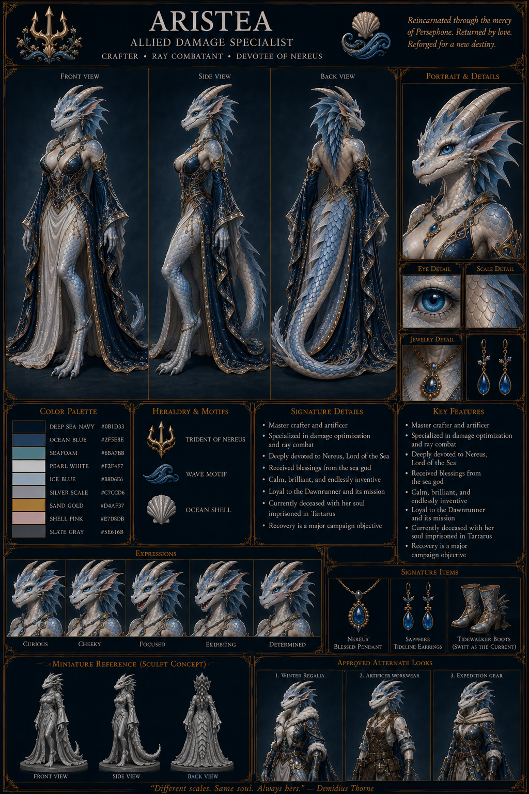
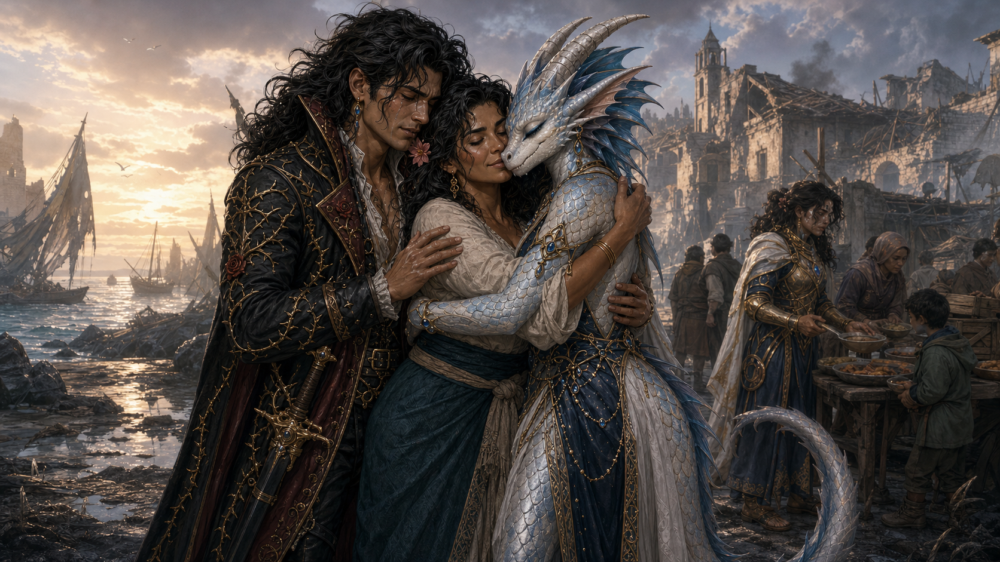

# Aristea Enontië

The appearance is definitive. Any lower-panel wording that calls Aristea
“currently deceased” is an obsolete interim label superseded by her confirmed
return.

Aristea Enontië is the living reincarnated continuation of
[Aristea of the Shifting Tides](aristea_backstory.md). Eris killed her
half-elven incarnation at the Battle for Tradegulf and imprisoned her soul in
Tartarus. Demidius later sacrificed the Key of Daedalus to Persephone and asked
for “one spring of my own.” Persephone accepted the offering and returned
Aristea in a kobold body.

She later reunited with Demidius and Philomela Thorne in ravaged Tradegulf
while survivors distributed food, received healing, and built temporary
shelters. Amparo participated in the recovery effort.

**Enontië** means **“reincarnated” in High Elvish**. She is permanently enlarged
and should be treated as comparable in height to the other player characters.

Her definitive current appearance is a feminine kobold with pearl-white and
silver-blue scales, luminous blue eyes, swept metallic horns, blue facial
frills, and a long tail. Her deep-sea navy, pearl-white, and sand-gold clothing
uses wave, shell, gemstone, and Nereus-trident motifs. Do not depict her as a
tiny mascot or as a human with cosmetic scales.

Her pre-reincarnation level-17 build, Nereus devotion, Animal Lord of the Tides
mantle, narwhal form, crafting role, ray-combat specialization, relationship
with Demidius, and Dawnrunner history remain the latest confirmed record.
Ancestry-dependent mechanics, the permanent-enlargement rules, her post-return
Dawnrunner office, memories of Tartarus, and any conditions imposed by
Persephone remain unrecorded.

All existing half-elven artwork remains canonical for the deceased elven
incarnation and must not be overwritten.

## Reunion artwork

