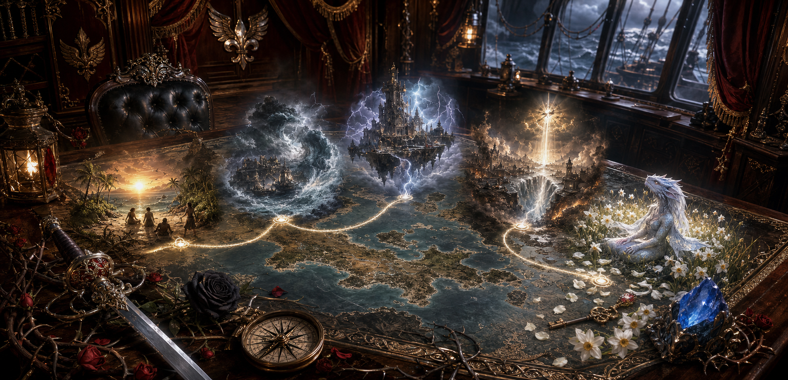

# Events and Timeline

This is the repository's master event catalog. The reader-facing version is
mirrored in the GitHub wiki as `Events-and-Timeline.md`.

## Chronological catalog

1. **Deep history:** The Arrival; the banning of the Mother's Lament; the
   Godclaw bloodline program; Tenor's bloodline rite.
2. **Opening:** awakening after ten years of magical stasis on Sounon and the
   liberation of its enslaved grippli.
3. **Misthold:** Tulip and Alley's wedding; the quest for Odysseus; rescue of
   the divine prisoners; Maarin's tsunami; Gideon's Sunshot.
4. **Stormspire:** the festival diversion, theft of the final Scepter piece,
   sabotage of the flying city, and Maarin's rescue of the settlement below.
5. **Tradegulf:** Declan's raid, the battle, fifty-five deaths, Eris's
   intervention, and the early beginning of the Culling.
6. **Aftermath:** the Old Nysian power vacuum, the Grand Artifact Auction,
   Demidius and Maarin's confrontation with the Crafter's Bow's hidden Maker's
   Knot leadership, the resulting civic-guard and relief campaign, and the
   accepted proposal for Dame Mathilda to succeed Declan in the Sunlit Chain.
7. **Death and return:** rescue of Philomela, sacrifice of the Key of Daedalus,
   and Aristea's reincarnation as Aristea Enontië.
8. **Roberts bloodline conflict:** Nyssa's betrayal and the Misthold tournament
   in which one sibling became a mortal god.
9. **[Battle beneath the Champions' garrison](../docs/events/battle-beneath-the-champions-garrison.md):**
   A few days after the Crafter's Bow address, the party exposed the apparent
   Oros of the Blossom as a Lawful Evil, magically disguised kobold mortal god
   of Fel. The resulting surface and basement battles ended with the party
   defeating the infiltrator, a Fel abomination, and a shield guardian.
   Demidius became Champion of Hermes and Amparo became Champion of Hestia.
10. **Ongoing Culling losses:** the New Gods' Lodingen raid, deaths and
    resurrection attempts among gods and pirate powers, and Apollo's
    catastrophic plague of the Berres mainland are tracked in the
    [Culling casualty ledger](culling_casualty_ledger.md).
11. **[Necropolis expedition](events/necropolis-expedition.md):** the party returned with 200 of its 250-person
    force, but the allied forces of Persephone, Hades, Hermes, and Prince Luis
    suffered catastrophic losses. Pete was restored by Hermes, Alley passed a
    God save, and several named leaders could not be resurrected.
12. **Recovery of the Silent Court ledgers:** the records exposed the Maker's
    Knot slave-sales network, its Underdark and political clients, Praxius's
    hidden leadership of the Ivory Ladder, and large contracts for enchanted
    arms and armor.
13. **Recovered Dawnrunner design history:** the vessel's original order
    included an underwater-access smuggling hold intended for trafficking
    enslaved people. This records the builders' intended use, not the ship's
    present purpose under Demidius.
14. **Glistria cartography guild explosion:** the destruction of the guild
    killed approximately 500 people and deprived the region of navigational
    expertise valuable in the cursed waters of Berres.
15. **Tradegulf-Glistria corridor:** Tradegulf contains three monoliths, and
    the recorded ferry journey between Tradegulf and Glistria takes about
    three hours.
16. **Sabotage toward Sounon:** a recovered witch's journal records deliberate
    sabotage of a ship and its navigation toward Sounon. It also records a
    demigod of Hermes charged with assembling the Scepter of Keto for an
    invasion, a recovered claw, and rumors concerning the connector.

See `campaign/timeline.md` for the older detailed chronology and the wiki master
index for direct links to every event page.
