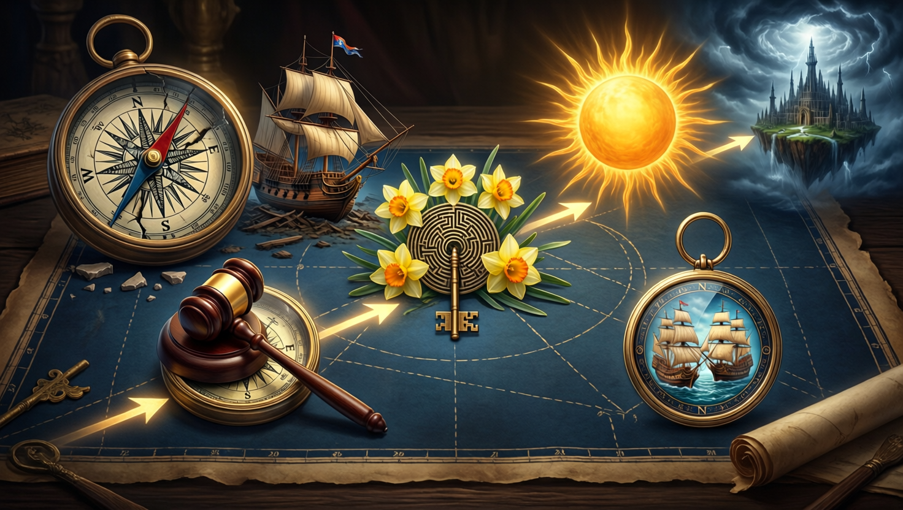

# Events and Timeline

This is the repository's master event catalog. The reader-facing version is
mirrored in the GitHub wiki as `Events-and-Timeline.md`.

## Chronological catalog

1. **Deep history:** The Arrival; the banning of the Mother's Lament; the
   Godclaw bloodline program; Tenor's bloodline rite.
2. **Opening:** awakening after ten years of magical stasis on Sounon and the
   liberation of its enslaved grippli.
3. **Misthold:** Tulip and Alley's wedding; the quest for Odysseus; rescue of
   the divine prisoners; Maarin's tsunami; Gideon's Sunshot.
4. **Stormspire:** the festival diversion, theft of the final Scepter piece,
   sabotage of the flying city, and Maarin's rescue of the settlement below.
5. **Tradegulf:** Declan's raid, the battle, fifty-five deaths, Eris's
   intervention, and the early beginning of the Culling.
6. **Aftermath:** the Old Nysian power vacuum, the Grand Artifact Auction,
   Demidius and Maarin's confrontation with the Crafter's Bow's hidden Maker's
   Knot leadership, the resulting civic-guard and relief campaign, and the
   accepted proposal for Dame Mathilda to succeed Declan in the Sunlit Chain.
7. **Death and return:** rescue of Philomela, sacrifice of the Key of Daedalus,
   and Aristea's reincarnation as Aristea Enontië.
8. **Roberts bloodline conflict:** Nyssa's betrayal and the Misthold tournament
   in which one sibling became a mortal god.
9. **Champions of Hermes and Hestia:** Demidius and Amparo defeated the leader
   of the Champions, completing their respective third trials. With both divine
   offices vacant, Demidius became Champion of Hermes and Amparo became
   Champion of Hestia. The encounter's full story remains pending.
10. **Ongoing Culling losses:** the New Gods' Lodingen raid, deaths and
    resurrection attempts among gods and pirate powers, and Apollo's
    catastrophic plague of the Berres mainland are tracked in the
    [Culling casualty ledger](culling_casualty_ledger.md).

See `campaign/timeline.md` for the older detailed chronology and the wiki master
index for direct links to every event page.
