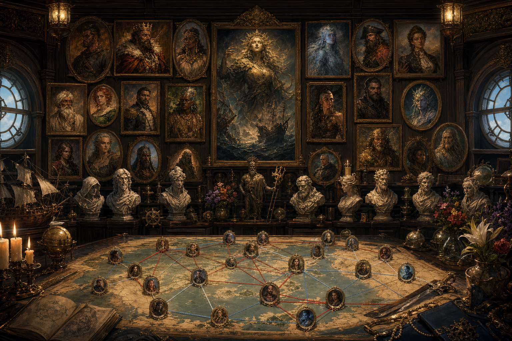

# Notable Figures

Only confirmed relationships and campaign facts are recorded here. Unknown biography, motive, and appearance are left unspecified.

## Demidius Thorne

Charisma-centered oracle, mythic controller, captain, party face, demigod, and Champion of Hermes. Demidius completed his third Hermes trial when he and Amparo defeated the leader of the Champions. He retains the Advanced simple template from his Blessed stage and gains two Hermes-domain godly powers whose identities remain unrecorded. He commands the Dawnrunner. His strategic doctrine emphasizes certainty, magical defense removal, action-economy control, party enablement, influence, and infrastructure rather than personal weapon damage. His permanent visual identifiers include gold rose-and-vine tattoos framing the outer chest while leaving the sternum bare, gold thorn tattoos over his hands, and a glowing purple artifact eyebrow piercing; he has no face or neck tattoos, and his eyes are beginning to blend pink and purple as his Aphroditean power grows.

**Key relationships:** patronage from Hermes; alliance or gift relationship with Queen Beaumont; loyalty relationship with Aristea through the inherited demiplane; heir to his deceased brother's demiplane.

Demidius was born in Lodingen to Philomela Thorne and Pirate King Smokey Roberts. Smokey is a demigod of Athena whom the Hellknight Order of the Godclaw targeted as the paternal source for an attempted new god of war loyal to the order. The Godclaw used attractive women to produce children through Smokey for that project; Demidius and Paradox were confirmed results. The record does not establish whether Smokey, the women, or Athena knew the scheme's purpose. Philomela fled with Demidius and raised him among the kobold Tagata Fetu on Motu Leilani; mother and son were the community's only known non-kobold residents. Ten years before the present account, the kobold lorekeeper Fetu’mana received a vision sending Demidius to search for scattered siblings including Siopi and Paradox.

## Amparo Decoris Ignatius

A level 17 nonbinary undine life oracle, player character, first mate of the *Matcha Frappuccino*, and Champion of Hestia. Amparo completed their third Hestian trial when they and Demidius defeated the leader of the Champions. They retain the Advanced simple template from their Blessed stage and gain two Hestia-domain godly powers whose identities remain unrecorded. Amparo was born into Hestia's bloodline as a one-quarter godling. Eating an Apple of Discord elevated them to demigodhood and gave Eris a claim over them. At the Battle for Tradegulf, Eris called Amparo her future Champion and confirmed that Amparo had completed a first Eris trial by helping sow discord into the world. That separate Eris claim remains unresolved. Amparo and the minor goddess Ena share the same father and are half-sisters; their father's identity remains unrecorded.

## Queen Lidda Beaumont of Nysia

Queen of Nysia, Slayer of War, and Minor Goddess of Dueling (War Subdomain). Immediately after the Battle for Tradegulf's 55 deaths triggered the Culling early, she offered Ares a chance to withdraw and reconcile with the New Gods. After he attacked, she killed him with a single decapitating strike outside Tradegulf.

The Culling's onset was physically witnessed after Declan died: the world shook, the ocean split, Maarin's storm faded, and the heavens broke.

Beaumont rules Nysia from Arverdon Palace. The palace is her confirmed seat of rule, although the record does not yet establish whether it is also Nysia's formal capital.

Beaumont later gifted Demidius the Glasses of Beaumont, which provide alignment revelation and *true seeing*. During her duel, she addressed Perlot and called her red-tasseled longsword “our blade.”

## Hermes

Demidius's patron deity and the source of his custom obedience and divine-power progression. Confirmed gifts include the Seven-Pipped Gem divine ability and Hermes's Boots of Speed.

## Eris and Pat

Eris is a member of the Dogs of War associated with Discord, Destruction, and Rivalry. At the Battle for Tradegulf she appeared through the identity or form of Pat, killed Aristea and Sly, and declared the battle Amparo's first trial toward becoming her champion. The record does not establish whether Pat was a disguise, manifestation, host, or separate person.

## Aristea Enontië

The current living incarnation of Aristea is a permanently enlarged kobold
comparable in height to the other player characters. Enontië means
“reincarnated” in High Elvish. Persephone returned her after Demidius
sacrificed the Key of Daedalus. Her latest confirmed mechanics remain those of
the level-17 neutral-good wizard of Nereus, water-and-cold specialist,
merchant-mage, shapeshifter, item creator, Animal Lord of the Tides, and
Demidius's cohort. Her post-return Dawnrunner office and ancestry mechanics
remain unrecorded.

## Aristea of the Shifting Tides

The deceased half-elven incarnation served as Dawnrunner navigator and chief
engineer before the Battle for Tradegulf. Eris killed her with *death knell*,
made her appear alive but unconscious, and pulled her soul into Tartarus. All
existing elven artwork remains canonical for this incarnation.

## Kaelen Thorne

A deceased former party member, elf, druid, and worshiper of Hermes. Kaelen was the child of an elven herbalist and elven ranger and was trained by the elder Ylvara in the languages of the forest and attunement to the natural world. At twelve she comforted a dying beaver and raised its lone pup to adulthood. She preferred animals and quiet to people and believed that the balance between civilization and nature sometimes had to be enforced. Her relationship to the wider Thorne family and the circumstances of her death remain unrecorded.

## Sly

Declan's second-in-command. Eris killed Sly with *death knell* during the Battle for Tradegulf. The present custody of the Wayfinder associated with Sly's former office is unknown.

## Ares

God of War slain by Queen Beaumont during the Culling outside Tradegulf. He refused Beaumont's offer to withdraw and reconcile with the New Gods before initiating the fight.

## Dame Mathilda

A level-50 paladin of Apollo who refused godhood and possesses the Sword of Helios. Her blood and abilities uniquely connect her to the Sunlit Chain. Maarin and the party proposed transferring Declan's Wayfinder and the heroes' succession claim to Mathilda because the current party cannot safely hold the domain against the surviving Pirate Kings and other regional powers. Mathilda agreed to the proposal. The formal transfer and her installation remain pending or unrecorded.

## Sea Serpent Declan

Former Pirate King and lord of the Sunlit Chain. Declan could call a kraken and took his seat by using it to defeat Calico Bill's seventy-five-ship fleet. Maarin killed Declan at Tradegulf. The heroes now possess his Wayfinder, reducing the active Council of Seven to six and creating a succession crisis.

## The surviving Pirate Kings and Queens

Immediately after Declan's death, six council members remained. Bloody Anne has since died during the Culling, leaving five named living rulers: Smokey Roberts, Bluebeard the Valiant, Rosalind Galeheart, Wavelord Santiago, and Morrigan “the Burner” Crossfire. Smokey was killed during the Culling but successfully resurrected. He is a demigod of Athena and was targeted by the Godclaw's attempted war-god breeding program. Santiago and Roberts are the two Maarin specifically identified as immediate dangers to a party-held Sunlit Chain. The Storm King is a separate storm giant and is not a council member.

During the escape from Misthold, Bluebeard chased the party through his
territory with his flagship and two ships of the line. Gideon stopped the
flagship with one sun-charged arrow that killed everyone aboard except
Bluebeard. The fate of the two escorting ships and the flagship's surviving
hull remain unrecorded.

## The Storm King

A powerful storm giant who rules Stormspire, a floating city in the Sunlit Chain. During the Stormspire operation, the crews distracted the Storm King while Odysseus stole the final component required for the Scepter of Keto. The Storm King is a major regional power but not one of the Council of Seven.

## Odysseus

A level-30 rogue of an unspecified specialization, tactical genius, and
operative of Queen Lidda Beaumont who had been missing for twenty years. The
party recovered him from imprisonment at Rosalind Galeheart's great games in
Misthold. Odysseus supplied the guard uniforms used in the infiltration, then
escaped with the divine prisoners through the Key of Daedalus.

Odysseus stole the final component of the Scepter of Keto during the subsequent
Stormspire operation. He also deliberately sabotaged the floating city's
flight to destroy an enemy of Nysia and the New Gods, accepting the deaths of
the settlement below without its people's consent. Maarin prevented the
disaster. Odysseus pursues the greater good through methods the party
considers callous and morally unacceptable.

Odysseus is also cursed to lose his way. During the retreat from Misthold,
Demidius hosted him because Demidius had the stronger Profession (sailor)
modifier, but the curse imposed a -40 penalty. Smokey Roberts supercharged the
curse after the party reached Stormspire. Almost all accompanying ships were
then lost at sea; Maarin navigated with the Scepter of Keto, while Demidius
survived through extreme sailing skill. The curse's origin, precise mechanics,
and means of removal remain unrecorded.

## Achilles

The great champion of the Dogs of War and an unmatched warrior. Achilles
attended Rosalind Galeheart's gathering at Misthold while the party infiltrated
the games to rescue Odysseus and its divine prisoners. His mechanical level,
divine powers, and conduct during the escape remain unrecorded.

## Fel

A lawful-evil primordial blue dragon from the Outer Realms, Lord of the Underworld, and one of the four primary gods of the Lords of Order. Fel is associated with Magic, Death, Knowledge, and Scalykind. Fel's arrival in Zatera is one candidate for the event defining year 0 Post-Arrival; the other currently identified candidate is Cronus's release.

## Alexander

A primordial silver dragon, Lord of the Earth, and one of the four primary gods of the Lords of Order. Alexander's half-celestial aasimar mortal avatar retained his appearance from life and ruled as Emperor of Lodingen for hundreds of years.

## Vornix Drazgul

A male kobold petty officer hired by Demidius for the Dawnrunner. Vornix calls Demidius the “great, scaleless, pink lizard” and advocates a strict charitable anti-corruption program with the Maker's Knot: raid corrupt businesses, sell the seized goods at reduced prices, donate all proceeds to charity and displaced workers, and use unrelated adventuring income to fund the ship. The proposal has not yet been accepted or implemented. Vornix's class, level, duty, crew share, and appearance beyond being a male kobold remain unrecorded.

## Pete

A male gnome, skilled artificer, mystery-box merchant, and Dawnrunner petty officer. Pete sells mystery boxes to the crew in every port, and Demidius is his best customer. He owns a shop in Glistria with portals to both the Dawnrunner and Matcha Frappuccino. Pete is in a relationship with Fizz, an avatar of Hermes. Pete's level, class mechanics, exact shipboard duty, shop name and location within Glistria, and the portals' operating and security rules remain unrecorded.

## Ulaa

A grippli cleric of Hermes and spiritual leader of the grippli freed on
Sounon. Ulaa led most of the grippli away to purchase passage to another
village or island, believing the party should not be involved in their
relocation. Pete and six grippli stayed aboard; those six remain Demidius's
followers. Ulaa was last seen leaving the party on an island that was
destroyed soon afterward, but his survival is unknown. He gave the party the
Ember Blade, a green-obsidian sword stolen years earlier at Hermes's direction.

## Fizz

A gnome avatar of Hermes, a distinct person with an orange goatee, and Pete's partner. Fizz's gender, pronouns, other appearance details, powers, divine duties, present location, and degree of independence from Hermes remain unrecorded.

## Qarvel Drah'kar

A male sea elf and one of Demidius's newer Dawnrunner petty officers. Qarvel proposes hunting large sea game for merchant goods and hunting pirates. Goods recovered from pirates would be given to struggling communities, with the Dawnrunner retaining a 10% acquisition fee. The proposal is not yet accepted or implemented. His class, level, duty, crew share, and appearance beyond being a male sea elf remain unrecorded.

## Zephyra Coralshade

A female sea elf and one of Demidius's newer Dawnrunner petty officers. Zephyra supports Demidius's new hiring practices and Pete's suggestions. She proposes a safe luxury passenger service in which each 500-gp fare provides free passage to one person in need. Her example carries 150 paying and 150 free passengers for 75,000 gp in gross fares before expenses. The proposal is not yet accepted or implemented. Her class, level, duty, crew share, and appearance beyond being a female sea elf remain unrecorded.

## Paradox and Siopi

Paradox and Siopi were children of Pirate King Smokey Roberts, half-siblings of Demidius, former party members, and adventuring companions. Both are deceased; their dates, causes, and places of death remain unrecorded. Paradox was one of the confirmed children produced through the Godclaw's effort to create an Athena-descended new god of war; Demidius was another. Raised and invasively tested by the Godclaw, Paradox escaped Lodingen when his mother conspired with rebels to smuggle him to the Isles of Berres. Her father, a Godclaw captain commanding a steel vessel, unknowingly destroyed their smuggling ship. Paradox survived through an unexplained natural affinity for the sea and was taken in by smugglers led by a wayang shadow master, who taught him shadow magic. Paradox was a man with paired red-and-blue heterochromia in both his eyes and hair. He had seven reported wives across seven regions and six reported biological children: Perseus, Aella, Echo, Hera, Phrixus, and Daphne. Echo and Hera are twins, and both are age 10. After later joining Siopi aboard another vessel, he survived its destruction by a kraken and eventually awoke with the shipwrecked group on Sounon after ten years in magical stasis. Siopi was nonbinary, used they/them pronouns, presented femininely, and helped Nyssa decipher the map in *The Mother's Lament*.

## Nyssa

Nyssa was Demidius's former cohort and an agent of Smokey Roberts. After rejecting Demidius's romantic advances, controlling Tulip with a Zeus-associated artifact glove, helping decipher *The Mother's Lament*, and later stealing the book, she eventually attacked the party alongside Tenor and her husband. Her husband was an unnamed child of Smokey Roberts who looked almost exactly like Demidius. He was killed during the exchange and his body fell into the sea. This battle was the last time the crew saw Nyssa; her present location and status remain unknown.

The later tournament among Smokey Roberts's children took place in a huge colosseum at Misthold. One unnamed sibling killed more than fifty other children of Smokey there, accumulated their power through Tenor's rite, became a mortal god, and swore to kill Demidius.

## Perlot

Addressed by Queen Beaumont during her confrontation with Ares. Beaumont's phrase “our blade” establishes some connection among Perlot, Beaumont, and the red-tasseled longsword, but the nature of that connection is not yet recorded.

## Demidius's deceased brother

Former owner of the inherited demiplane. Bix may be his reincarnation, although this remains uncertain and Demidius does not know about the possibility. His name, history, and manner of death are not yet present in the canonical record.

## Bix

Chaotic-good male grippli godling of Hermes, Dawnrunner officer, newlywed to another crew member, and Demidius's longest-serving follower. Bix has one red eye and one blue eye. He may be the reincarnation of Demidius's deceased brother; this remains unconfirmed and is not part of Demidius's current character knowledge.

## Mentioned associates

The optimization record names level 17 Maarin, a mistsoul undine captain and Persephone's unique Champion, and level 15 Okeanikos, a male mortal god, sorcerer, Dragon Disciple, and child of Echidna, as stronger personal damage dealers whom Demidius should enable rather than imitate. Maarin completed three Persephone trials, leads among Persephone's followers, and receives two Persephone-domain godly powers from the Champion office; the individual trials and powers remain unrecorded. Maarin is muscular, with blue skin, aqua mistlike hair, and pink eyes that changed when she became Persephone's Champion. She wears plant-covered medium armor and is perpetually surrounded by plant life, animals, and vermin. She can create and control extreme weather, but she cannot change or control seasons. Poseidon created the storm that killed Maarin's family, and Maarin seeks revenge and intends to kill him. Maarin's first Dark Prophecy led the party to Filius after warning that his future death could awaken Gaia and ultimately end the cosmos. A later prophecy led the party to Okeanikos's egg before another power could shape what he became. Maarin took him as her cohort; he now worships her and regards her as his sister.

## Related pages

- [Reader-facing People and Places](../docs/people-and-places.md)
- [Campaign Timeline](timeline.md)
- [Planar Operations](../codex/PLANAR_OPERATIONS.md)
