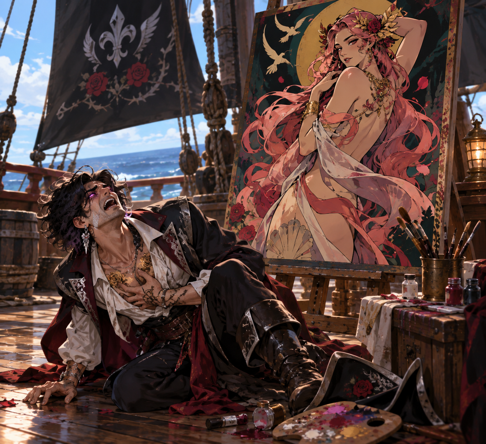
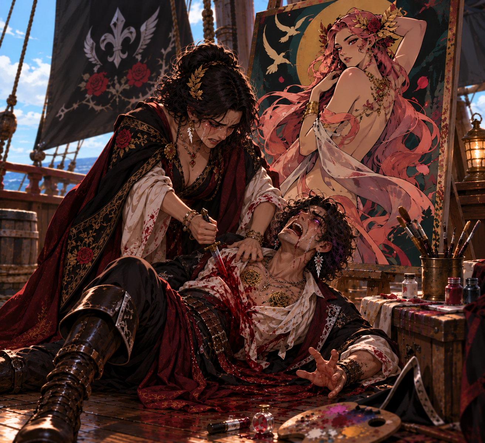
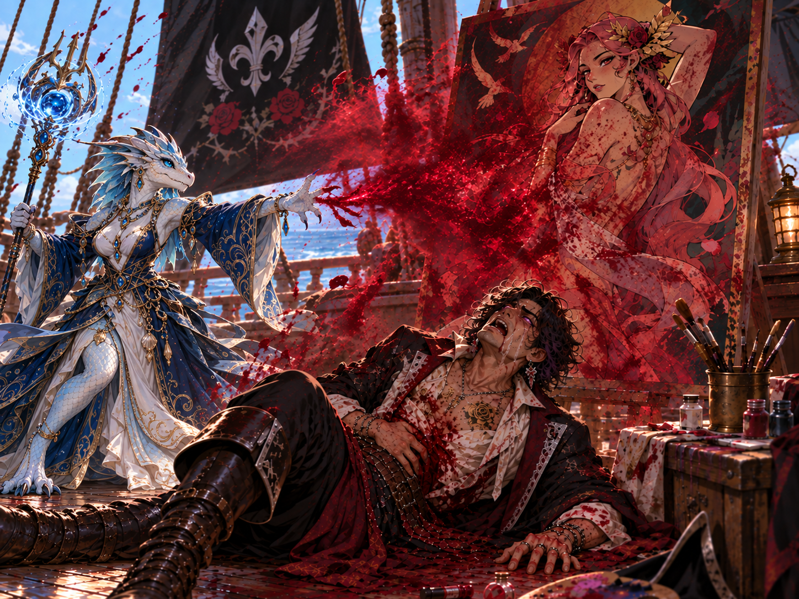

# Post-Culling Intelligence and Rumors

This dossier preserves information received after the Culling began and before
the current campaign endpoint at the Temple of Pyroth. The source did not place
the entries in a complete sequence, so this record does not impose one.

Evidence is kept in four distinct categories:

- **Recovered or witnessed:** treasure found by the party, direct visions, and
  events the party personally encountered.
- **Official:** instructions or declarations attributed to a government or
  other named authority.
- **Attributed intelligence:** claims made by a named source, chiefly Hamlet
  Boarsk.
- **Public report or rumor:** tavern talk, circulating claims, and incomplete or
  conflicting battle reports. These are leads, not automatically confirmed
  facts.

## Recovered artifacts from ocean raiding

- **Echo Blade:** a blade carrying the voices of fallen warriors who guide its
  wielder in battle. The fuller item record identifies it as a +5 sword holding
  more than thirty soul-and-memory echoes.
- **Tiara of the Ancients:** combines ancient wisdom and knowledge with the
  power of love. It grants a magical-girl transformation, immunity to
  mind-affecting effects, and other powers. Every power requires an appropriate
  catchphrase about the power of love.
- **Sapphire of Stubbornness:** a ring that substitutes the wearer's Will save
  for every other saving throw. It also permits running in heavy armor and
  removes armor-based movement reductions, but imposes -10 feet to every
  movement speed and -10 on all physical skill checks.
- **Gamester's Coin:** must be flipped for every skill check made by its owner.
  Heads grants a +25 untyped bonus; tails imposes a -25 penalty.
- **Nebula's Embrace:** an ancient wand combining ancient magic and love to
  protect and heal. It grants a magical-girl transformation and augments
  protection and healing spells. Its owner gains the Merciful Fatal Flaw and
  loses access to the wand for one week if those augmented powers damage a
  living humanoid enemy. Undead, outsiders, oozes, and dragons do not trigger
  that restriction. Spell activation requires a magical-girl catchphrase.
- **Ring of Embers:** adds +3 to every die of fire damage. Its owner cannot cast
  other elemental damage, although sonic, force, and non-elemental spells and
  bombs remain available.
- **Halfhead's Halfblade:** described as the world's strongest dogslicer. Its
  wielder is feared by canines, but horses remain frightening.

## Artifacts recovered from named combatants

| Former holder | Recovered item | Supplied properties |
|---|---|---|
| Declan | Heart of Echidna | Major artifact; full mechanics not supplied |
| Declan | Heart of the Damned | Major artifact; -5 on saves against curses; doubles maximum hit points |
| Sly | Sword of Eris | Major artifact; +5 transforming blade; Mythic Bane, Bane (living), Bane (outsider), and Unholy; Unbreakable, Foe-Biting, and Extra Legendary Power twice |
| Sly | Wanderer's Scarf | Minor artifact, head slot; grants Mythic Dodge, Mobility, and Spring Attack; +10 feet untyped movement; walking on air and water |
| Tremble | Focusing Wand | Major artifact; +1 damage per die for spells cast while held; one additional prepared spell or spell cast per spell level |
| Olive | The Iron Tyrant | Major artifact; cursed adamantine plate armor; further mechanics not supplied |

## The partially claimed Plane of the Apocalypse

The plane is surrounded by fire, lava, and boiling water and contains steam,
fire, and lava elementals as well as unique creatures such as Vadon the Sea
Dragon. Several people are attempting to claim it. Killing Okeanikos is
described as one of the most effective ways to establish a claim.

Outsiders and followers of flame gods are killed on sight. The plane's people
commonly test suspected outsiders by observing whether its environment and
magic harm them. Its fires rapidly exhaust those they injure and eat away at
magic, including dispelling protective effects.

### Pyroth

Pyroth is described as a demigod of Prometheus, a Great Wyrm red dragon, and a
20th-level bloodrager. He is immune to godly fire, while his own fire ignores
godly immunity and resistance; creatures healed by fire remain healed by it.
His fire is claimed to become hot enough to liquefy and then vaporize solid
matter, including stone.

Pyroth is extraordinarily lazy and was not expected to wake for another five
years. Waking him early can trigger a rampage capable of ending small kingdoms.
All of his buffs are believed to have been made permanent so he remains
protected while asleep.

## The Obsidian Key and the Burner's former territory

The Obsidian Key is a long, low island made of an ancient coral reef, shells,
sand, bones, and obsidian. Most of it rises no more than ten feet above sea
level, leaving it highly vulnerable to storms and natural disasters. Its soil
could be fertile because of ancient bones and volcanic ash, but serious
agriculture currently risks severe runoff because the island lacks enough
shrubs and trees.

Its only settlement is **Magorga**, a pirate haven. The island stands amid the
lanes of the Obsidian Pass, forcing most safe regional travel past it. Morrigan
the Burner formerly permitted pirates to hunt passing ships in exchange for
twenty-five percent of all loot and first claim on anything taken.

## Old Nysian political and criminal reports

### Children of Nysia

The Cobras are reported to have disappeared into a new full-scale thieves'
guild called the **Children of Nysia**, or **CoNs**. The guild has adopted
Hermes as its patron, concentrates its theft on the very wealthy, and
distributes food and supplies to homeless and unemployed residents. Its new
guildmaster is known only as **the Mistress**.

As Provisional Mayor of Tradegulf, Demidius received an official first task
from the Senate of Old Nysia: hunt down the CoNs and eliminate the Mistress.
The Senate argues that merchants will return to Tradegulf and Glistria once
confidence in fair government is restored and the guild is removed. This
creates a direct conflict between the guild's reported relief work and the
Senate's reconstruction policy.

### Slavery disclosures and Senate deaths

Public rhetoric now identifies the Maker's Knot as slavers who betrayed
Nysia's founding as a refuge created by escaped Elven and Half-Elven slaves
from the Prathian Empire. The Crafter's Bow is accused of being led by the same
slavers and of preserving Prathian slave operations after Prathia claimed to
have abandoned them.

Numerous senators in Tradegulf, Glistria, and other cities have died in
mysterious accidents over several weeks. A special election was announced.
The CoNs were reportedly mobilizing voters, with rumors that support for
Percalus, Menoesces, Zita, or their allies would be rewarded with a pound of
meat and a loaf of bread for every vote, including repeat voting.

Senators Kore and Agave of Tradegulf reportedly died in a murder-suicide after
a lovers' quarrel. Before her death, Kore allegedly assembled ledgers and
letters proving their corruption and Maker's Knot payments for concealing
slave shipments through Tradegulf harbor. Public talk places them among roughly
thirty senators who recently confessed crimes before dying under suspicious
circumstances.

## Oros, Mathilda, and recruitment for the war

Public reports say Oros of the Blossom has “bloomed again.” His Aevum bounty
was first reported to have risen from 500,000 gp to 2,000,000 gp and later to
3,000,000 gp. Rumor attributes the increase to his attacks on evil nobles, but
does not name confirmed victims.

The Order of the Blossom and Order of Scales are recruiting for Dame Mathilda
and Oros's war against the Dogs of War. Recruits who demonstrate basic weapon
competence are reportedly offered 200 gp up front, which may be sent to their
families, a share of war spoils, and a further 300 gp to their families if they
die. In ruined Tradegulf, the terms are attracting people who see enlistment as
a way to feed and relocate their families.

## Nysian succession and Trazac

Street demonstrations denounce “Luis the Roach,” call for a hero rather than a
loser, and demand that Nysia continue its recent tradition of queens. A growing
movement wants Prince Luis passed over. Royal supporters defend his right to
rule or redirect support toward the youngest princess, **Victoria**, described
as a low-level cleric of Hestia.

Other factions support **Princess Stella**, absent from court for years and
removed from the succession after taking control of the Night Knights and
redirecting them away from domestic zealotry. Stella claimed the Sword of
Guydessucles and Kyra from the New Gods-aligned branch of the Hellknights,
declared herself Kyra's heir, and ordered both the Order of Guydessucles and the
Night Knights to focus solely on Tartarus's forces and the Nightmare Lords on
Trazac. Stella characterized this as directing dangerous zealots toward targets
that would not harm civilians; Queen Lidda regarded it as the destruction of a
lawful stabilizing force.

The barrier around Trazac has now fallen and demons are loose. One account says
the Dogs of War attacked the Order of Guydessucles and the other defenders who
maintained it. Another says the attack was a distraction while someone used a
strange key-like artifact to open the barrier.

## Aevum succession and approaching weather

The Queen of Aevum, also described as the overall Queen of Nysia, is reported
dead without a clear heir. Her nephew **Morris**, leader of the Knights of
Aevum and a Culling-eligible warrior, emerged as the frontrunner. He was then
found dead, riddled with arrows and buried in a ditch beneath wildflowers.

Heavy rain was expected within weeks. The report described a storm as brewing,
but did not establish whether that wording was mundane, prophetic, or both.

## Wider Culling and war reports

- The Prathian Empire and the “Republic” of Lodingen are mustering troops and
  ships for an announced invasion of the Isles of Berres.
- A fleet from Salleria, home of the Titans, has been seen sailing toward the
  Isles.
- Achilles, Wavelord Santiago, Rosalind Galeheart, Apollo, Artemis, and Smokey
  Roberts reportedly fought a free-for-all. One report says Achilles defeated
  and killed Apollo after someone protected Achilles from arrows. A later
  account says Rosalind charmed Apollo, Achilles stabbed him in the back,
  Artemis mortally wounded Achilles, and Achilles died but resurrected.
  Rosalind then killed Artemis, but not before Artemis killed Smokey; Smokey
  also resurrected. The competing reports remain unresolved.
- Champions of Atlas and Kronos invaded Hoterra from Salleria and conquered
  the continent's southern shore.
- Yalta and Yusia entered open warfare among their city-states.
- Several Titans in avatar form came to Ithaca, capital of Cypress, to call out
  Odysseus. When he did not answer, they fought other Culling-eligible people
  in the city. One combatant died and failed to resurrect. Ithaca was destroyed
  and only about 15,000 people—approximately twenty percent of its
  population—survived.

## Maarin's new Dark Prophecy

Maarin heard metal striking stone and saw a crazed sea elf with a dark,
smoking beard wearing a sealed full-body suit while mining prismatic rock on a
small island. Other suited miners worked nearby. A flying shard cut one
miner's suit; within about sixty seconds the victim developed boils and
lesions and the skin slid from their face. The sea elf, recognized as Smokey
Roberts, ordered everyone back to work.

The vision shifted to a small laboratory where Smokey smelted the prismatic
ore. He grew increasingly gaunt as boils and lesions appeared. In the final
scene, he forged **thirteen bullets** glowing with ominous green light. Smokey
appeared to have aged at least fifty years and looked leprous, yet was more
terrifying than ever.

This is the newest supplied post-Culling Dark Prophecy. The existing record
numbers the Okeanikos, Filius, and Necropolis visions second through fourth and
leaves Maarin's actual first unrecorded; this vision's ordinal remains pending
explicit confirmation rather than being inferred here.

## Hamlet Boarsk debrief

After defeating the Ash Prophet, the party hired his follower Hamlet Boarsk.
The following claims are attributed to Hamlet after the party ordered him to
tell them everything and filtered out irrelevant material.

### Ash Prophet aftermath

The Ash Prophet was defeated, but one clone escaped. The party accidentally
killed one experiment and saved another: **Dom**, a son of the Ash Prophet who
also carries genes from Fel. Dom has human features, a strong build, and looks
about nineteen. His skin consists of small reflective blue and red scales;
he has jewel-red eyes and pointed dragon teeth. He regards Demidius as his
father and emperor, and Demidius named him.

### Bluebeard and the Burner

- Hamlet considered Bluebeard his favorite employer and worked with him for
  almost twenty years.
- Hamlet says Bluebeard was originally a one-eighth godling of a minor sea god,
  then captured a demigod of Hermes and paid a ritualist to transfer that
  bloodline to himself. Bluebeard killed both the captive demigod and the
  ritualist. He spared Hamlet because of their friendship, on condition that
  Hamlet leave his territory and never reveal the secret.
- Hamlet later worked for Morrigan the Burner as Bluebeard's double agent.
  Bluebeard continued paying him; Hamlet never signed the Burner's contract and
  used that distinction to justify betraying her.

### Safeguards, contracts, and intelligence

- Hamlet has an ioun-stone fragment surgically implanted with a high-powered
  *break enchantment* contingency. It triggers after an enchantment lasts more
  than twenty-four hours or if the stone is surgically removed. He believes
  *mage's disjunction* would probably destroy it without triggering, while also
  breaking the enchantment.
- Apollo was Hamlet's second-favorite employer. Apollo hired him to kill Declan
  and paid him with the two swords Hamlet carries. Hamlet failed because
  Rosalind Galeheart possessed him for several years.
- Hamlet can identify nine businesses across Lodingen, Nysia, and Prathia that
  Smokey Roberts owns and knows the roosts of three regional dragons.
- Hamlet estimates that he personally killed more than 15,000 people in over
  sixty years as a mercenary and later admitted that this probably understates
  the total by several thousand.

### Pyroth, the Burner's capitals, and unusual islands

- Hamlet once survived Pyroth by using an artifact amulet that can grant
  immunity to one chosen being's godly powers each day, locked to that choice
  for twenty-four hours. He selected Pyroth and played dead after surviving the
  dragon's godly breath. Hamlet later sold the amulet to the party. They used
  it in a ritual that made the entire group immune to Pyroth's power; whether
  the ritual consumed or changed the amulet remains unrecorded.
- The Burner's current capital is **Torgus** on Burner's Isle. Her territory's
  original capital was **Blackflag Reach**, a fortified city and keep used by
  the previous regents. Morrigan destroyed most nearby settlements and moved
  to Torgus because she considered it more entertaining.
- On **Treasure Island**, 100,000 gp disappears from each visitor upon arrival.
  Better treasure lies deeper in its maze. Hamlet found his anti-Pyroth amulet
  there. Entry is permitted only once every fifty years; he has entered twice.
- At the **Sapphire Sanctuary**, rumored to have powdered-sapphire sand, Hamlet
  met Lotus Eaters, attended a party, and awoke on a raft miles offshore three
  months later with little memory of the interval.

### Hamlet's carried wealth

Hamlet expressed gratitude that the party did not rob him. He carried the
artifact amulet, two +10 swords, +10 armor, a +7 cloak of resistance, a +8 belt
of physical perfection, a +6 headband of mental superiority, a +6 ring of
natural armor, a combined +6 ring of evasion and force shield, and a type II
bag of holding containing 500 pounds of platinum bars valued at 250,000 gp.
His friends called him **Ham the Piggy Bank**.

## Confirmed sequence after Pyroth

*Canonical illustration of Demidius's response to his grandmother's death.*

Unlike most reports in this dossier, the following order was supplied
explicitly:

1. The party defeated Pyroth.
2. Before departing, Demidius used his Horn of Resnik artifact to resurrect
   the dead Apollo.
3. Theseus and his fleet found the party and pursued them.
4. The party used boons to escape and to bring away the lost *Dawnrunner* and
   a captured ship it was towing.
5. The party warned Oros about Theseus. Oros said he would deal with the threat
   and directed the party to reach safety, after which they beached on an
   island.
6. Oros alerted the New Gods that several Culling-eligible demigods were in the
   area. Theseus was accompanied by eligible demigods of Aphrodite and Poseidon,
   who came to defend them when the New Gods attacked.
7. Demidius painted the war as the gods fought. Aphrodite's arrival filled him
   with a great rapture, and he began painting her.
8. Poseidon was wounded and fled. Aphrodite was smote and faded from existence;
   the supplied account states that she is gone permanently.
9. When Aphrodite died, Demidius collapsed in horror that his grandmother was
   dead.

The specific boons spent, identity of the captured ship, island, combatants,
and being who dealt the final blow to Aphrodite remain unrecorded.

## Philomela's attack after Aphrodite's death

Philomela was the woman who raised Demidius and whom he believed to be his mother. She was actually a Hellknight assassin assigned to kill him if he became too powerful. Aphrodite enchanted her to free Demidius and care for him. When Aphrodite died, that control ended and Philomela moved to kill him. The attack would have killed Demidius, but his *heal* contingency saved him. Aristea then killed Philomela with a bloody sneak attack. Demidius's biological mother remains unidentified.

## Demidius's aftermath

After the attack, Demidius screamed and laughed in abject horror for hours.
He has since been oddly calm. He placed his painting of Aphrodite, stained
with his own blood and Philomela's, in a prominent place aboard the ship.
He has been spending extra time with Dom and Aristea, obsessively teaching
Dom and showing Aristea his love.

## Chronology boundary

*Supplied illustration of the counterattack: Demidius's heal contingency saved
him, and Aristea killed Philomela with a sneak attack.*

All entries belong to the period beginning with the current Culling and ending
at or before the latest supplied campaign state. The sequence above is ordered;
the relative order among most earlier entries, the dates of rumor transmission,
and which public reports have since been confirmed remain open.
