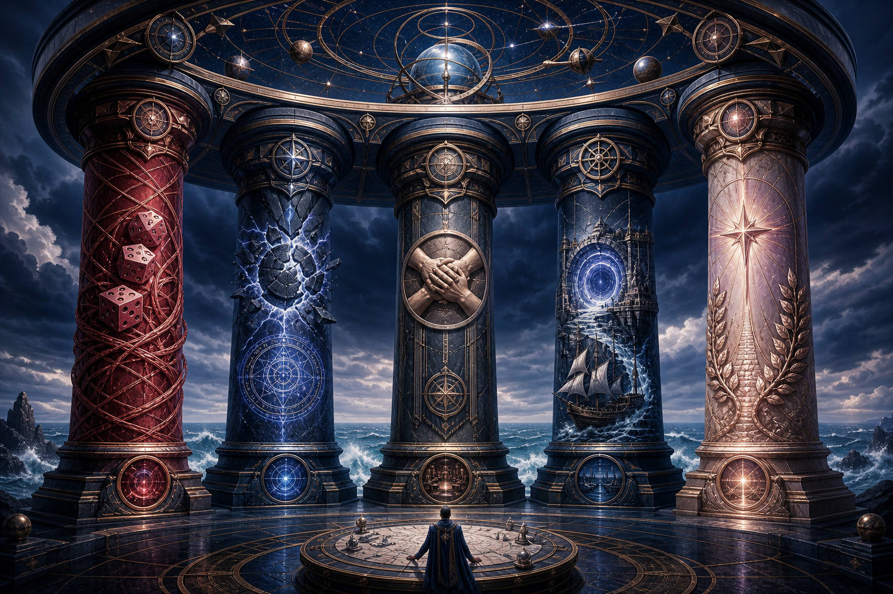

# The Five Pillars of Demidius

> Demidius does not win by overwhelming force. He wins by shaping probability, controlling magic, commanding influence, preparing infrastructure, and growing into divinity.

Every major option, artifact, spell, divine ability, and campaign asset should strengthen one or more of these pillars.

## Pillar I — Probability

**Doctrine:** Control the die.

Demidius spends probability resources only on rolls that materially alter the encounter or campaign. The core tools are Seven-Pipped Gem, Fortune's Child, Fate's Favored, Make Your Own Luck, the luckstone, Invoke Deity (Luck), rerolls, and post-roll modifiers.

Primary engine: [Probability Engine](../engines/01_PROBABILITY_ENGINE.md)

## Pillar II — Magical Supremacy

**Doctrine:** Decide whose magic works.

Demidius removes protections, counters recovery, pierces resistance, and follows with control or enchantment after defenses fall.

Primary engine: [Magical Supremacy Engine](../engines/02_MAGICAL_SUPREMACY_ENGINE.md)

## Pillar III — Influence

**Doctrine:** Build trust, organizations, and authority.

Charisma, Epic Leadership, the Dawnrunner, political alliances, social magic, and loyal companions turn Demidius into a campaign-scale actor.

Primary engine: [Influence Engine](../engines/03_INFLUENCE_ENGINE.md)

## Pillar IV — Infrastructure

**Doctrine:** Control the conditions before combat begins.

The inherited demiplane, Key of Daedalus, Dawnrunner, permanent gates, time manipulation, logistics, and secure recovery determine where and how the party operates.

Primary engine: [Infrastructure Engine](../engines/04_INFRASTRUCTURE_ENGINE.md)

## Pillar V — Divinity

**Doctrine:** Grow toward apotheosis without losing the character's moral center.

Hermes's gifts, custom divine abilities, mythic progression, legendary-item development, divine relationships, and Fatal Flaws all belong here.

Primary engine: [Divine Progression Engine](../engines/05_DIVINE_PROGRESSION_ENGINE.md)

## Pillar impact scale

| Score | Meaning |
|---:|---|
| 0 | No meaningful support |
| 1 | Incidental support |
| 2 | Useful secondary support |
| 3 | Strong support |
| 4 | Major support |
| 5 | Defining contribution |

## Current signature assets

| Asset | Probability | Magical Supremacy | Influence | Infrastructure | Divinity |
|---|---:|---:|---:|---:|---:|
| Seven-Pipped Gem | 5 | 4 | 1 | 0 | 5 |
| Eyebrow Piercing of Confidence | 4 | 4 | 5 | 0 | 5 |
| Hermes's Boots of Speed | 1 | 5 | 0 | 0 | 5 |
| Key of Daedalus | 0 | 2 | 1 | 5 | 4 |
| Glasses of Beaumont | 1 | 4 | 5 | 2 | 4 |
| Inherited Demiplane | 0 | 1 | 4 | 5 | 4 |
| Deck of Many Things | 5 | 1 | 1 | 1 | 4 |
