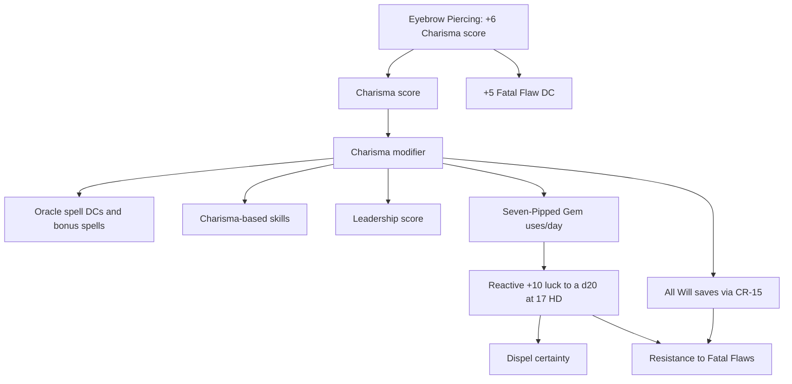

# Charisma Dependency Map

## Core principle

For Demidius, Charisma is infrastructure rather than merely a spellcasting score. It simultaneously powers offense, defense, daily resources, social authority, Leadership, and resistance to Fatal Flaws.

## Direct dependencies

| System | Charisma contribution | Verification |
|---|---|---|
| Oracle spellcasting | Spell save DCs, bonus spells, and class-feature scaling where specified | Character chassis |
| Charisma skills | Bluff, Diplomacy, Intimidate, Use Magic Device, and other Charisma-based checks | Core rules |
| Leadership | Adds to Leadership score and therefore cohort/follower capacity | CR-12 |
| Seven-Pipped Gem | Daily uses equal Demidius's Charisma bonus | CR-05 |
| Will saves | Full Charisma modifier applies to all Will saves through Steadfast Personality | CR-15 |
| Fatal Flaw resistance | Will saves against DC `25 + caster level` use the Charisma-enhanced Will save | CR-15, CR-16 |

## Legendary-item multiplier

### Eyebrow Piercing of Confidence

The legendary item grants a **+6 luck bonus to the Charisma score** after CR-01 and CR-02. A +6 increase to an ability score ordinarily raises its modifier by **+3**.

That +3 modifier then propagates to:

- Oracle spell DCs.
- Bonus spells where the new score crosses a threshold.
- Charisma-based skills.
- Leadership score.
- Seven-Pipped Gem uses per day.
- All Will saves through CR-15.
- Fatal Flaw saves through CR-16.

The item also increases Fatal Flaw DCs by 5, creating a deliberate tension: it improves the Will-save engine through Charisma while simultaneously raising the target DC.

## Dependency graph

## Mechanical return on investment

| Investment | Systems materially improved | Demidius ROI |
|---|---:|---|
| +2 Charisma score | Spell DCs, potential bonus spells, skills, Leadership, Gem uses at threshold, Will saves | Exceptional |
| +1 caster level | Dispel checks, level-dependent spell effects, Fatal Flaw DC also rises by 1 | High but double-edged |
| +1 spell DC | One offensive subsystem | Moderate |
| +1 AC | One defensive subsystem | Narrow |

## Optimization doctrine

When two options are otherwise comparable, prefer the option that raises Charisma or increases the value of Charisma. Exceptions include effects that directly improve action economy, guarantee a critical dispel, or solve an immunity that Charisma cannot overcome.

## Important precision

A bonus to the **Charisma score** is not itself a bonus to every Charisma-linked roll. Convert the score increase into its resulting ability modifier before calculating downstream effects. The current +6 score bonus from the Eyebrow Piercing produces a +3 Charisma modifier increase.
