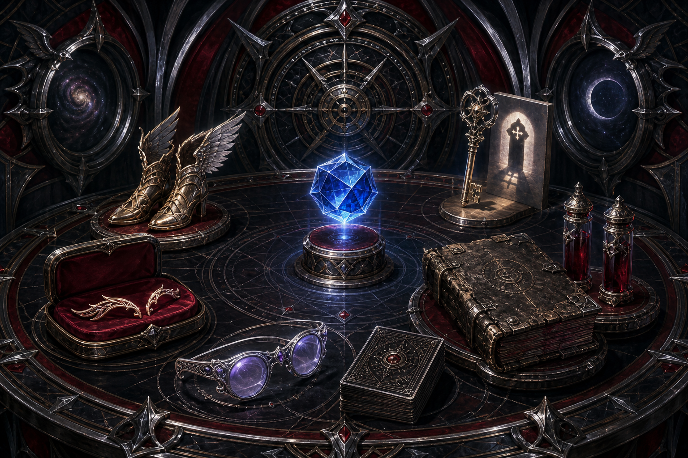

# Artifacts and Divine Gifts

Demidius's signature possessions are not a conventional equipment list. They are relationships, strategic capabilities, and permanent risks expressed as objects or divine abilities.

## At a glance

| Asset | Origin | Defining capability | Enduring concern |
|---|---|---|---|
| Seven-Pipped Gem | Hermes's custom divine progression | Post-roll luck on any d20 roll | Immediate-action timing and limited daily uses |
| Eyebrow Piercing of Confidence | Legendary item | Raises mental ability scores through luck | Also raises Fatal Flaw DCs by 5 |
| Hermes's Boots of Speed | Gift from Hermes | Free-action quickening and a daily +5 spell DC | Must be reserved for encounter-defining spells |
| Key of Daedalus | Campaign artifact | Universal unlocking and planar corridors | Permanent Paranoia; corridors remain open |
| Glasses of Beaumont | Gift from Queen Beaumont | Alignment revelation and *true seeing* | Limited uses require prioritization |
| Deck of Many Things | Standard Pathfinder major artifact | Extreme, reality-altering variance | Untouched for good reason |

## Seven-Pipped Gem

Despite its name and visual form, the Seven-Pipped Gem is a **divine ability**, not an artifact. At 17 Hit Dice it grants +8 luck to an ordinary d20 roll, increased to +10 by Fortune's Child and Fate's Favored. Gambling and Sleight of Hand instead receive +17, increased to +19. It may be used after seeing the die and before the outcome is announced.

Its governing doctrine is simple: spend certainty only where failure matters.

## Eyebrow Piercing of Confidence

Demidius's legendary item grants a +4 luck bonus to Intelligence, Wisdom, and Charisma, increased to +6 by the campaign's luck rulings. This single item strengthens spellcasting, social authority, Leadership, Will saves, and divine-resource capacity.

It also increases the DC of every Fatal Flaw by 5. The item embodies the campaign's central bargain: greater divine capacity brings more demanding divine consequences.

## Hermes's Boots of Speed

Hermes's gift can quicken a spell as a free action three times per day and add +5 to the save DC of one spell once per day. The free-action wording is crucial because it preserves Demidius's swift action. The DC increase belongs on a spell that can decide the encounter, after immunities and protections have been checked or removed.

## Key of Daedalus

The brass key can open any mundane or magical lock as a full-round action; godly magical locks require a spell-penetration check. Three times per day it creates an extradimensional corridor to a previously visited plane and location. A corridor lasts one week and is not selective: anyone or anything can use it.

The key also makes its wielder immune to *maze* and grants mastery over exits within the Labyrinth. Its first use permanently gave Demidius the Paranoia Fatal Flaw. Operationally, every corridor is both a route and a temporary breach that needs observation, access control, and a closure plan.

## Glasses of Beaumont

Queen Lidda Beaumont of Nysia gifted these glasses after killing Ares during the Culling. Three times per day they reveal a creature's alignment unerringly, and three times per day they provide *true seeing*.

Their real value is information superiority. They are useful in divine politics, negotiations, investigations, and encounters involving illusion, invisibility, shapechanging, or magical disguise.

## Deck of Many Things

Demidius holds an untouched standard Pathfinder Deck of Many Things. No one has drawn from it. The Deck is a usable strategic reserve, but it is the inverse of Demidius's normal doctrine: it introduces enormous variance rather than controlling it. It should remain a last-resort campaign decision, never casual equipment.

## Canonical entries

- [Artifact Compendium](../codex/ARTIFACT_COMPENDIUM.md)
- [Seven-Pipped Gem](../systems/divine_abilities/SEVEN_PIPPED_GEM.md)
- [Key of Daedalus](../systems/artifacts/KEY_OF_DAEDALUS.md)
- [Hermes's Boots of Speed](../systems/artifacts/HERMES_BOOTS_OF_SPEED.md)
- [Glasses of Beaumont](../systems/artifacts/GLASSES_OF_BEAUMONT.md)
- [Eyebrow Piercing of Confidence](../systems/artifacts/EYEBROW_PIERCING_OF_CONFIDENCE.md)
- [Deck of Many Things](../systems/artifacts/DECK_OF_MANY_THINGS.md)
