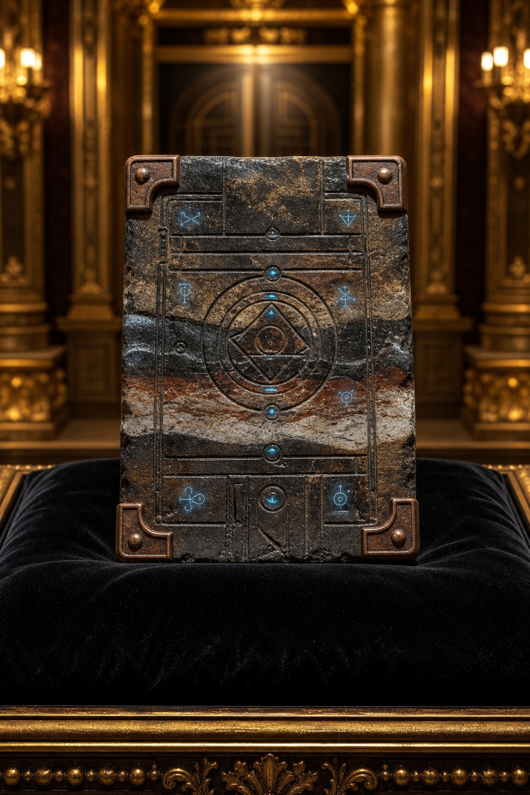

# Bawery Slab

Sold for **200,000 gp**. The first word is transcription-sensitive. The
portrait is interpretive; material, inscriptions, powers, buyer, and current
owner remain unknown.

[Catalog](index.md) · [Auction](../../events/grand-artifact-auction.md)
