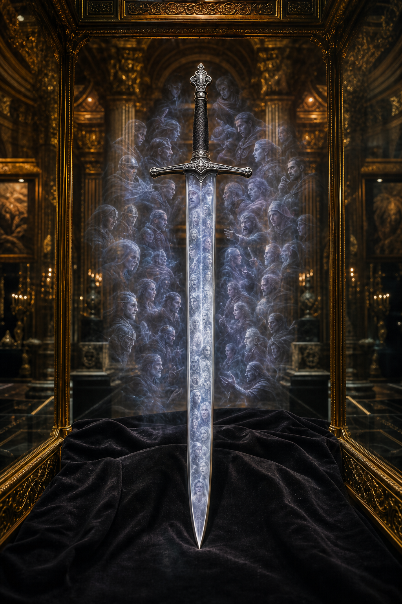

# Echo Blade

Sold for **200,000 gp**.

The Echo Blade is a **+5 sword** containing echoes of the souls and memories of
more than thirty former wielders. Its current wielder ignores attack-roll
penalties voluntarily accepted to gain additional power, including the penalty
from **Power Attack**.

The benefit comes with a persistent drawback. The many echoes do not always
agree, and they may argue loudly or scorn the current wielder. Their
interference imposes a **−10 penalty on the wielder's Perception checks**.

Its exact weapon type, seller, buyer, and current owner remain unknown. The
portrait visualizes preserved soul-memories rather than a sonic effect.

[Catalog](index.md) · [Auction](../../events/grand-artifact-auction.md)
