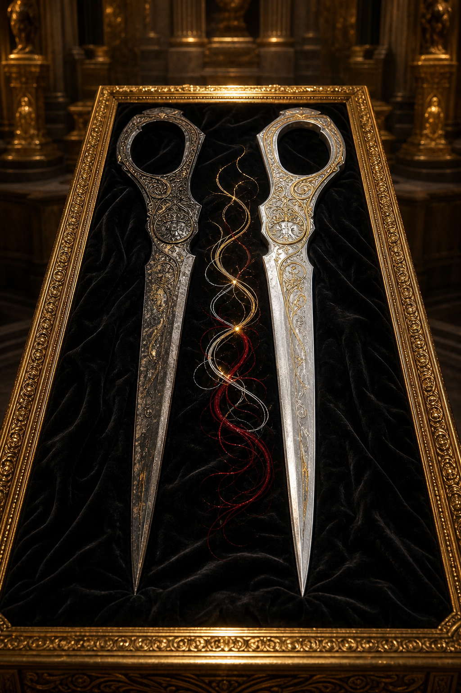

# Fate's Sword

Fate's Sword was once the **Scissors of the Fates**. Its known half sold for
**450,000 gp**. A second half, long thought lost, appeared later and sold for
**1,500,000 gp**, its recovery driving the price dramatically higher. The
record does not say who bought either half or whether they have been rejoined.
The portrait is interpretive and establishes no mechanics.

[Catalog](index.md) · [Auction](../../events/grand-artifact-auction.md)
