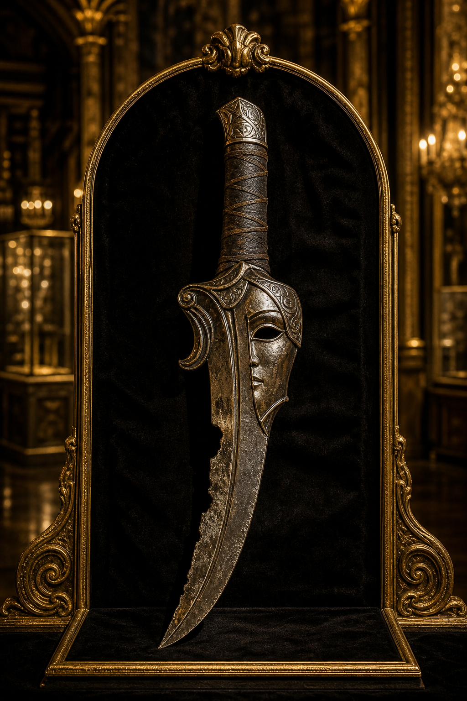

# Halfhead's Halfblade

Sold for **250,000 gp**. The handwritten name is slightly uncertain. The
portrait is interpretive; its appearance, completeness, powers, buyer, and
current owner remain unknown.

[Catalog](index.md) · [Auction](../../events/grand-artifact-auction.md)
