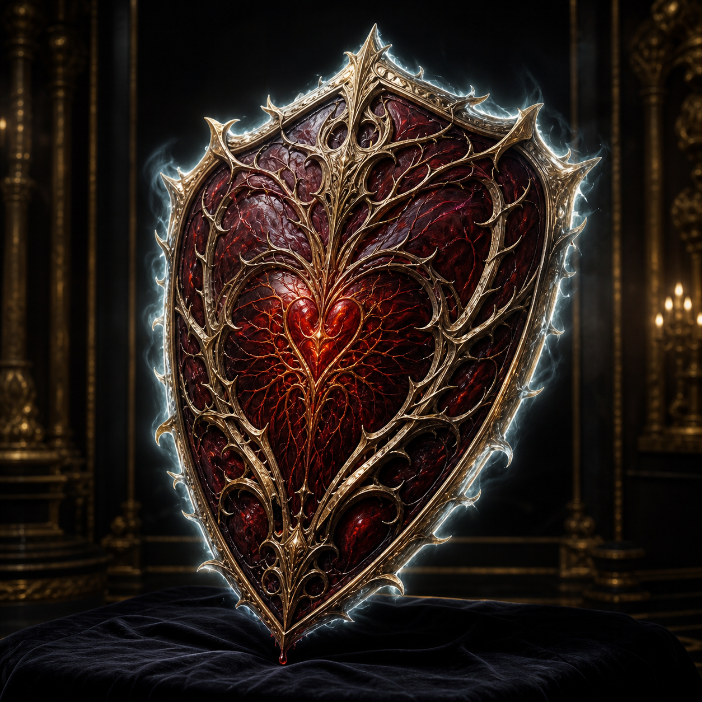

# Heartthorn Ward

Sold for **300,000 gp**. This willingly gifted living-heart shield is a **+5
heavy shield** with **Ghost Touch** and a **+10 sacred bonus against evil**.
The wielder takes double bleed damage and suffers 1 bleed while within 60 feet
of evil outsiders; healing stops that bleed. The exact target of the sacred
bonus and the phrase “shatter an evil” remain unresolved.

[Catalog](index.md) · [Auction](../../events/grand-artifact-auction.md)
