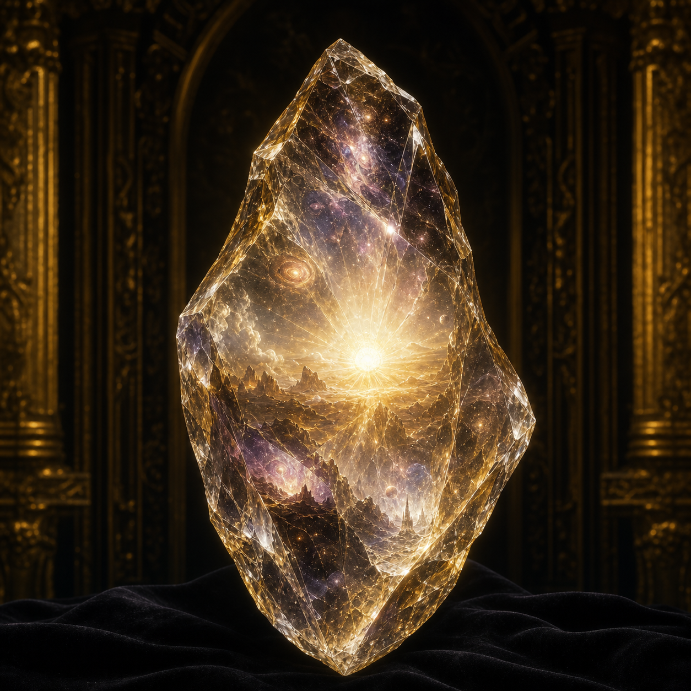

# Auction Artifact Catalog

This catalog mirrors the dedicated wiki entries for every named lot in the
[Grand Artifact Auction](../../events/grand-artifact-auction.md). Portraits of
artifacts without a confirmed appearance are interpretive visualizations, not
new mechanical canon.

| Artifact | Recorded price |
|---|---:|
| [Heartthorn Ward](heartthorn-ward.md) | 300,000 gp |
| [The Shard of First Light](shard-of-first-light.md) | 750,000 gp |
| [Rivenheart Crown](rivenheart-crown.md) | 150,000 gp from bundle |
| [Shard of the Shield of Ajax](shard-of-the-shield-of-ajax.md) | 200,000 gp |
| [Tiara of Decay](tiara-of-decay.md) | 1,000,000 gp |
| [Fate's Sword](fates-sword.md) | 450,000 gp and 1,500,000 gp |
| [Echo Blade](echo-blade.md) | 200,000 gp |
| [Halfhead's Halfblade](halfheads-halfblade.md) | 250,000 gp |
| [Horn of Resnik](horn-of-resnik.md) | 450,000 gp |
| [Grimoire of Honesty](grimoire-of-honesty.md) | 700,000 gp |
| [Aethereal Crown](aethereal-crown.md) | 650,000 gp |
| [Ichor of Virility](ichor-of-virility.md) | 2,300,000 gp |
| [Rod of Mending](rod-of-mending.md) | 300,000 gp |
| [Arch of Persecution](arch-of-persecution.md) | 250,000 gp |
| [Bawery Slab](bawery-slab.md) | 200,000 gp |
| [Grimoire of Doom](grimoire-of-doom.md) | 275,000 gp |
| [Gauntlet of Sentience](gauntlet-of-sentience.md) | 200,000 gp |
| [Ichor of Chaos](ichor-of-chaos.md) | 6,500,000 gp |
| [Obsidian Bracelet](obsidian-bracelet.md) | Not listed |
| [Lifeblood Tome](lifeblood-tome.md) | Not listed |
