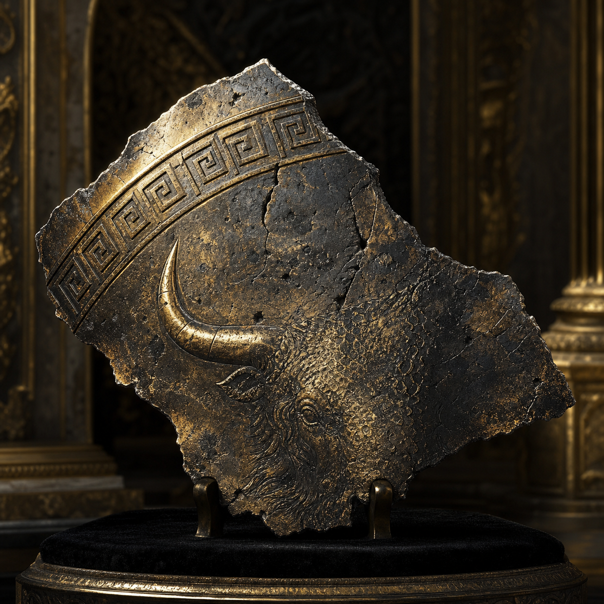

# Shard of the Shield of Ajax

Sold for **200,000 gp**.

Campaign tradition identifies the complete shield as **Rhos Aias**, the
Shield of Ajax the Great. It was reportedly broken into **eight pieces** that
became part of Echidna's lost hoard and were entrusted to Echidna and her many
children.

The auctioned object was presented as one such shard. Its price is confirmed,
but its authenticity, place among the eight pieces, powers, buyer, and current
owner remain unknown. The portrait is interpretive.

[Catalog](index.md) · [Auction](../../events/grand-artifact-auction.md)
