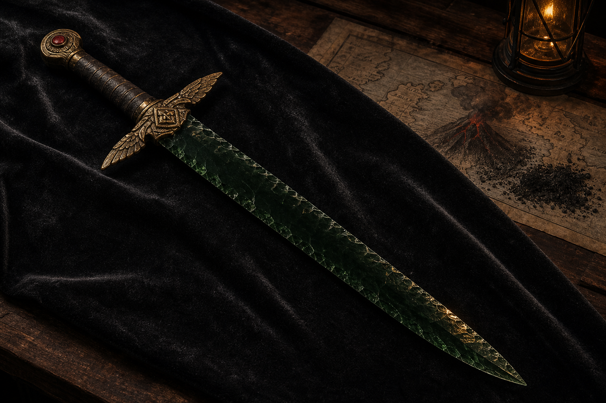

# The Ember Blade

The Ember Blade is a named green-obsidian sword rumored to originate on
Volcaris. Ulaa, the grippli cleric of Hermes, stole it years before the
campaign at Hermes's direction and later gave it to the party as thanks for
freeing and helping his people.

Its current bearer, former owner, exact magical powers, enhancement bonus, and
artifact classification are not recorded. The name alone does not establish
fire powers.

Status: Canon supplied by the user on 2026-07-28; visual hilt and blade details
are interpretive.
