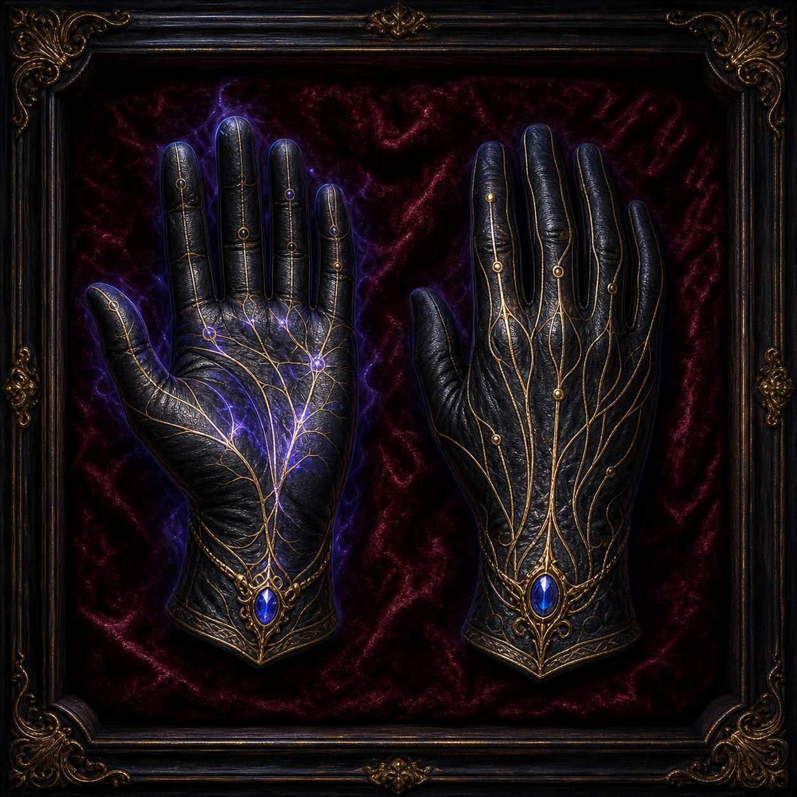

# Gloves of Sense Vitals

The Gloves of Sense Vitals are a CL 15 minor divination artifact worn by
Aristea. While equipped, they grant **+5d6 sneak attack damage**.

On the recorded sheet that showed +6d6 sneak attack, the gloves raised
Aristea's actual total to +11d6 while worn.

Their price, creator, origin, destruction method, and any additional powers are
unknown.
