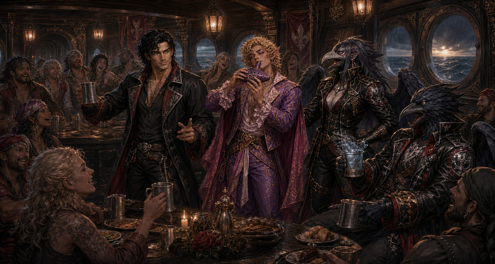

# The Ballad of the Dawnrunner

**Type:** Sea shanty of the Dawnrunner crew
**Associated vessel:** [Dawnrunner](dawnrunner.md)
**Notable voices:** Roy, Demidius Thorne, and the ship's company

*The Ballad of the Dawnrunner* is an affectionate crew song about the people
who made the galleon a home. Like any proper shanty, it mixes remembered events,
private jokes, heroic exaggeration, and just enough truth to embarrass everyone
named in it. Its refrain promises a place aboard for anyone willing to hold the
line, while its recurring watered-wine joke commemorates Zujuck's unfortunate
effect on nearby alcohol.

## Verse I

> Oh the Dawnrunner cuts through the morning foam,
> With a black-coated captain far from home,
> Demidius stares where the starwinds run,
> Still chased by gods and the rising sun!
>
> And Roy cries loud with a silver grin,
> "Come warm yourselves, let the voyage begin!"
> Though half his tales are outrageous lies,
> You'd trust the man with your very life!

## Chorus

> Heave away, boys, the Dawnrunner flies!
> Under storm-dark seas and silver skies!
> From pirate kings to the lightning squall,
> There's a place aboard for one and all!
>
> Hoist the sail and hold the line!
> Pass the stew and watered wine!
> For the gods may curse and kingdoms fall,
> But the Dawnrunner sails through all!

## Verse II

> Now Lilly shouts from the rigging high,
> Keeping the whole damned ship alive,
> While Zujuck laughs in the crow's nest breeze,
> Turning every last rum keg into seas!
>
> "Your fault!" he cries to his sister below,
> As another fine whiskey begins to flow
> Straight into water before his eyes—
> And the whole crew howls at his surprise!

## Verse III

> Aristea walks where the engine hums,
> With frost-blue eyes and arcane sums,
> The hull itself seems half alive,
> By sea-god wisdom the ship survives.
>
> And Rurd downstairs in the workshop glows,
> Testing inventions no sane man knows,
> Till Erika storms in covered in soot:
> "IF THIS SHIP BURNS I'LL COOK YOU FOOT!"

## Chorus

> Heave away, boys, the Dawnrunner flies!
> Under storm-dark seas and silver skies!
> From slaver flames to the harbor wall,
> There's a place aboard for one and all!
>
> Hoist the sail and hold the line!
> Pass the stew and watered wine!
> For the gods may curse and kingdoms fall,
> But the Dawnrunner sails through all!

## Verse IV

> There's Alecia singing the wounded whole,
> While Unni plays with heart and soul,
> Though she gives her silver all away,
> Still every port knows her songs today.
>
> And Shas stands watch by the cargo bay,
> Guarding merchants night and day,
> While Zel speaks freedom to every shore,
> Till the dockhands all demand much more!

## Verse V

> Now Matthias swears by Artemis fair,
> "I was once a badger!" he'll loudly declare,
> And Jenqa grins with her dagger green:
> "Pirates won't trouble these seas again."
>
> While Bix walks laughing the lantern hall,
> Knowing every sailor aboard by call,
> Red eye blazing and blue eye bright,
> Dancing with his love each harbor night.

## Final Chorus

> Heave away, boys, the Dawnrunner flies!
> Past ancient gods and cursed skies!
> Through wrathful storms and cannon call,
> There's a place aboard for one and all!
>
> Raise your cup—though it turns to brine!
> Sing your songs and hold the line!
> For while the stars still crown the foam,
> The Dawnrunner carries her people home!
