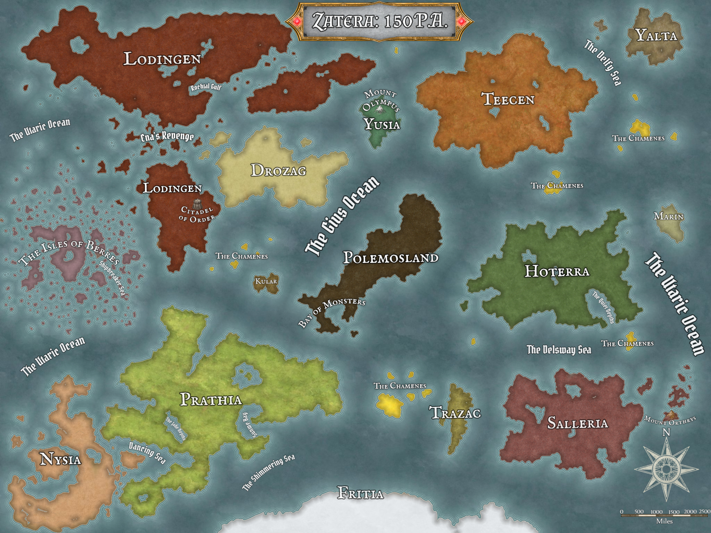
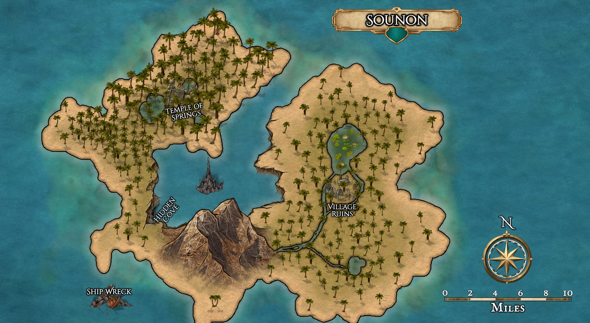
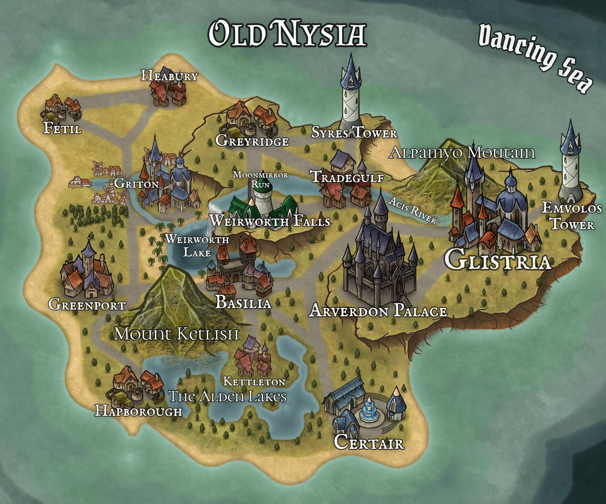

# The Arrival — Campaign Setting

## Zatera in 150 P.A.

**The Arrival** takes place on **Zatera** in **150 P.A.**, approximately one hundred years after the previous campaign. P.A. means **Post-Arrival**, but the identity of the calendar's Arrival is disputed. It may refer to Fel, a primordial dragon from the Outer Realms, arriving in Zatera, or to Cronus being freed from the Underworld. Cronus's release caused the divine schism, but the record does not prove that the schism began the calendar.

The intervening century saw the rise of new pantheons, the Lodingen Republic become the Lodingen Empire, the fall of the Fye Empire, the rise of Nysia as a semi-constitutional monarchy, and the expansion of the Isles of Berres.

The world map records Lodingen, Drozag, Yusia and Mount Olympus, Teecen, Yalta, Polemosland, Hoterra, Prathia, Nysia, Trazac, Salleria, Fritia, the Isles of Berres, and several Chamenes archipelagos. Its ocean-scale features include the Utaric and Guis oceans, Shipbreaker, Dancing, and Shimmering seas, and the Bay of Monsters.

## The Isles of Berres and the Shipbreaker Sea

Motu Leilani, the Heavenly Island, is a secluded island deep within the Isles and the childhood home of Demidius Thorne. The Tagata Fetu sheltered Demidius and his mother Philomela there after their escape from Lodingen. Its precise location and navigation route remain unrecorded.

Poseidon is patron of the Isles. Approximately five hundred years ago, he cursed the Shipbreaker Sea so ordinary compasses and navigational tools fail. Clouds cover the stars and moon every night, preventing conventional nighttime celestial navigation.

The Scepter of Keto can bypass this navigation spell. The heroes obtained its final required component during an operation at Stormspire, although its present assembly, custody, activation, and limits have not yet been recorded.

Poseidon created fourteen **Wayfinders** that function despite the curse. At the campaign's start, each of the seven Pirate Kings and Queens and each ruler's second-in-command held one. Passage out of the Isles from the unnamed capital costs roughly 25,000–50,000 gp per person.

Sailors without a Wayfinder use landmark maps, line-of-sight island hopping, instinctive or supernatural navigation, and outpost lanes whose anchored ships or floating communities lie within a day's sail. Independent and rival-controlled outposts are frequent pirate targets.

The curse has isolated many islands for more than 150 years, allowing distinct cultures, languages, communities, myths, and legends to develop.

## The Council of Seven

The seven Pirate Kings and Queens at the campaign's start were:

1. Sea Serpent Declan.
2. Smokey Roberts (Jack Roberts).
3. Bloody Anne (Anne Read).
4. Bluebeard the Valiant.
5. Rosalind Galeheart, the Rose of the Sea.
6. Wavelord Santiago.
7. Morrigan “the Burner” Crossfire.

Declan's death leaves six active council members. The heroes hold his Wayfinder and therefore possess both a navigation asset and a politically significant succession token.

## Sounon and the Sunlit Chain

The campaign began on an unidentified island now known as **Sounon**, within Declan's former domain, the **Sunlit Chain**. Demidius's and Maarin's crews intend to make Sounon their shared home.

Sounon's local map identifies the Temple of Springs, Hidden Cove, Village Ruins, and an offshore shipwreck. The regional map places Sounon near Caldoran, Ironclaw Isle, Volcara Isle, Rylkora, and numerous smaller islands, reefs, coves, and settlements.

The Chain's solar geography includes Helios' Gift, the Sunspike, Sunspike Cove, Heliospire, Solaris, and Sunhaven Isle. These names support Maarin's belief that Dame Mathilda—a level-50 paladin of Apollo who refused godhood and possesses the Sword of Helios—is uniquely suited to succeed Declan.

Maarin proposes that the heroes abdicate their claim, give Declan's Wayfinder to Mathilda, and appoint Aelwyn as her second. Aelwyn is a recognized regional folk hero. The transfer and appointment remain proposals.

## Old Nysia and Tradegulf

The Old Nysia map places Tradegulf east of Greyridge, north of Weirworth Falls, and west of the Acis River corridor toward Glistria. Queen Lidda Beaumont rules Nysia from Arverdon Palace. Other sites include Syrens Tower, Emvolos Tower, Griton, Weirworth, Basilia, Greenport, Kettleton, Hapborough, Certair, Fetil, Heabury, Mount Ketlish, the Alden Lakes, and the Dancing Sea.

Glistria's detailed map depicts a large fortified coastal city centered on the Keep. Its named quarters include Upper Bluffs District, North Knightskeep Borough, Highdale, Orb Ward, Cast Orb Village, East Market, Hell-Hounds Borough, South Lamp District, Southwest Market, and Alchemist's Borough. The map also identifies civic, religious, commercial, and defensive landmarks. See [Glistria](glistria.md) for the indexed map record.

At the recent Battle for Tradegulf, Maarin killed Declan. Eris killed Declan's second-in-command Sly and Aristea with *death knell*, concealed Aristea's death by making her appear alive but unconscious, and pulled her soul into Tartarus. After Declan fell, Eris revealed herself through Pat, called Amparo her future champion, and declared the battle Amparo's first completed trial toward that path. The final toll of 55 deaths triggered the Culling early. Immediately after Declan died, the world shook, the ocean split open, Maarin's storm faded, and the heavens broke. Declan's death left the Sunlit Chain leaderless. Aristea's soul must be released before resurrection.

The party's proposed future invasion of Nysia would use a secured Sunlit Chain, the Scepter, and the Key of Daedalus. The Old Nysia map is historical and does not establish current borders, settlement status, defenses, or allegiances.

## Misthold

Misthold is the supplied name for a cloud-covered archipelago or region and for a prominent fortified settlement on its map. The map records the Diamond Palace, Mistguard, Pythopolis, Duskmarsh Haven, Snowfort, Juniper Light, the Heavengazer, Suncurse Mountain, Plague Lake, Arcanerift Cove, and numerous other settlements and landmarks. Its location within Zatera and relationship to the established nations remain unknown. See [Misthold](misthold.md).

## Fel

Fel is a lawful-evil primordial dragon from the Outer Realms, aligned with the Lords of Order and associated with Magic, Death, Knowledge, and Scalykind. Fel's arrival is one candidate for the event defining year 0 P.A. Fel's appearance, abilities, purpose in Zatera, and role in the divine schism remain unrecorded.

## Open setting questions

- Which event defines the Arrival: Fel's coming, Cronus's release, or another event?
- Who controls the Wayfinder associated with Sly, Declan's deceased second-in-command?
- What are the current borders and capital of Nysia?
- Which Sunlit Chain settlements remain inhabited and loyal after Declan's death?
- What infrastructure and defenses will the two crews establish on Sounon?
- What are the powers and history of the Sword of Helios and the Chain's solar sites?

## Related records

- [Campaign Guide](campaign-guide.md)
- [Timeline](../campaign/timeline.md)
- [Notable Figures](../campaign/notable_figures.md)
- [Strategic Assets](../campaign/strategic_assets.md)
- [People and Places](people-and-places.md)
