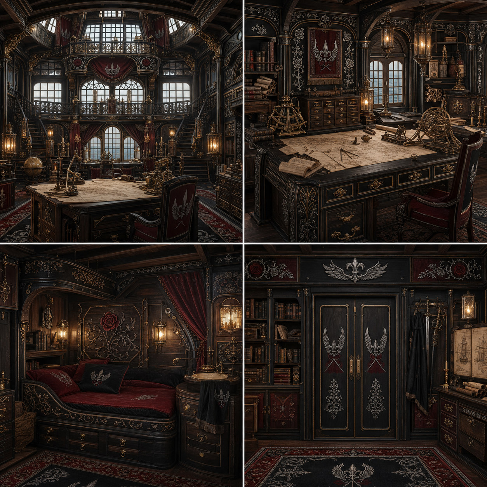
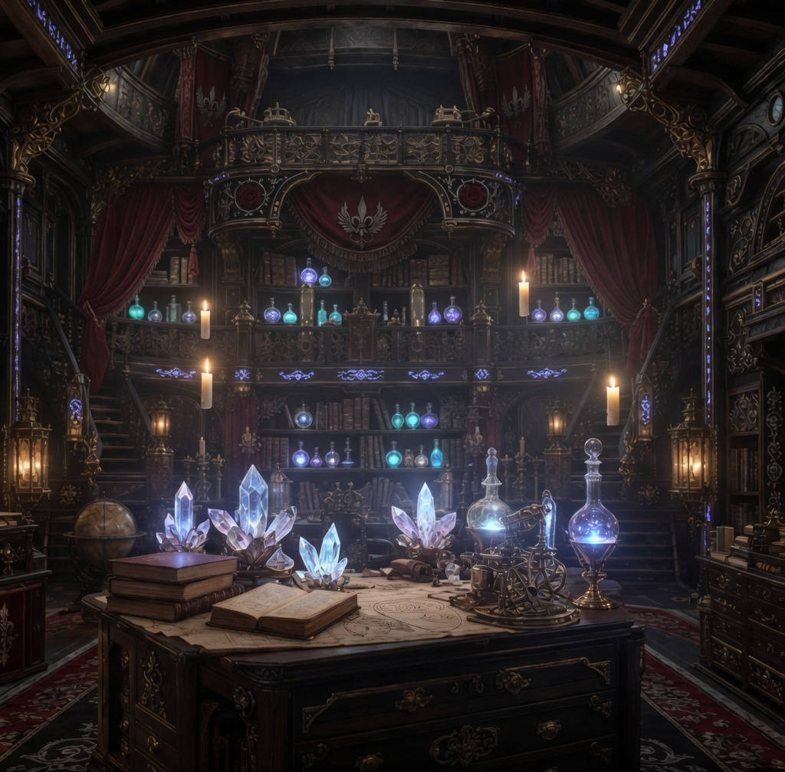
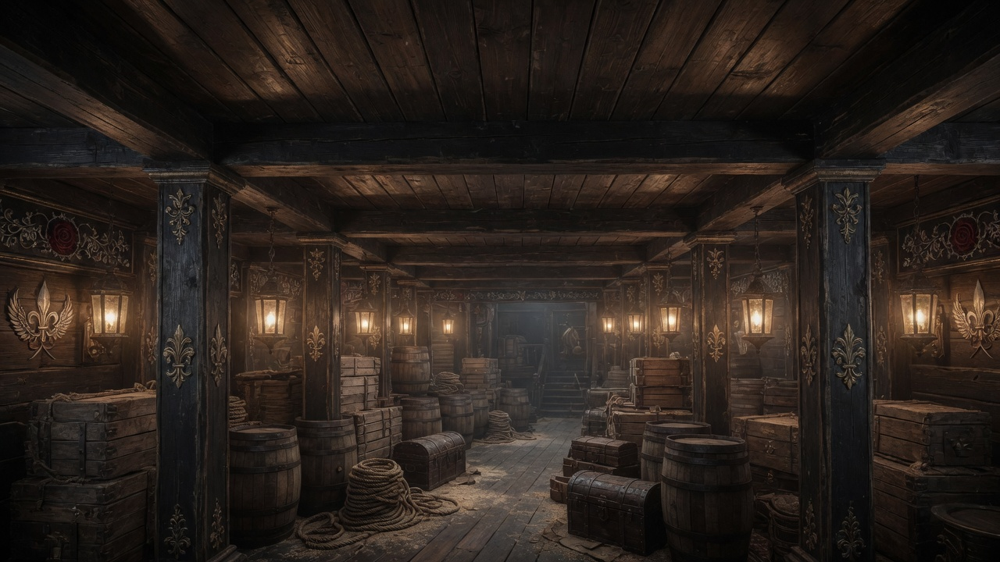
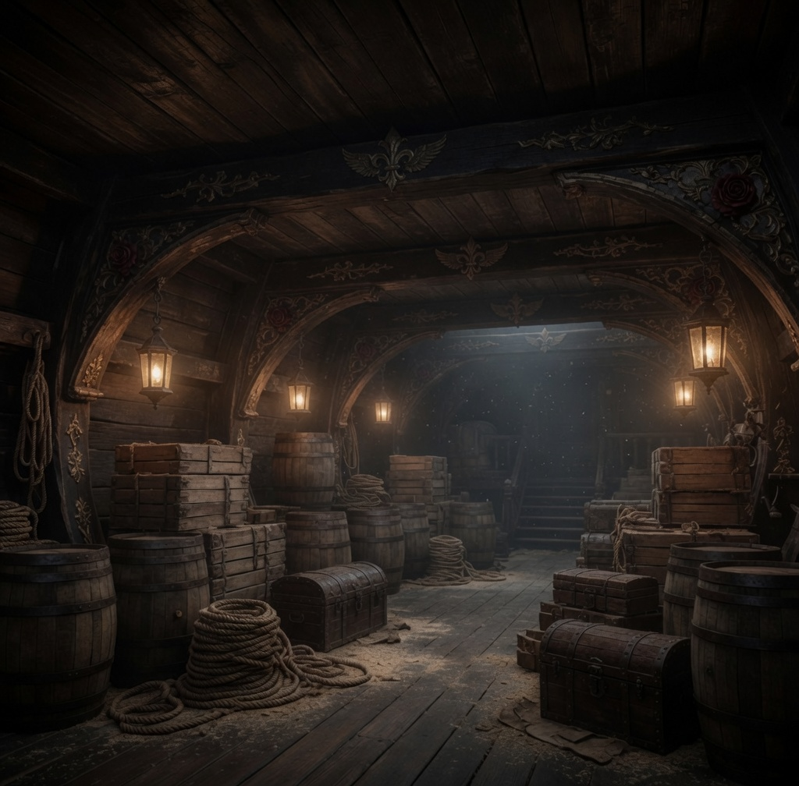
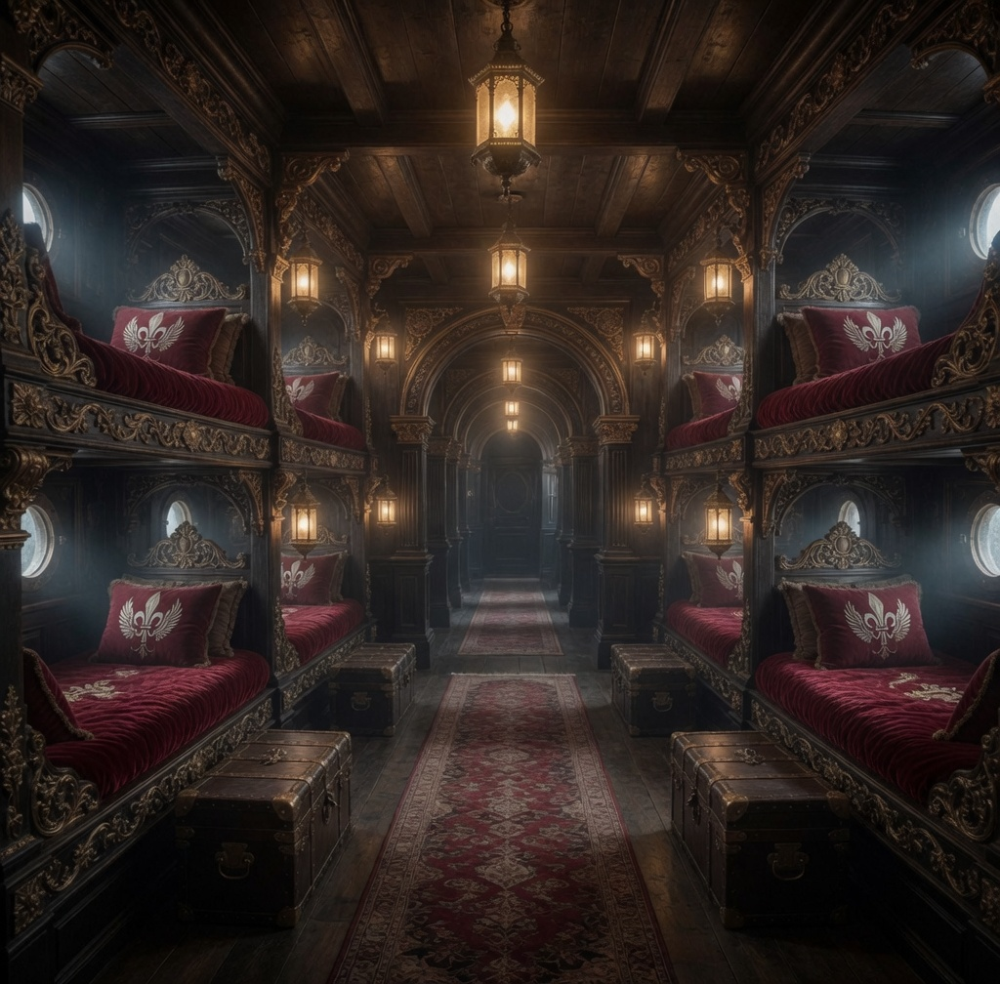
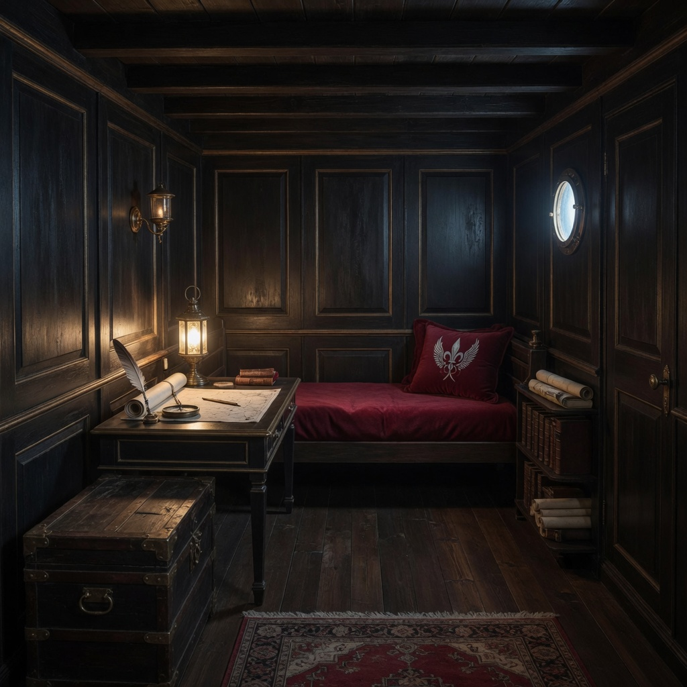

# Dawnrunner Interiors

The *Dawnrunner* is an enormous three-deck, three-masted galleon. Its approved
interiors share dark walnut and raven-black construction, deep-crimson
textiles, restrained antique-gold and silver fittings, protected warm
lanterns, and the ship's winged fleur-de-lis, roses, and thorn tracery.

The images below establish visual identity and principal uses. They do not
lock an exact deck plan, dimensions, inventories, or the permanent placement
of every furnishing.

## Captain's command suite

The large stern suite supports navigation, administration, private counsel,
and rest. It includes a grand command room beneath the stern galleries, an
instrument-rich navigation workspace, a compact built-in private berth, and
an entry wall with secure storage. The broad windows, galleries, chart tables,
books, and shipboard joinery distinguish it from a landbound palace.

## Arcane workshop

The two-level workshop is the ship's principal space for magical research,
item creation, alchemy, and the study of unusual materials. Its central
worktable, library gallery, secure cabinets, crystals, glassware, and precision
apparatus support several specialists without displacing the captain's command
functions. Individual objects shown are representative rather than a recorded
artifact inventory.

## Cargo hold

| Longitudinal view | Arched structural view |
|---|---|
|  |  |

The principal hold preserves a broad central aisle, regular support-post or
structural-rib rhythm, and organized bays of barrels, crates, ropes, and
locked chests. Vornix Drazgul, the ship's quartermaster, is the named officer
most directly associated with its manifests and stores. The containers shown
are representative, not a complete current inventory.

## General crew quarters

Two tiers of built-in bunks line a long central passage. Deep-crimson bedding,
individual sea chests, protected lanterns, and round hull ports create a more
comfortable shared sleeping deck than an ordinary warship while preserving
clear circulation and practical shipboard construction.

This approved single view supplements the coordinated crew-sleeping Canonical
Reference Pack. It does not silently replace the pack's additional fixed-bunk,
hammock, wash, storage, and circulation references.

## Officer and guest quarters

Officers and important guests receive compact private cabins with one built-in
berth, a writing desk, a secure sea chest, modest shelving, enclosed lanterns,
and a round hull port. Personal objects may vary by occupant, but the
architecture and shipwide colors remain consistent.

## Production authority

The matching ComfyUI Canonical Reference Packs are stored under:

`D:\comfyui\ComfyUI-Easy-Install\ComfyUI\input\Canonical Reference Packs`

Relevant packs include the captain's quarters, magical workshop, cargo hold,
crew sleeping quarters, and related Dawnrunner environmental packs. Pack
images remain the hard continuity references for generated scenes; the
reader-facing images on this page are approved canonical views and useful
routing references.

## Related records

- [Dawnrunner vessel and crew record](dawnrunner.md)
- [Dawnrunner canonical ship design](dawnrunner-ship-design.md)
- [Strategic assets](../campaign/strategic_assets.md)
