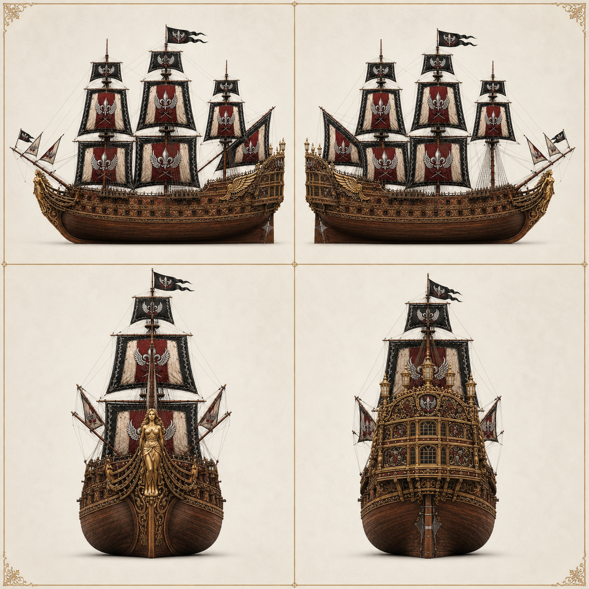
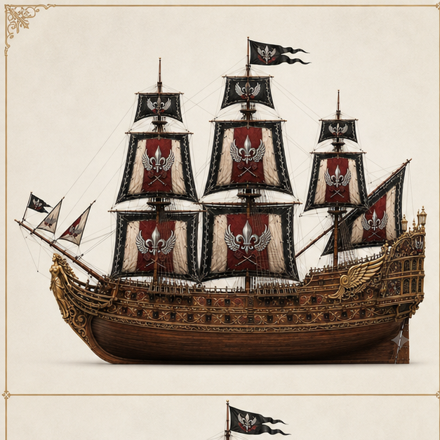
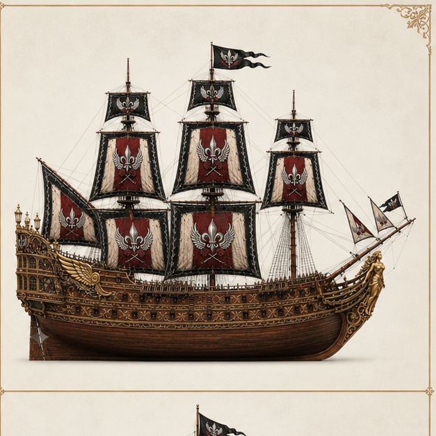
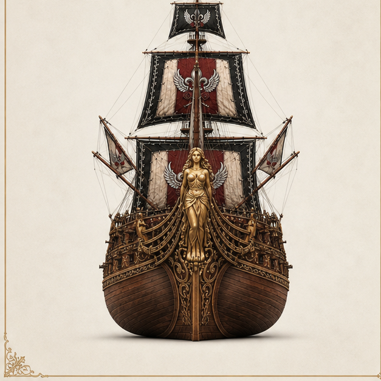
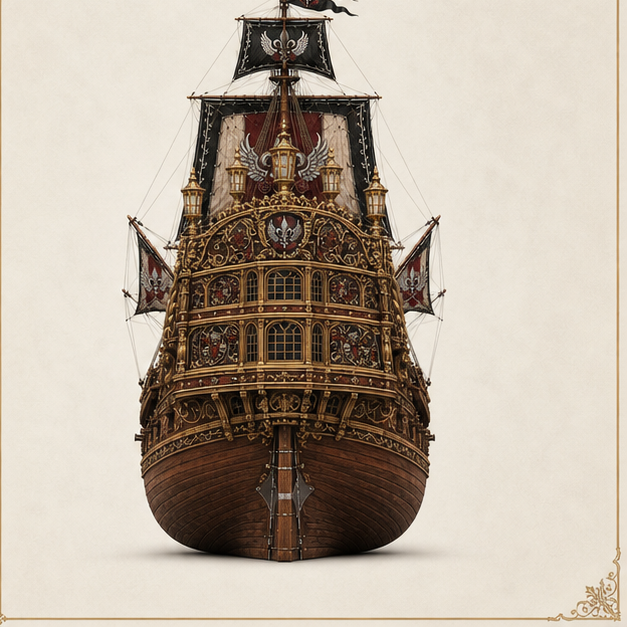
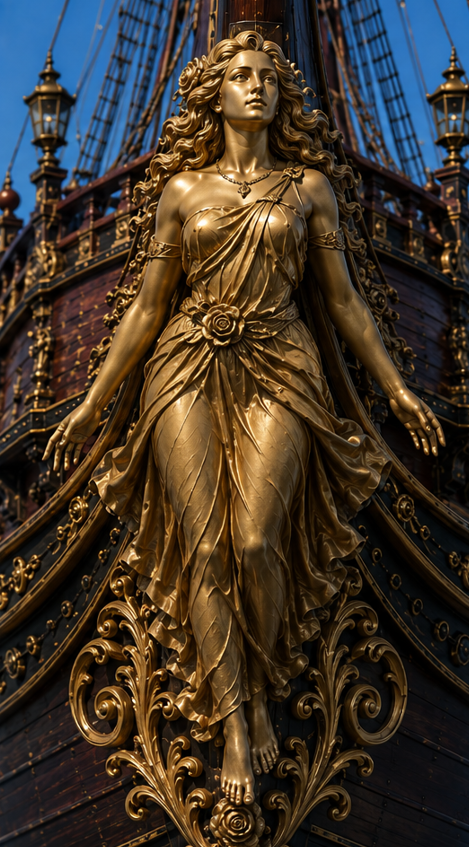
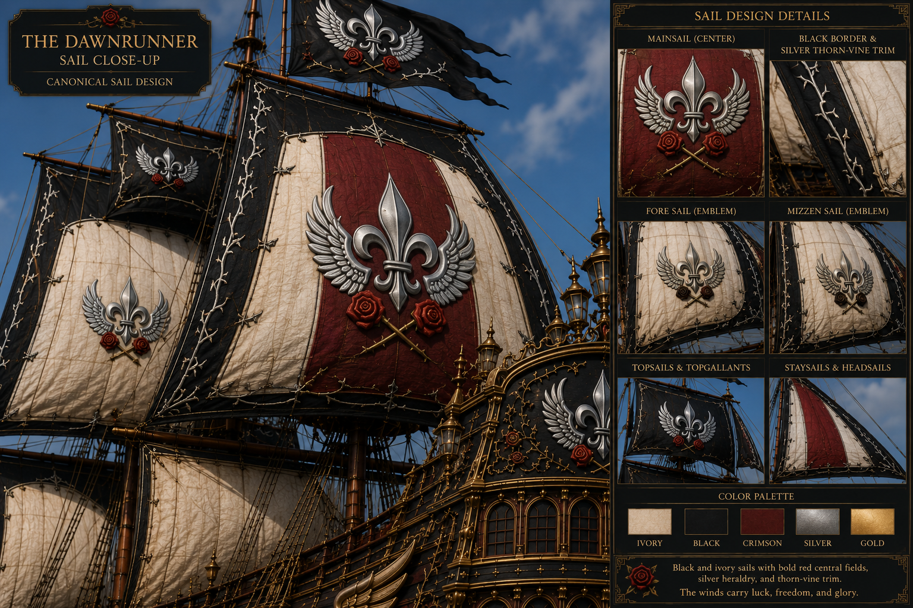
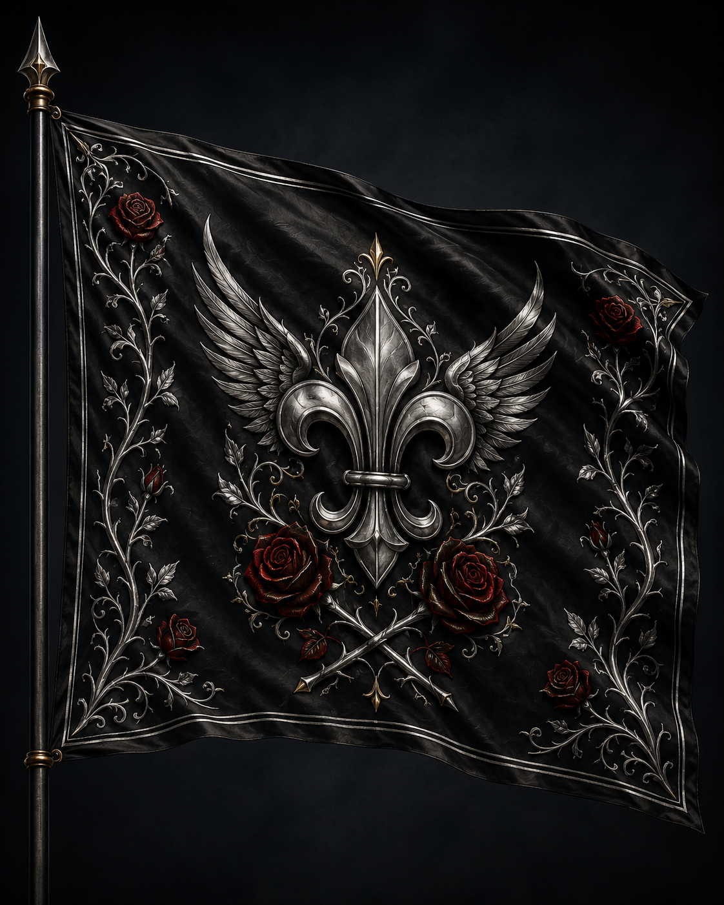
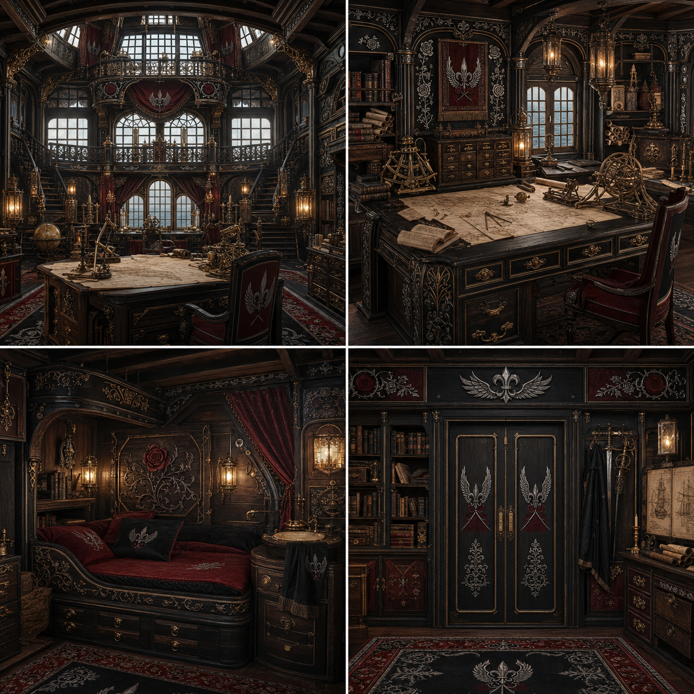

# Dawnrunner — Canonical Ship Design

This document records the canonical physical design of the *Dawnrunner*
itself. Crew organization, officers, statistics, upgrades, and service history
remain in the main Dawnrunner record.

## Design basis

The *Dawnrunner* is a three-masted fantasy galleon with a broad, heavily armed
hull, pronounced beakhead, dense square rig, and towering multi-gallery stern.
It is a mobile headquarters and command ship rather than a historical
reconstruction.

Its locked visual identity is:

- warm dark-brown lower hull planking and red-brown upperworks;
- dense but restrained antique-gold baroque carving and fittings;
- black, ivory, and crimson sails with silver thorn-vine trim;
- silver winged fleur-de-lis heraldry, crimson roses, and crossed thorns;
- a full-length gilded Aphrodite figurehead; and
- an ornate rounded stern with stacked arched windows and lantern towers.

Matcha green, tea cups, leaves, waves, crossed oars, and anchor-based heraldry
belong to the *Matcha Frappuccino* and do not appear here.

## Exterior turnaround

| Port side | Starboard side |
|---|---|
|  |  |

| Bow | Stern |
|---|---|
|  |  |

These views lock the hull proportions, mast spacing, gun-port rhythm, beakhead,
figurehead mounting, stern profile, window tiers, and overall rigging
silhouette.

## Figurehead

The figurehead is Aphrodite rendered as a full-length gilded classical woman.
She has a serene upward-looking face, long flowing hair, a one-shoulder draped
gown, rose ornaments, relaxed open hands, and bare feet. Her vertical mounting
is formed from symmetrical acanthus-and-rose scrollwork.

She is a dignified divine guardian rather than a weapon-bearing or armored
figure. She must not be replaced with a mermaid, angel, or portrait of a crew
member.

## Sail system

The principal square sails use ivory side panels, broad crimson center fields,
and black borders edged in continuous silver thorn-vine trim. The central
device is a silver winged fleur-de-lis above paired crimson roses and crossed
gold thorns. Smaller sails use simplified versions of the same emblem.

Black top sails and flags preserve the same winged-fleur, rose, and thorn
language. Future art should preserve the established sail hierarchy rather
than defaulting to uniformly black sails.

## Flag and ship's colors

The flag is the exact authority for the *Dawnrunner*'s ensign, command colors,
and complete heraldic arrangement. Its raven-black field carries an engraved
silver fleur-de-lis backed by silver wings, framed by deep-crimson roses and
silver thorn vines.

## Ship interiors

The approved captain's command suite, arcane workshop, cargo hold, crew
quarters, and officer/guest cabins are collected in the
[Dawnrunner interiors record](dawnrunner-interiors.md).

## Rear captain's quarters

The captain's quarters occupy the curved rear galleries beneath the
multi-tiered stern windows. They form a luxurious but functional command suite
rather than a ceremonial palace.

The four canonical zones are:

- a stern-window command room with a central chart table and clear views aft;
- a navigation and work area with charts, instruments, books, and secure
  drawers;
- a compact resting alcove with built-in storage; and
- a forward wall with paired doors, wardrobes, bookshelves, and navigation
  plans.

Dark walnut, black leather, crimson textiles, silver fittings, restrained gold
trim, and rose-and-thorn ornament carry the exterior identity inside. The
winged fleur-de-lis appears as a command mark on doors, chairs, carpets, and
wall panels.

## Canonical reference packs

The Dawnrunner is separated into component-specific ComfyUI packs so a specific component
can be locked without forcing unrelated ship details into a scene:

- `Ship_Dawnrunner` — complete ship and four-view exterior geometry;
- `Ship_Dawnrunner_Hull_Sides` — port and starboard construction;
- `Ship_Dawnrunner_Stern` — rear elevation and gallery geometry;
- `Ship_Dawnrunner_Figurehead` — Aphrodite figurehead and bow mounting;
- `Ship_Dawnrunner_Sails` — complete sail plan and emblem hierarchy;
- `Heraldry_Dawnrunner_Flag` — exact flag and heraldic palette; and
- `Ship_Interior_Dawnrunner_Captains_Quarters` — rear cabin architecture and
  furnishings;
- `Ship_Interior_Dawnrunner_Magical_Workshop` — the two-level arcane
  laboratory, library gallery, and central worktable;
- `Ship_Interior_Dawnrunner_Cargo_Hold` — the principal hold, structural
  rhythm, and organized storage bays; and
- `Ship_Interior_Dawnrunner_Crew_Sleeping_Quarters` — shared sleeping,
  circulation, hammock, wash, and personal-storage references.

The approved single-cabin officer/guest view is also recorded in the
[interiors guide](dawnrunner-interiors.md). It establishes the standard cabin
appearance without claiming a fixed occupant or exact deck-plan location.

The packs are stored under:

`D:\comfyui\ComfyUI-Easy-Install\ComfyUI\input\Canonical Reference Packs`

The durable approved art masters are stored under:

`C:\Users\coutu\Documents\Codex\Documents\Dawnrunner\Ship Design`
