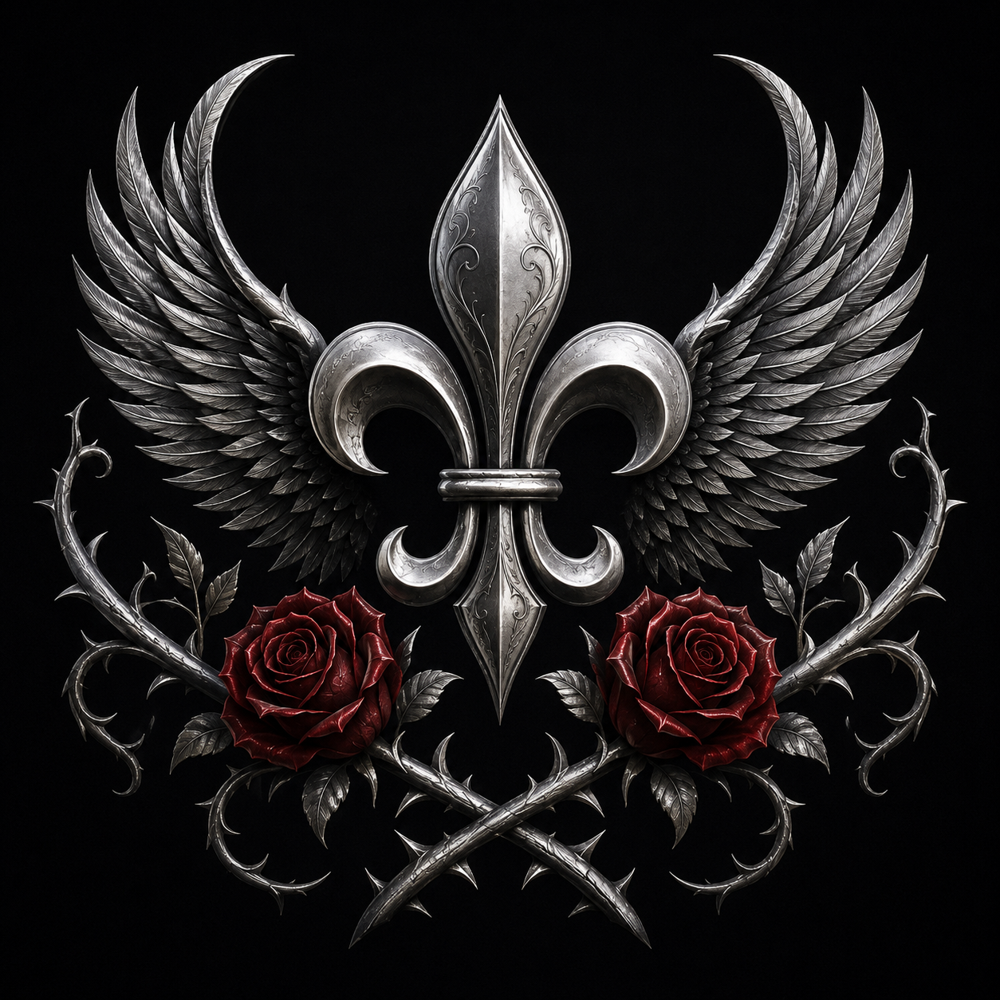

# Demidius — Canonical Art

This is the primary visual reference for current-era Demidius Thorne. It
preserves the face and hair established by the *Kiss from a Rose* portrait and
combines his present divine signs, Dawnrunner uniform, and signature jewelry.

## Canonical features

- Warm olive-tan skin, refined angular features, strong jaw, and cleft chin.
- Long, thick, wavy-to-curly black hair with loose face-framing curls.
- Current eyes with a subtle luminous pink-purple blend.
- Lean, athletic build and elegant posture.
- Black-and-gold Dawnrunner captain's coat, restrained silver, crimson lining,
  and an open ivory ruffled shirt.
- Metallic-gold rose-and-thorn tattoos on the outer chest and backs of the
  hands, with the sternum clear and no face or neck tattoos.

## Signature jewelry

**Hermes’ Earrings of Arcane Refrain** are a matched pair of gold wing
earrings with elongated faceted sapphire-blue crystal drops. The separate
detail panel is the design reference for future art.

The **Eyebrow Piercing of Confidence** is a small magical piercing at the outer
eyebrow with a controlled purple glow. It must not be converted into a
forehead gem, tattoo, scar, or painted symbol.

## Personal heraldry

This is Demidius's definitive personal heraldic symbol: an engraved silver
fleur-de-lis before silver-and-black feathered wings, two deep-crimson roses,
and crossed silver thorn branches on black. Its proportions, arrangement,
materials, and colors are fixed. It is related to the Dawnrunner's visual
language but must not be silently replaced by the ship's complete heraldry.

See [Demidius Thorne](demidius-thorne.md) for the complete character record.
