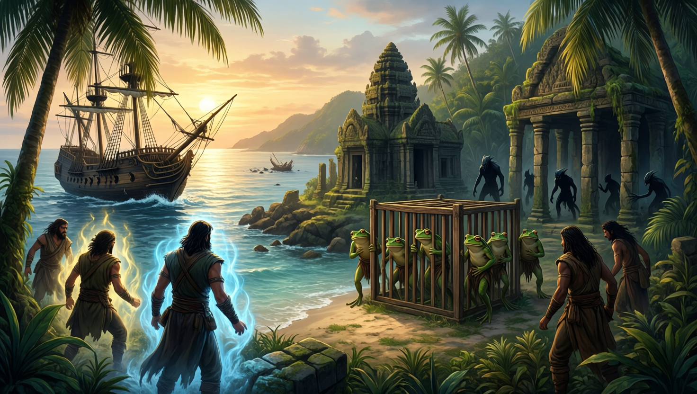

# Awakening on Sounon

The campaign opened when Siopi, Maarin, Paradox, Kaelen, Alley, Tulip, and
other survivors awakened on Sounon after ten years in magical stasis. Pete was
present, but whether he was shipwrecked with them remains unknown. The island
held kuo-toa and enslaved grippli, including Bix.

See the wiki pages `Awakening-on-Sounon.md`, `Sounon.md`, and
`Events-and-Timeline.md`.

