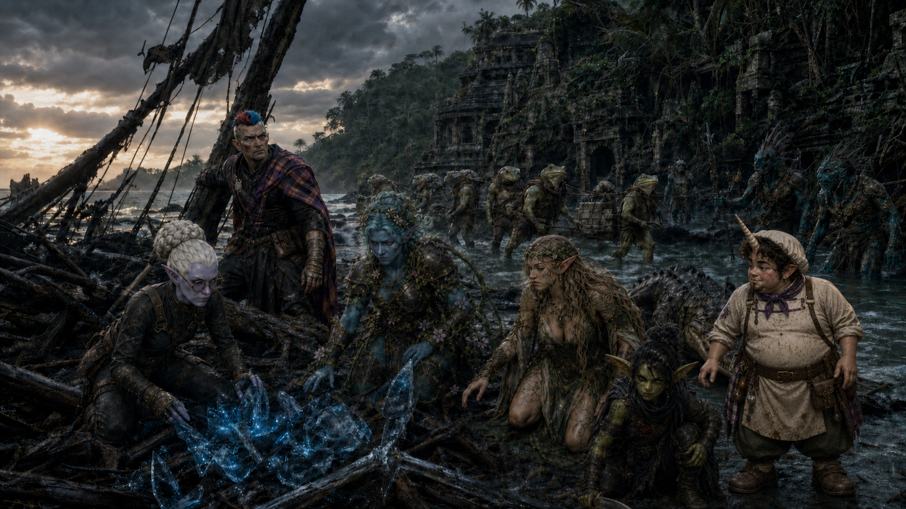

# Awakening on Sounon

The campaign opened when Siopi, Maarin, Paradox, Kaelen, Alley, Tulip, and
other survivors awakened on Sounon after ten years in magical stasis. Pete was
present, but whether he was shipwrecked with them remains unknown. The island
held kuo-toa and enslaved grippli, including Bix.

The grippli's spiritual leader was Ulaa, a cleric of Hermes. He later led most
of the freed grippli away to relocate without the party's involvement. Pete,
a gnome, remained aboard along with six grippli who became Demidius's
followers. Ulaa left the party on an island that was destroyed soon afterward;
his survival is unknown. His parting gift was the green-obsidian [Ember
Blade](../artifacts/ember-blade.md), which he had stolen at Hermes's direction.

See the wiki pages `Awakening-on-Sounon.md`, `Sounon.md`, and
`Events-and-Timeline.md`.
