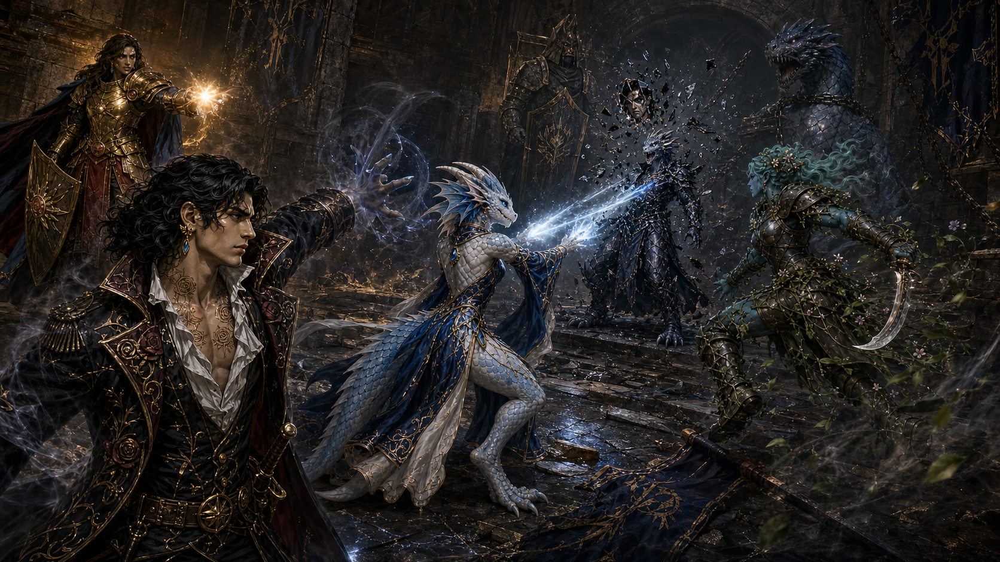
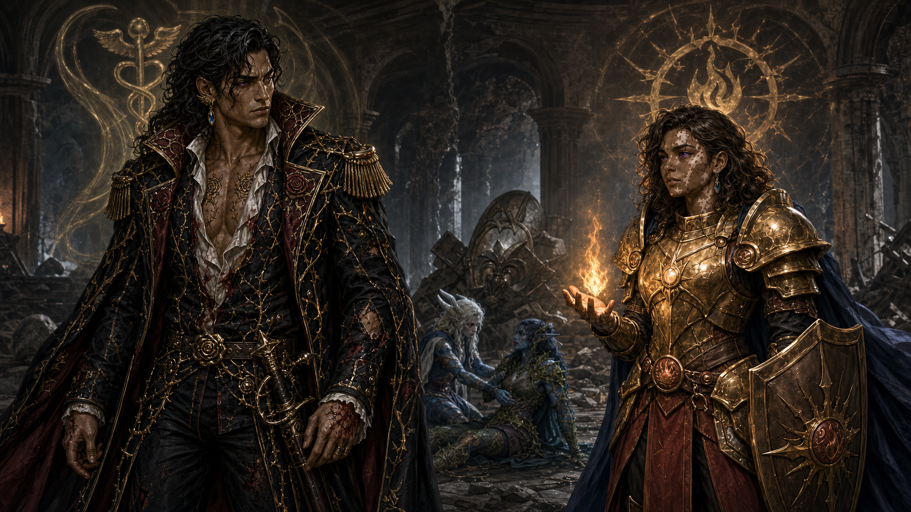

# Battle Beneath the Champions' Garrison

A few days after [Demidius's address to the Crafter's Bow](demidius-speech-to-the-crafters-bow.md), Maarin brought the party to meet Oros of the Blossom and the Champions. The encounter exposed the apparent Oros as an unnamed kobold mortal god of Fel and culminated in Demidius and Amparo becoming divine Champions.

## Exposure

The party first saw the Champions savagely beating a thief. Oros argued that the violence prevented more harm than it caused. Demidius covertly used an artifact that unerringly reveals alignment and found the apparent Oros to be Lawful Evil. He also briefly perceived a kobold beneath the disguise and telepathically warned Maarin that he suspected the Lords of Order.

When Maarin revealed their knowledge, the false Oros attempted and failed to dominate the reincarnated kobold Aristea Enontië. Demidius stripped away the enemy's protections and disguise, exposing a kobold mortal god of Fel. Aristea struck with ice rays and Maarin followed with a physical assault.

## The basement battle

A contingency allowed the enemy to continue the fight. His attacks against Demidius failed because Demidius had assumed incorporeal form. The kobold fled while Maarin and Okeanikos made short work of his remaining henchmen. Demidius's attempt to rally the other Champions had mixed results.

Maarin teleported into the basement and fell in the ensuing battle. Demidius and Amparo reached and revived her before her final breath escaped. The defenders included a Fel clone or abomination and a shield guardian. At one point only three party members remained standing, but Amparo restored the group through heroic healing. Roy seized control of the shield guardian and used it to kill the Fel clone. The party then defeated the kobold.

## Rewards and offices

| Hero | Reward |
|---|---|
| Roy | 3 Boons |
| Maarin | 3 Boons |
| Aristea Enontië | 2 Boons |
| Okeanikos | 2 Boons |
| Demidius | Third Hermes trial completed; became Champion of Hermes |
| Amparo | Third Hestia trial completed; became Champion of Hestia |

The precise new godly powers granted to Demidius and Amparo have not been recorded.

## Unknowns

The enemy's personal name, the true Oros's fate, the duration of the infiltration, the loyalties of the minor Champions, and the exact nature of the Fel clone remain unknown.
