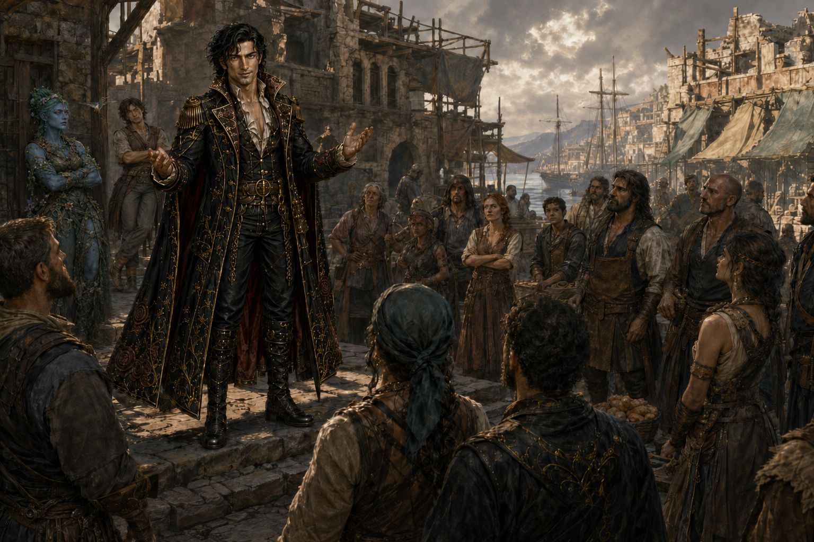

# Demidius's Speech to the Crafter's Bow

Just after the Grand Artifact Auction, Demidius addressed the Crafter's Bow
amid Tradegulf's worsening civic and economic crisis. Maarin stood beside him,
giving him a notably disapproving look. The encounter made clear to them that
the faction's leaders were members or agents of the Maker's Knot, although its
rank and file did not know this. Demidius challenged the faction to abandon
indiscriminate looting and become guardians of honest labor, open roads,
workshops, markets, caravans, and docks.

## The speech

> “Look around you. The law lies in tatters. Tradegulf—the greatest city in Nysia—is beginning to starve beneath the weight of fear. Merchants close their doors. Caravans turn away. Ships choose safer ports. Craftsmen cannot sell their work, laborers cannot find wages, and families wonder whether there will be bread tomorrow.
>
> “You formed because you saw corruption and refused to kneel before it. You defended your streets when others would not. That courage was real. The people know it. I know it.
>
> “But courage can be deceived.
>
> “I once believed I was helping people by standing beside those who spoke of justice, freedom, and resistance. I believed their enemies must be wicked because they claimed their cause was righteous. I was wrong. Beneath their noble words were chains. In trying to help, I strengthened evil men and aided slavers.
>
> “I cannot undo that mistake. I can only confess it, learn from it, and refuse to watch others walk the same road.
>
> “The Maker’s Knot taught you that every business was an oppressor and every act of theft a blow against corruption. But when a shop is sacked, it is not only a wealthy owner who suffers. The clerk loses her wages. The apprentice loses his future. The farmer loses a buyer. The mason loses the contract to build another home. The children of all of them lose food from their tables.
>
> “A city cannot eat vengeance. It cannot build houses from broken windows. It cannot pay workers with ashes.
>
> “Tradegulf needs you—but not as looters. It needs you as guardians.
>
> “Protect the markets. Guard the workshops. Escort the caravans and keep the docks safe. Stop thieves, extortionists, slavers, and corrupt merchants alike. Make it known that anyone may come here to trade honestly without being robbed, threatened, or forced to purchase protection.
>
> “Do that, and the ships will return. Businesses will reopen. Jobs will follow. Carpenters will build homes. Bakers will fill their ovens. Farmers will bring food through the gates because they know it will reach the people instead of being stolen on the road.
>
> “You have already shown that you possess strength, discipline, and the courage to stand when the law cannot. Now you must decide what that strength is for.
>
> “You can become another gang wearing justice as a mask. Or you can become the reason this city survives.
>
> “Hermes is the lord of roads, trade, travelers, and clever hands. He teaches us to overcome barriers—not to become another barrier ourselves. A road ruled by fear is no road at all. A market protected only for those who pay tribute is merely a prison without walls.
>
> “So I offer you a better purpose. Return what can be returned. Help rebuild what was broken. Bring me evidence against those who exploited workers, cheated craftsmen, or trafficked in slaves, and I will stand beside you against them.
>
> “But the looting ends now.
>
> “Not because the powerful deserve protection from you—but because the powerless need protection from what this city is becoming.
>
> “Rise now, Crafter’s Bow. Not as thieves. Not as enforcers for the Maker’s Knot. Rise as the shield of honest labor, the guardians of open roads, and the reason Tradegulf’s people can work, build, and eat again.
>
> “You wanted to change this city. Here is your chance.
>
> “Be its heroes.”

## Outcome

The speech worked well, sometimes too well: members guarded people who did not
need protection. Demidius recruited volunteers for the temples, worked with
Amparo to build homes and feed people, and gave daily speeches to prevent the
movement from becoming an unruly mob. This work also served as restitution for
his former association with the Maker's Knot. Whether the reform becomes
permanent remains unknown.
