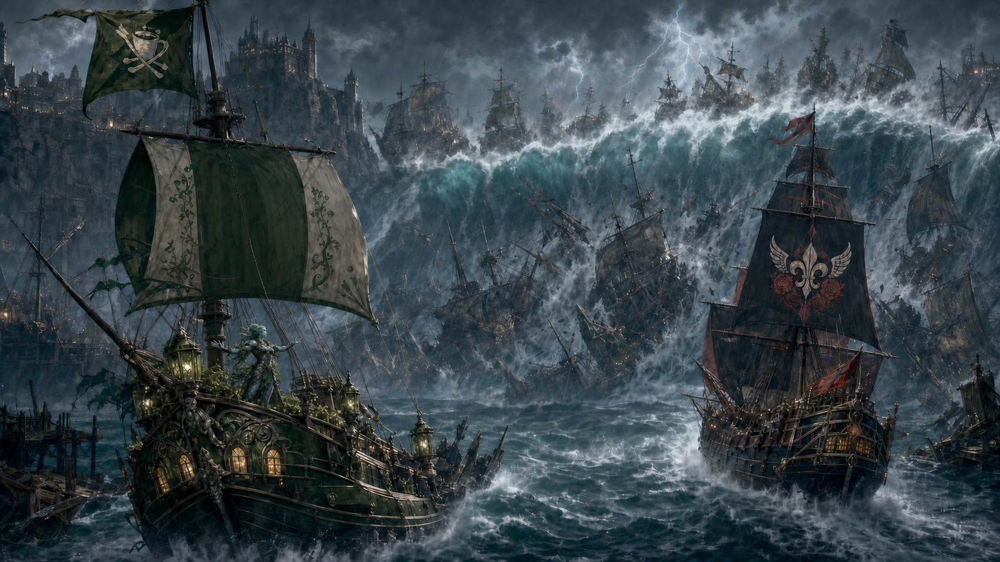

# Escape from Misthold

After the party freed Odysseus and the divine prisoners held for Rosalind
Galeheart's great games, the Key of Daedalus carried them to the newly
completed Dawnrunner and Matcha Frappuccino outside Misthold's docks.

Maarin stopped pursuit with a catastrophic tsunami. It destroyed more than
seventy ships of the line and killed countless thousands. The exact number of
smaller vessels, coastal structures, combatants, and civilians affected
remains unrecorded.

The two galleons escaped with Odysseus and proceeded to Stormspire.

