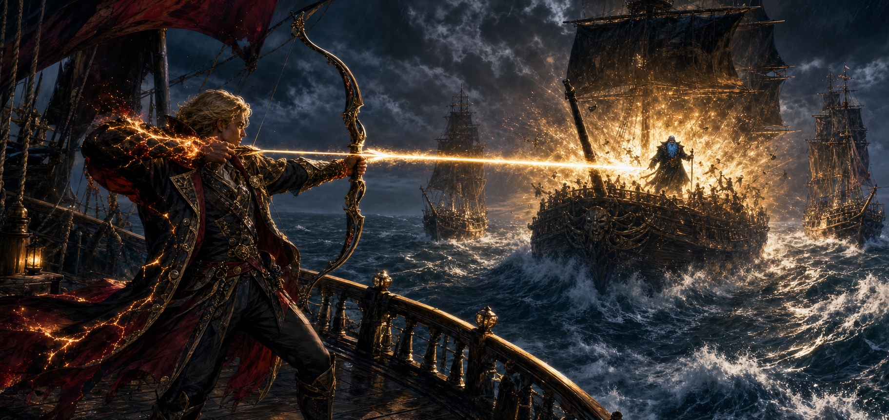

# Gideon's Sunshot

During the party's escape through Bluebeard's territory, Bluebeard's flagship
and two ships of the line gained rapidly on the heroes. Gideon, Champion of
Apollo, used all of his godly power for the first time and fired a single arrow
carrying the power of the sun.

The attack killed everyone aboard Bluebeard's flagship except Bluebeard.
Channeling the sun burned Gideon terribly and caused immense pain, but the
party and crews nursed him back to health.

The flagship's physical condition, the fate of the two escorting ships, and the
precise mechanics of Gideon's expenditure and backlash remain unrecorded.

