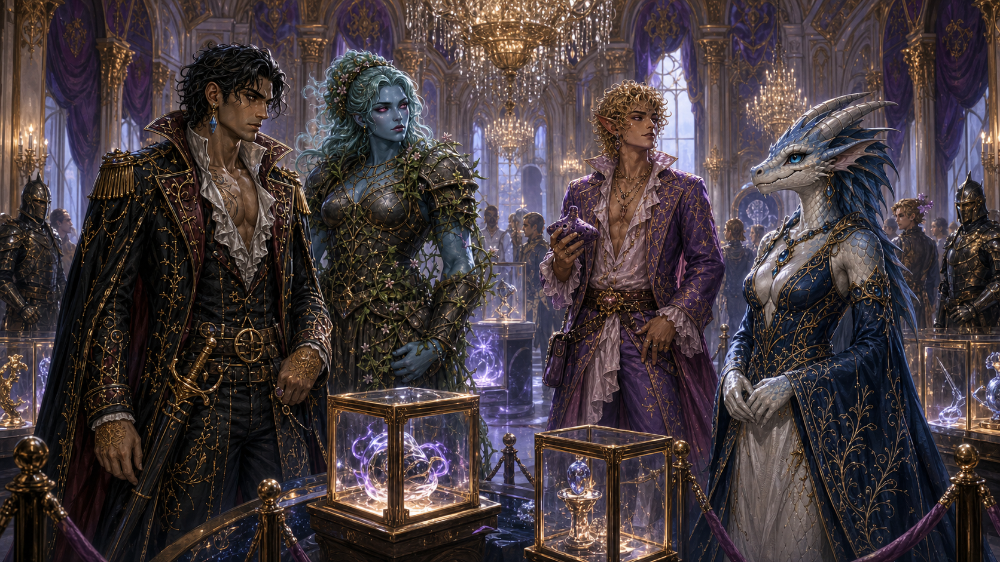

# Grand Artifact Auction

The Grand Artifact Auction is held at Arverdon Palace once every several
years. Declan's raid targeted the collection, but Odysseus substituted fakes
and the raiders stole the decoys.

Just after the authentic lots were sold, Demidius delivered an
[address to the Crafter's Bow](demidius-speech-to-the-crafters-bow.md),
calling on the faction to end looting and become guardians of Tradegulf's
honest labor and trade. Maarin accompanied him. The speech began a successful
but imperfect reform and relief effort while revealing the faction's hidden
Maker's Knot leadership to Demidius and Maarin.

## Recorded results

Every named lot has a dedicated illustrated entry in the
[Auction Artifact Catalog](../artifacts/auction/index.md).

| Lot | Recorded price | Notes |
|---|---:|---|
| [Heartthorn Ward](../artifacts/auction/heartthorn-ward.md) | 300,000 gp | +5 heavy shield; +10 sacred bonus against evil; Ghost Touch; doubles bleed damage suffered; causes 1 bleed within 60 feet of evil outsiders; healing stops the bleed |
| [The Shard of First Light](../artifacts/auction/shard-of-first-light.md) | 750,000 gp | Primordial-creation artifact that grants vision into unformed realms |
| [Rivenheart Crown](../artifacts/auction/rivenheart-crown.md) | 150,000 gp | Price from a bundle; splits in two when worn, with one piece granting power and the other revealing truth |
| [Shard of the Shield of Ajax](../artifacts/auction/shard-of-the-shield-of-ajax.md) | 200,000 gp | Further properties unknown |
| [Tiara of Decay](../artifacts/auction/tiara-of-decay.md) | 1,000,000 gp | Further properties unknown |
| [Fate's Sword — known half](../artifacts/auction/fates-sword.md) | 450,000 gp | One half of the former Scissors of the Fates |
| [Echo Blade](../artifacts/auction/echo-blade.md) | 200,000 gp | Further properties unknown |
| [Halfhead's Halfblade](../artifacts/auction/halfheads-halfblade.md) | 250,000 gp | Name slightly uncertain |
| [Fate's Sword — presumed-lost half](../artifacts/auction/fates-sword.md) | 1,500,000 gp | Unexpected recovery drove the price dramatically higher |
| [Horn of Resnik](../artifacts/auction/horn-of-resnik.md) | 450,000 gp | Further properties unknown |
| [Grimoire of Honesty](../artifacts/auction/grimoire-of-honesty.md) | 700,000 gp | Further properties unknown |
| [Aethereal Crown](../artifacts/auction/aethereal-crown.md) | 650,000 gp | Further properties unknown |
| [Ichor of Virility](../artifacts/auction/ichor-of-virility.md) | 2,300,000 gp | Further properties unknown |
| [Rod of Mending](../artifacts/auction/rod-of-mending.md) | 300,000 gp | Further properties unknown |
| [Arch of Persecution](../artifacts/auction/arch-of-persecution.md) | 250,000 gp | Further properties unknown |
| [Bawery Slab](../artifacts/auction/bawery-slab.md) | 200,000 gp | First word uncertain |
| [Grimoire of Doom](../artifacts/auction/grimoire-of-doom.md) | 275,000 gp | Further properties unknown |
| [Gauntlet of Sentience](../artifacts/auction/gauntlet-of-sentience.md) | 200,000 gp | Further properties unknown |
| [Ichor of Chaos](../artifacts/auction/ichor-of-chaos.md) | 6,500,000 gp | Highest recorded sale price |
| [Obsidian Bracelet](../artifacts/auction/obsidian-bracelet.md) | Not listed | Price and properties unknown |
| [Lifeblood Tome](../artifacts/auction/lifeblood-tome.md) | Not listed | Price and properties unknown |

The listed prices total **16,625,000 gp**. Fate's Sword was once the Scissors
of the Fates. One half was thought lost; its later appearance accounts for the
second, much higher price. Buyers and current owners have not been recorded.
