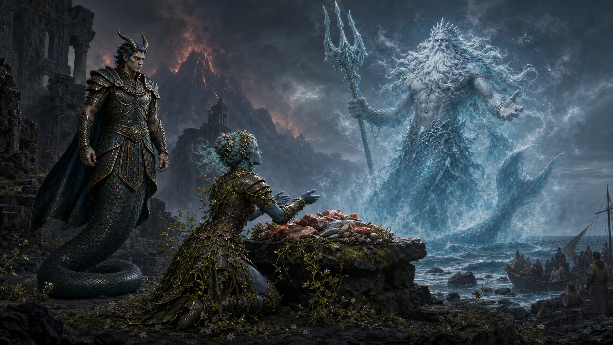

# Maarin's Petition to Nereus

After Okeanikos hatched at the hidden temple at Lavawyn Point on Volcaris,
Maarin sacrificed fifty pounds of meat and prayed to Nereus.

Lavawyn Point was historically considered uninhabitable because fumaroles
cover the island, though pilgrims visited its hidden sanctuary. One tradition
says it began as Echidna's temple in Lodingen, was rededicated to the
Olympians, became a testing ground for divine champions, and returned to
Echidna after the Sundering of Ena's Revenge. Another inquiry identified
Nereus as its original dedicatee; the conflict remains unresolved.

Thirty-eight years ago, Sea Serpent Declan attacked the sanctuary. Pilgrims
said Echidna was visibly weak but repeatedly stopped his crew from entering.
She sealed the temple before he killed her and removed her heart. The pilgrims
could not reenter and believed divine patronage was required to pass the seal.
Volcanic activity increased significantly after her death.

She apologized for giving Nereus's shield to Tenor. The party had made the
agreement while carrying families who survived the eruption at Palmara Reef,
and Maarin feared that refusing Tenor could expose those refugees to murder,
capture, or enslavement. She connected that decision to the party's recent
liberation of the enslaved grippli on Sounon.

During Okeanikos's birth, a lava comet launched from Volcaris and produced an
active Lava Haze around Palmara Reef. The party's successful Profession
(sailor) check carried its ships out of the worst concentration. The island
nevertheless remained surrounded by a sitting cloud of steam, hydrochloric
acid, and tiny volcanic-glass shards capable of cutting exposed eyes and
damaging the lungs when breathed.

Maarin also apologized for the explosion of Nereus's temple, while admitting
that she did not know whether rescuing Okeanikos caused the destruction. She
thanked Nereus for caring for Okeanikos and expressed her belief that he would
become a good person who benefited the world rather than destroying it.

Rumors describe the temple as a longstanding testing ground for gods and say
that even Nereus, its original dedicatee, was tested there. The truth of that
tradition and its possible relationship to Okeanikos's hatching remain
unconfirmed.

Finally, Maarin praised Nereus's cleverness, goodness, honesty, and humor. She
invited the then-unaffiliated sea god to consider joining the New Gods because
they care about people, oppose tyranny, and represent a change from the former
divine order.

The campaign record does not yet establish Nereus's answer, whether he accepted
the offering, whether his shield was recovered, or whether he joined the New
Gods.
