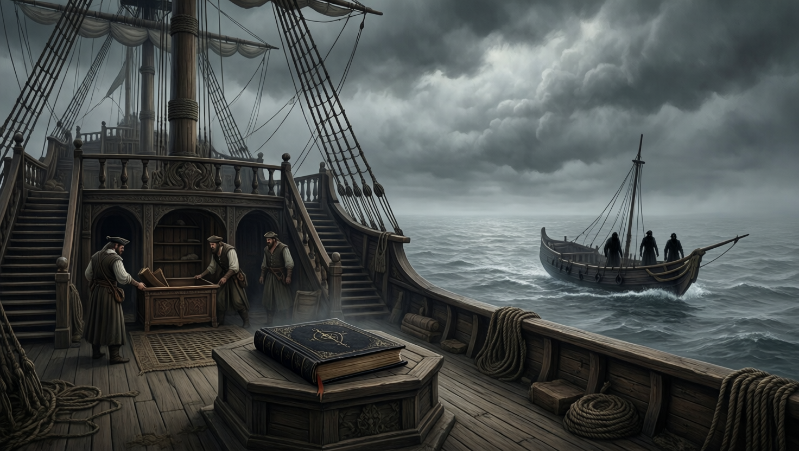

# Nyssa's Betrayal

Nyssa helped decipher the map in the Mother's Lament, later stole the book
under an ash cloud, controlled Tulip with a Zeus-linked artifact glove, and was
eventually revealed as an agent of Smokey Roberts. Her last confirmed
appearance was an attack made beside Tenor and her husband.

