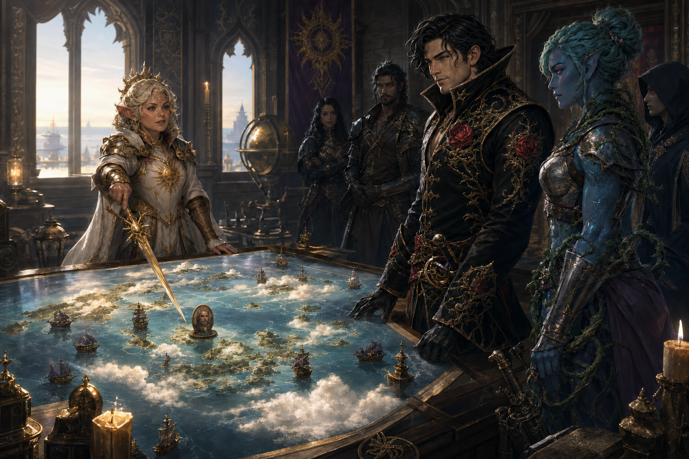

# Quest to Rescue Odysseus

Queen Lidda Beaumont sent the party to recover her operative Odysseus, who had
been missing for twenty years. The newly completed Dawnrunner and Matcha
Frappuccino were teleported to Rosalind Galeheart's lands for her great event
at Misthold, which functioned as a temporary truce among Pirate Lords.

The party found Odysseus imprisoned and discovered that divine heroes were
also being held to fight in the games. Odysseus supplied guard uniforms,
Demidius used diplomacy, and Roy used deception to infiltrate the prison.

The event's formal name, the ship-teleport method, and Queen Beaumont's exact
prior intelligence remain unrecorded.
