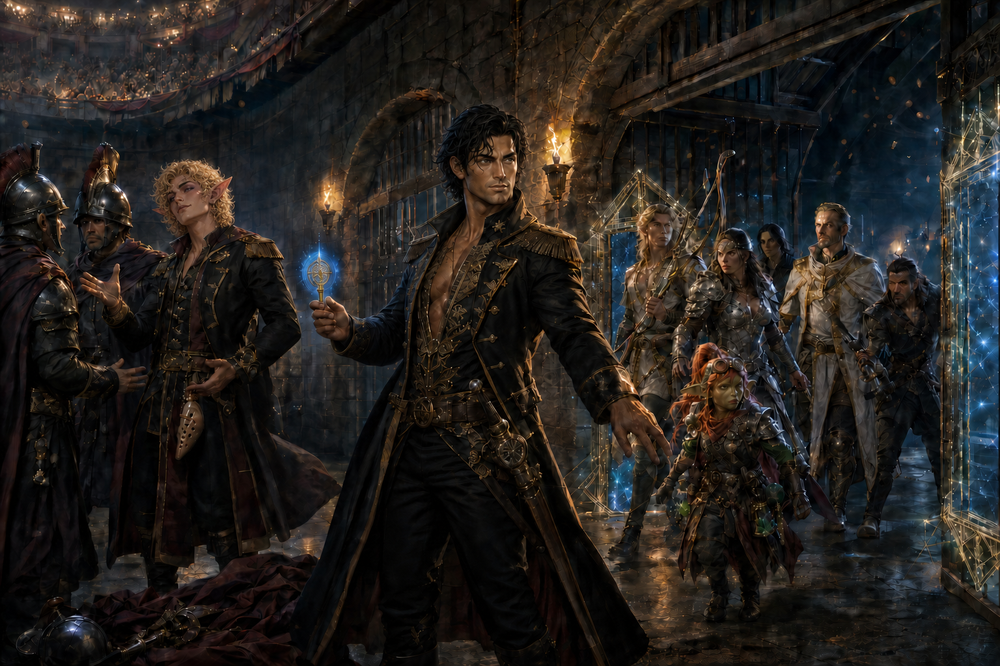

# Rescue of the Champions and Blessed

At Misthold, Demidius and Roy infiltrated the prison using guard uniforms
supplied by Odysseus, diplomacy, and deception. Demidius used the Key of
Daedalus to free Odysseus, Gideon, Crystal, Binky, Rickard, an unnamed Blessed
of Hades, and other unidentified prisoners.

The Key carried the rescuers and freed captives to the Dawnrunner and Matcha
Frappuccino outside Misthold's docks. The extraction led directly to Maarin's
catastrophic tsunami and the Escape from Misthold.
