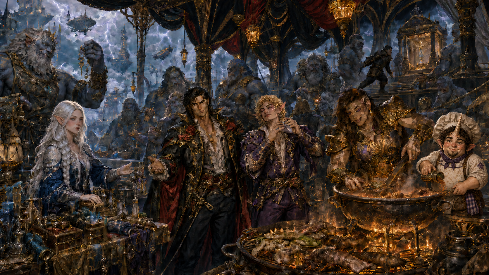

# Stormspire Festival Diversion

At Stormspire, the party staged a carnival-like diversion for the storm
giants. Elven Aristea sold huge quantities of goods, Demidius and Roy
performed music, and Amparo, Tulip, and others held a cookoff inside a huge
pavilion erected by Demidius.

While the city was occupied, Odysseus stole the final component required for
the Scepter of Keto. The theft and his deliberate sabotage prompted
Stormspire to fall. Maarin arrested the fall with her weather power and saved
the settlement below.

