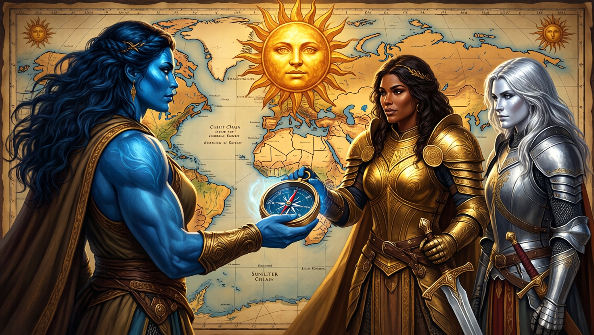

# Succession of the Sunlit Chain

After Maarin killed Declan, the party chose not to retain his lordship. Dame
Mathilda accepted their proposal that she succeed him, with Aelwyn proposed as
her second. The formal transfer and response of the other pirate lords remain
open.

