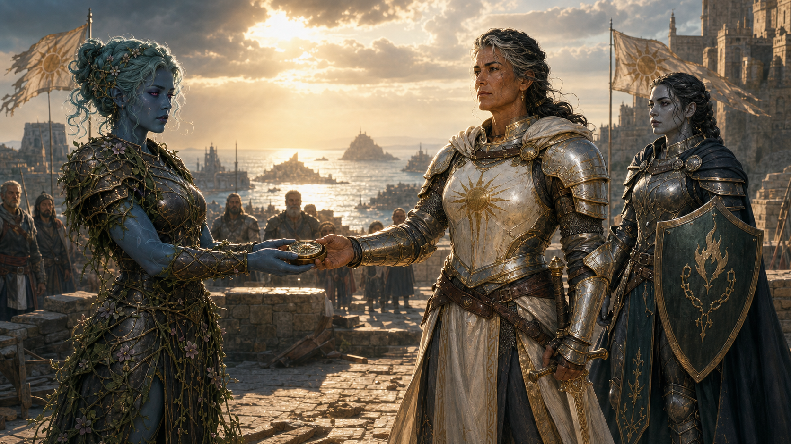

# Succession of the Sunlit Chain

After Maarin killed Declan, the party chose not to retain his lordship. Dame
Mathilda accepted their proposal that she succeed him. Aelwyn was initially
proposed as her second, but Demidius later persuaded Mathilda to appoint him
instead. The formal transfer, installation, and response of the other pirate
lords remain open.
