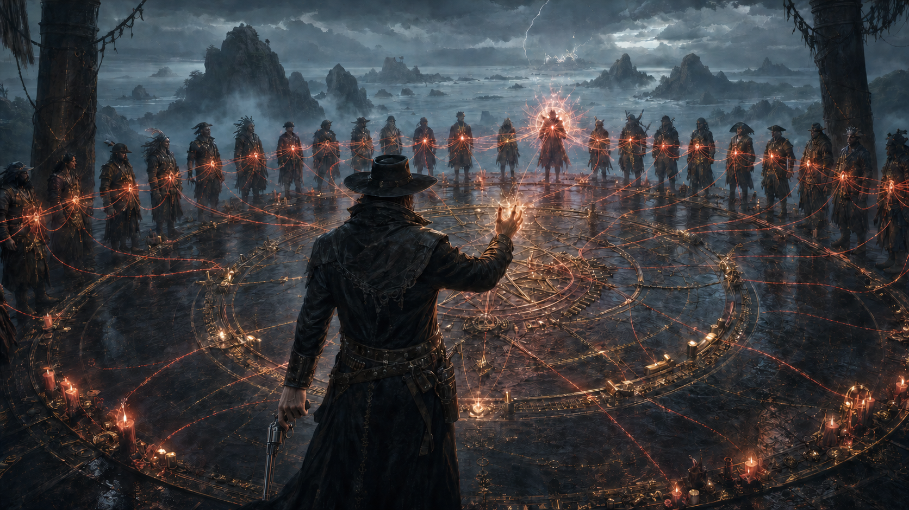

# Tenor's Bloodline Rite

*Interpretive scene: the rite's exact location and Tenor's canonical appearance
remain unknown, so he is shown from behind while the bloodline web takes visual
priority.*

Tenor, the level 15 gunslinger known as Smokey Roberts's Left Hand and fixer,
linked Smokey's many children so that a sibling who killed another absorbed
part of the victim's power. The rite produced catastrophic results at the
Misthold bloodline tournament, where one child killed more than fifty siblings
and became a mortal god.

Tenor's first personal ritual sacrificed his potential for further advancement
in exchange for agelessness. His second sacrificed ten levels—reducing him
from level 25 to level 15—and one eye in exchange for the ability to perceive
and understand all magic, including unrealized divine potential. He used that
sight to recruit demigods, quarter godlings, and many of Smokey's children
before their powers manifested, treating them as valuable tools to be raised
into soldiers loyal to himself and Smokey.
