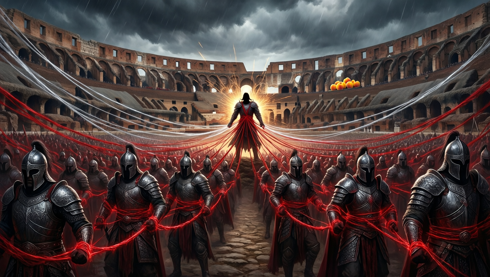

# Tenor's Bloodline Rite

Tenor linked Smokey Roberts's many children so that a sibling who killed
another absorbed part of the victim's power. The rite produced catastrophic
results at the Misthold bloodline tournament, where one child killed more than
fifty siblings and became a mortal god.
