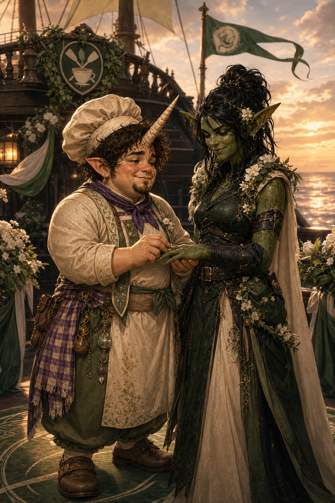
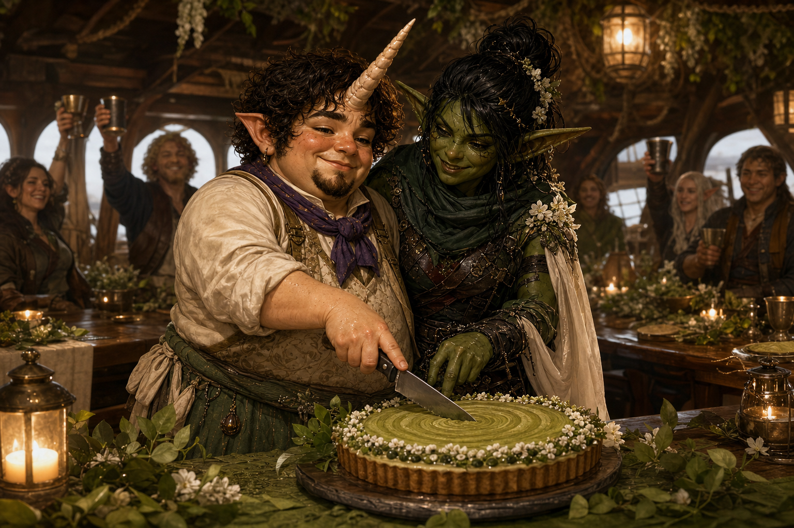

# Wedding of Tulip and Alley

Tulip and Alley married immediately before the party departed to rescue
Odysseus. Tulip is the *Matcha Frappuccino*'s head chef and healer; Alley is
Maarin's spymaster. Both already described the other as the love of their
life.

The marriage immediately precedes the Misthold operation in the campaign
sequence: the party teleported the new *Matcha Frappuccino* and *Dawnrunner*
to Roslynd Galeheart's territory, infiltrated the gathering, recovered
Odysseus, freed captive champions and blessed, and escaped beneath Maarin's
tsunami.

The officiant, vows, exact guest list, and other ceremony details have not
been recorded and remain intentionally open.

