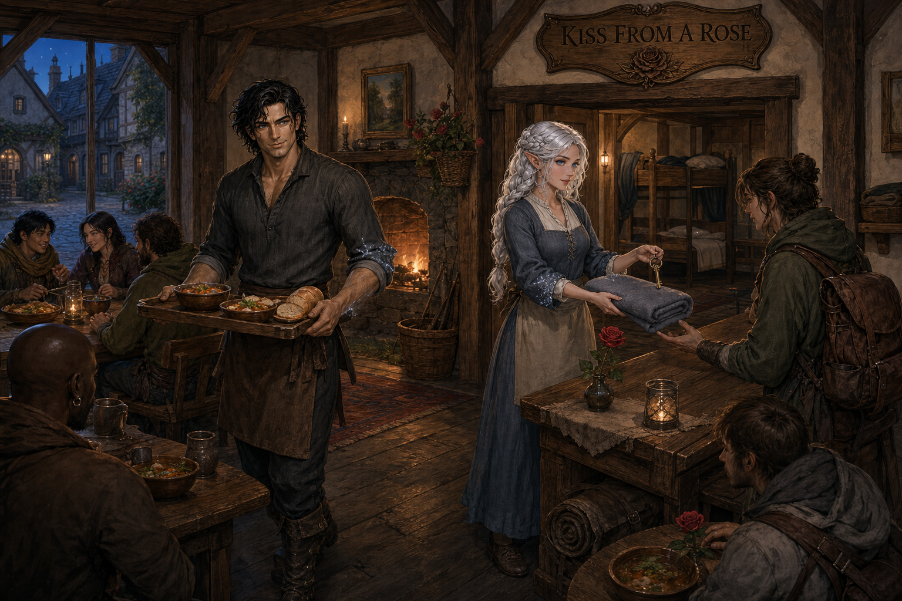

# Kiss from a Rose

**Kiss from a Rose** is a hostel owned by Demidius Thorne in a suburb of [Glistria](glistria.md). Siopi donated half of the money needed to open it. That contribution is part of Siopi's legacy, but the current record identifies Demidius—not Siopi—as the hostel's owner.

## Recorded profile

| Field | Established information |
|---|---|
| Type | Hostel |
| Location | A suburb of Glistria; the specific suburb, street, and mapped building are unrecorded |
| Owner | Demidius Thorne |
| Opening funds | Demidius and Siopi; Siopi donated half of the required money |
| Day-to-day operators | Simulacra of Demidius and Aristea |
| Staff presentation | Both simulacra dress humbly and simply |
| Capacity, prices, and services | Unrecorded |

## Simulacrum staff

Magical duplicates of Demidius and Aristea run the hostel in simple garb rather than captain's finery, formal wizard's clothing, or battle equipment. The number of simulacra, their precise spell mechanics, memories, autonomy, maintenance needs, and the effect of Aristea's death and imprisonment in Tartarus upon her duplicate have not yet been recorded.

The illustration establishes the intended tone: a warm, modest common room in which the two simulacra receive travelers, serve food, distribute bedding, and keep the house. Those activities are an interpretive presentation rather than a confirmed price list or complete inventory of services.

## Strategic and personal importance

Kiss from a Rose gives Demidius a fixed presence near Glistria in addition to the mobile base provided by the [Dawnrunner](dawnrunner.md). It also preserves a visible legacy of Siopi's generosity and of Demidius and Aristea's partnership. The hostel's charitable policies, clientele, security, income, local reputation, and relationship with Glistria's authorities remain unrecorded.

## Related records

- [Demidius Thorne](demidius-thorne.md)
- [Glistria](glistria.md)
- [Dawnrunner](dawnrunner.md)
- [People and Places](people-and-places.md)
- [Strategic Assets](../campaign/strategic_assets.md)

