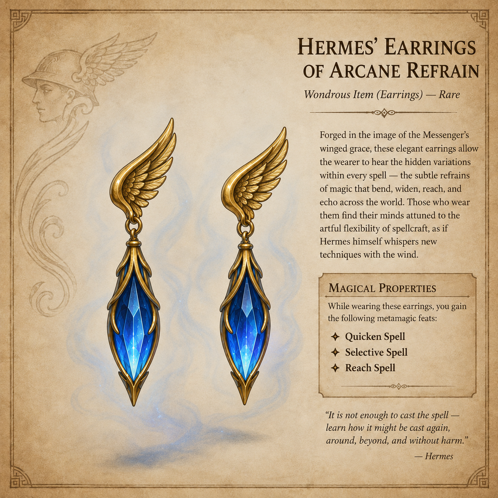

# Demidius's Magic Items

This page lists Demidius’s confirmed magic items separately from artifacts,
divine abilities, consumables, and ordinary equipment.

## Confirmed items

| Magic item | Function | Status |
|---|---|---|
| [Hermes’ Earrings of Arcane Refrain](../systems/magic_items/HERMES_EARRINGS_OF_ARCANE_REFRAIN.md) | Grants Quicken Spell, Reach Spell, and Selective Spell | Active; worn by Demidius |

## Hermes’ Earrings of Arcane Refrain

The matched gold earrings grant Demidius three metamagic feats: **Quicken
Spell**, **Reach Spell**, and **Selective Spell**. These are granted as feats;
no separate daily-use limit or reduction to their normal spell-level
adjustments has been recorded.
