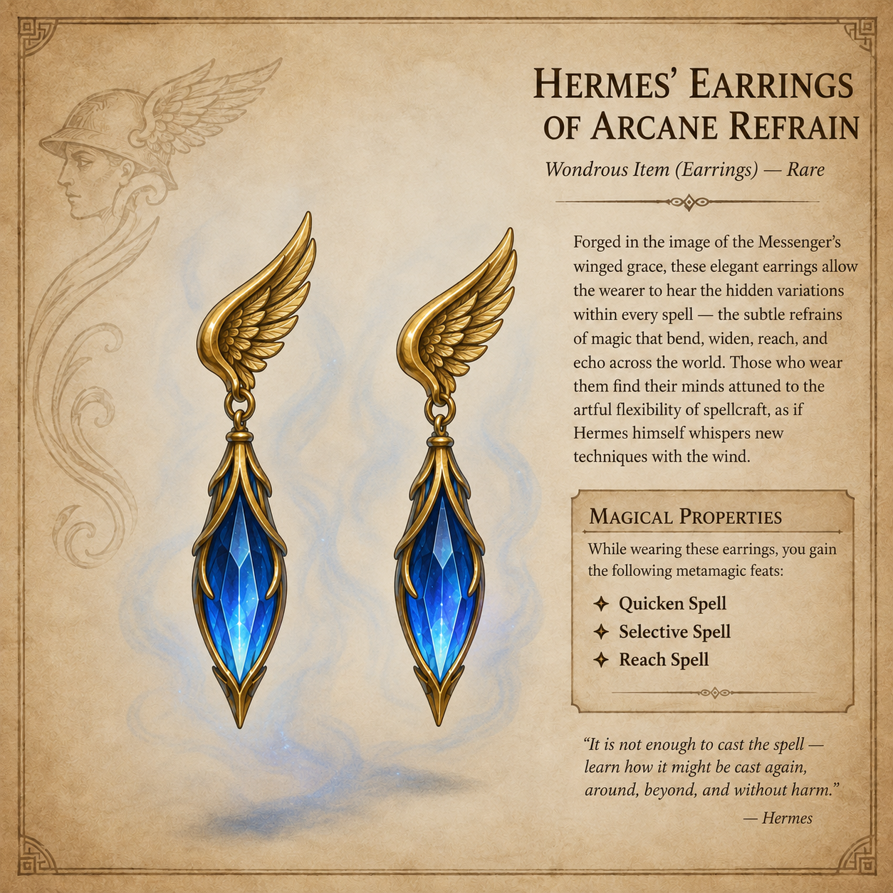
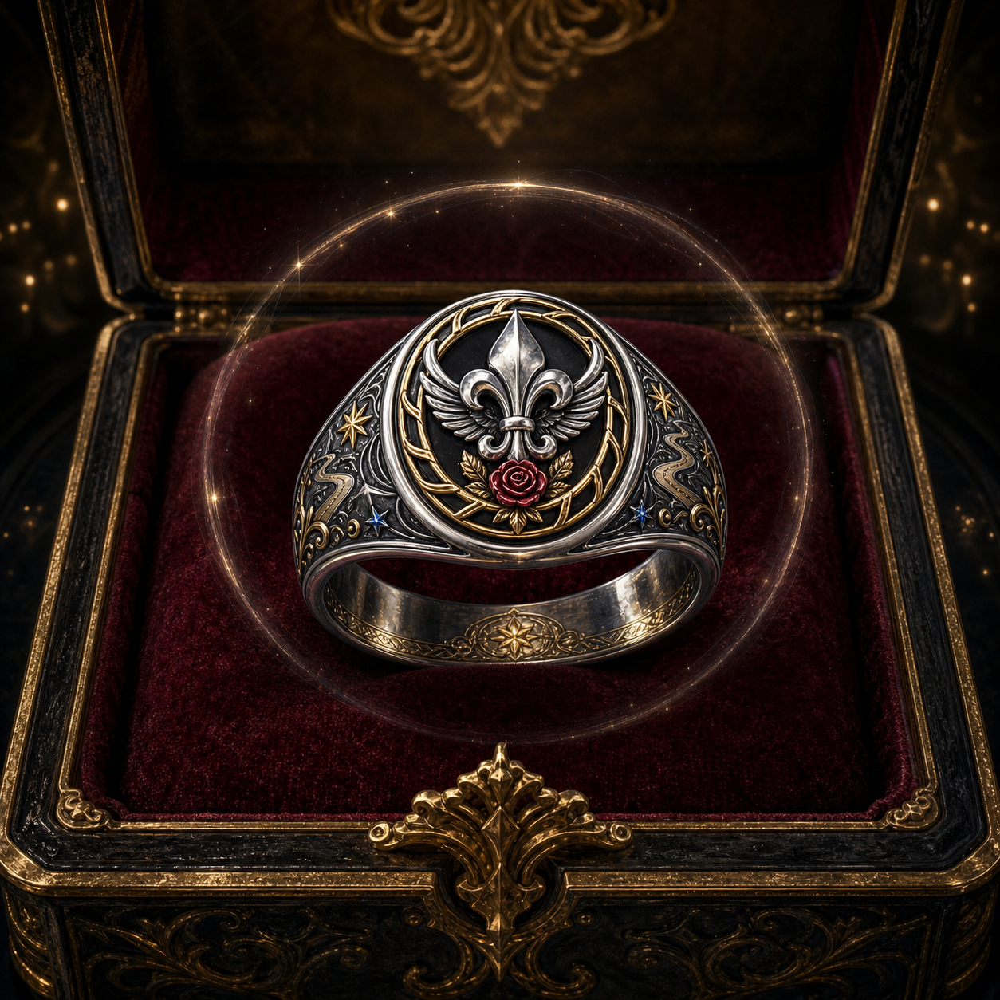

# Demidius's Magic Items

This page lists Demidius's confirmed magic items separately from divine
abilities, consumables, and ordinary equipment.

## Confirmed items

| Magic item | Function | Status |
|---|---|---|
| [Hermes' Earrings of Arcane Refrain](../systems/magic_items/HERMES_EARRINGS_OF_ARCANE_REFRAIN.md) | Grants three metamagic feats and four utility feats | Active; worn by Demidius |
| [Ring of the Suzerain](artifacts/ring-of-the-suzerain.md) | Consolidated defensive, ecclesiastical, and Leadership artifact | Active; worn by Demidius |

## Hermes' Earrings of Arcane Refrain

The matched gold earrings grant Demidius **Quicken Spell**, **Reach Spell**,
**Selective Spell**, **Signature Skill (Diplomacy)**, **Deceitful**, **Extra
Traits**, and **Extra Revelation**. These are granted as feats; no separate
daily-use limit or reduction to normal metamagic spell-level adjustments has
been recorded.

The canonical design is a matched gold-and-blue pair. Each earring has a
sculpted polished-gold wing fitting, one short connecting link, and an
elongated faceted sapphire-blue crystal drop held in a slender pointed gold
frame.

## Ring of the Suzerain

The ring combines the powers formerly carried by Demidius's Ring of Evasion,
Ring of Freedom of Movement, and Ring of the Ecclesiarch. Its full mechanical
record is maintained on its dedicated artifact page.
