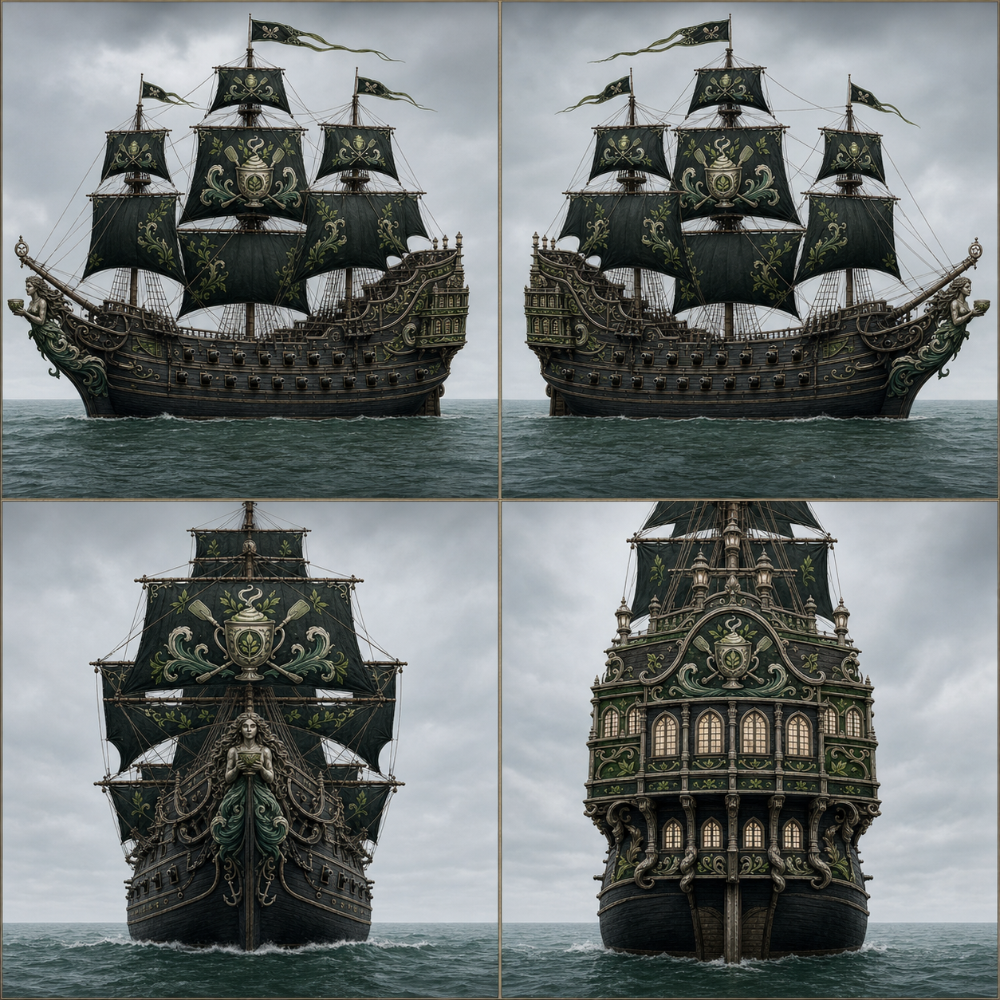
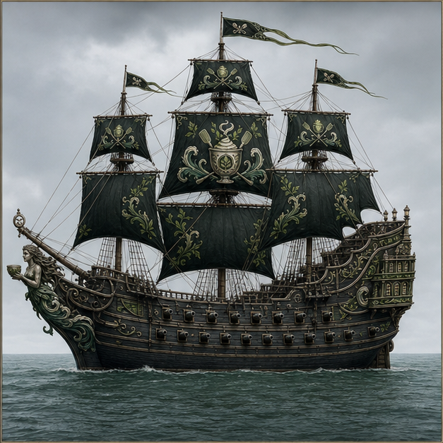
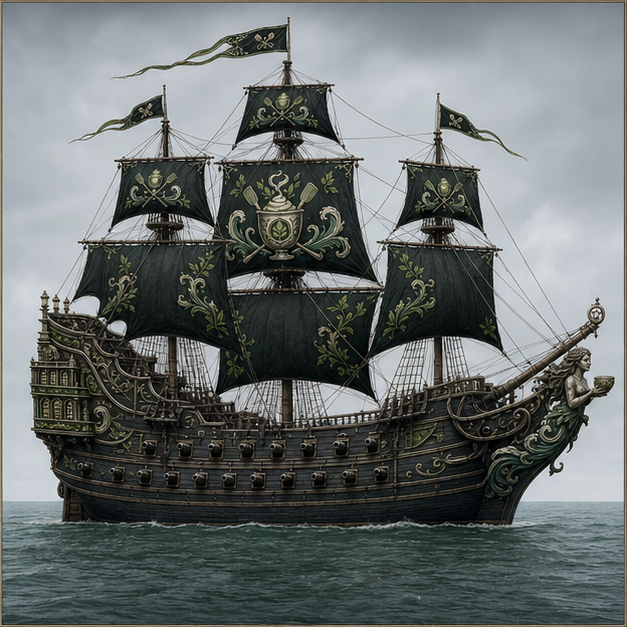
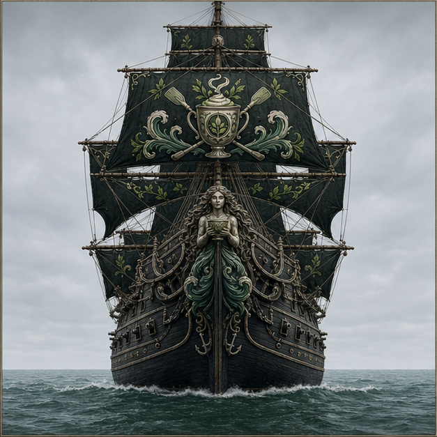
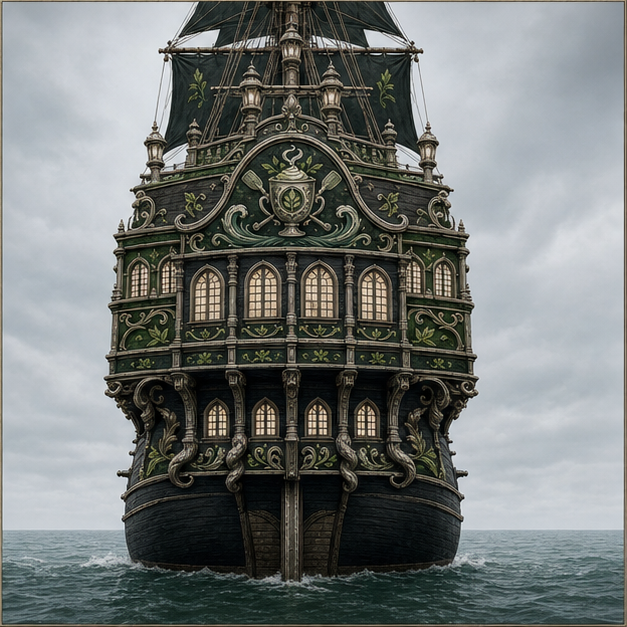
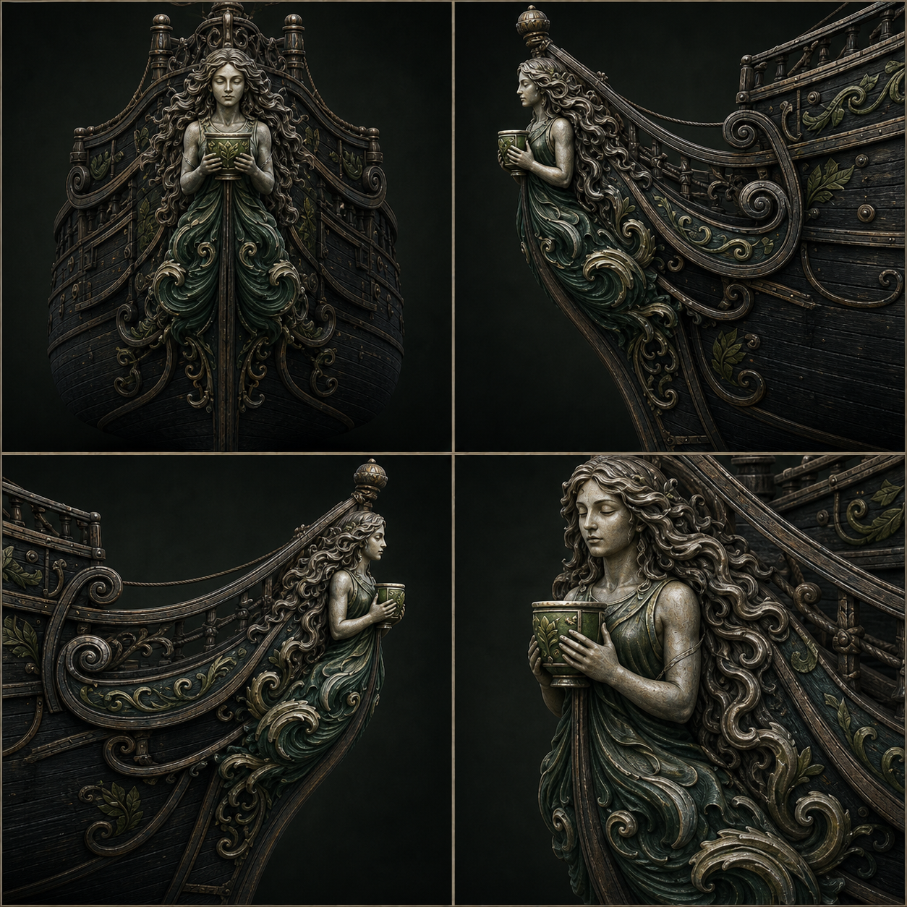
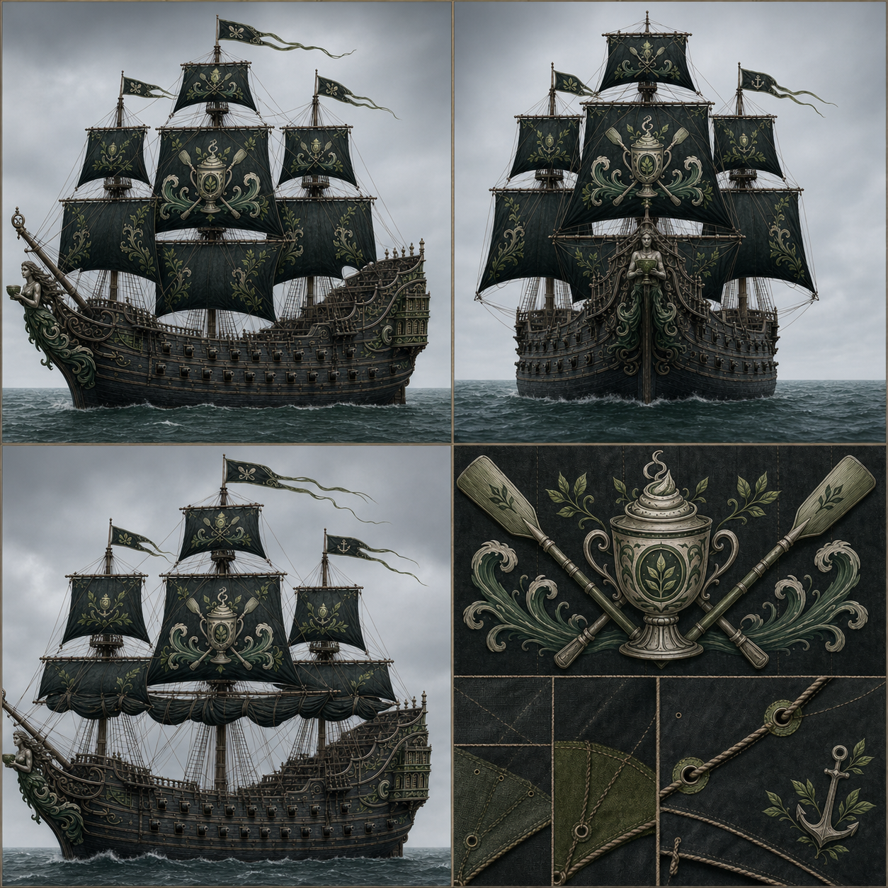
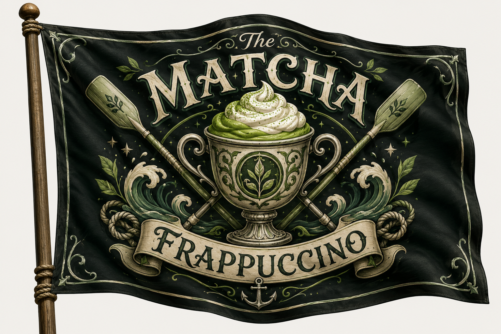
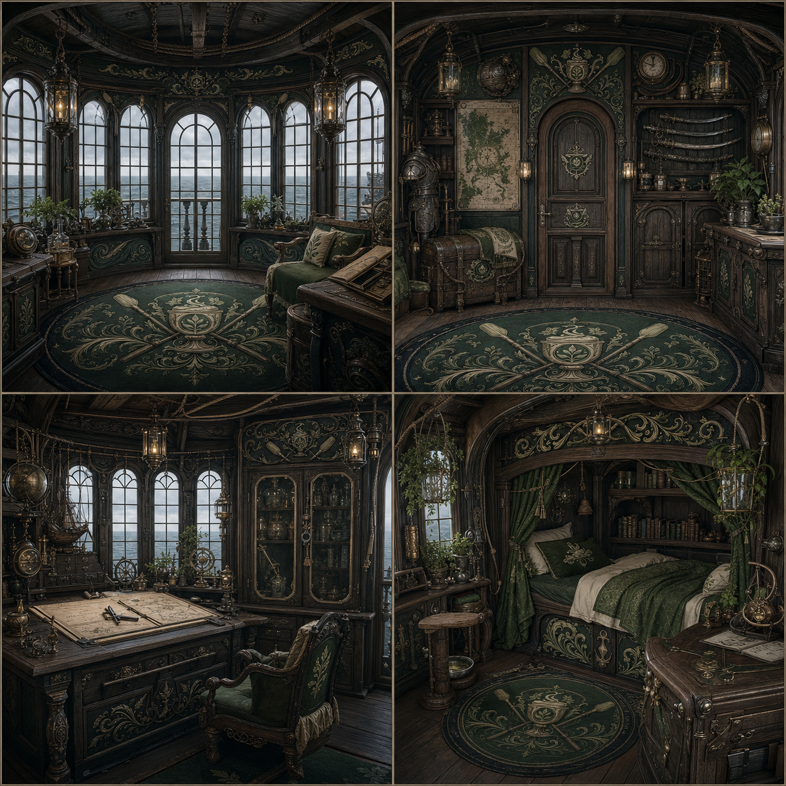

# Matcha Frappuccino — Canonical Ship Design

This document records the canonical physical design of the *Matcha Frappuccino*. Its crew, officers, statistics, upgrades, and service history remain in the campaign records and wiki.

## Design basis

The *Matcha Frappuccino* is a three-masted galleon. Its long hull, pronounced beakhead, two visible gun decks, broad beam, heavy square rig, and high multi-level stern galleries use Queen Anne's Revenge as a silhouette and construction inspiration. It is not intended as a historical reconstruction.

The Matcha's own identity controls all decoration:

- deep black-green hull panels and sails;
- matcha, olive, moss, cream, ivory, aged pewter, sea green, rope tan, and warm timber;
- ceremonial cup, leaf, crossed oars, waves, botanical scrollwork, rope knots, and anchor motifs;
- no Dawnrunner crimson, roses, thorns, wings, or fleur-de-lis.

## Exterior

| Port side | Starboard side |
|---|---|
|  |  |

| Bow | Stern |
|---|---|
|  |  |

These views lock the hull proportions, mast spacing, cannon-port rhythm, beakhead, figurehead mounting, and stern-gallery window arrangement.

## Figurehead

The figurehead is a dignified adult feminine undine-like botanical sea spirit. Long carved hair becomes curling waves and tea leaves. Two hands hold one shallow ceremonial cup close to the chest. The lower form merges into symmetrical wave-and-leaf carving attached to the beakhead.

Materials are dark weathered wood, aged pewter, restrained matcha-green enamel, and cream highlights.

## Sail system and flag

The heavy black-green sails use cream piping, matcha-green reinforced corners, and rope-tan reef lines. The main emblem is an aged-pewter cup with one leaf, crossed oars, and curling waves. Smaller sails use restrained tea-leaf scrollwork or a leaf-and-anchor mark.

The flag remains the exact authority for the ship's named ensign, palette, and full heraldic arrangement.

## Rear captain's quarters

The quarters fit inside the curved rear galleries. They combine broad stern windows, a chart table, writing desk, weather instruments, secure artifact cabinet, sea chest, simple bunk, compact armor and weapon storage, secured herbs and vines, and modest accommodations for animals. The cabin is practical and seaworthy rather than palatial.

## ComfyUI packs

- `Ship_Matcha_Frappuccino`
- `Ship_Part_Matcha_Figurehead`
- `Ship_Interior_Matcha_Captains_Quarters`
- `Ship_Sails_Matcha_Frappuccino`
- `Heraldry_Matcha_Frappuccino_Flag`

The packs are stored under:

`D:\comfyui\ComfyUI-Easy-Install\ComfyUI\input\Canonical Reference Packs`

The durable approved art masters are stored under:

`C:\Users\coutu\Documents\Codex\Documents\Dawnrunner\Matcha Frappuccino\Ship Design`

