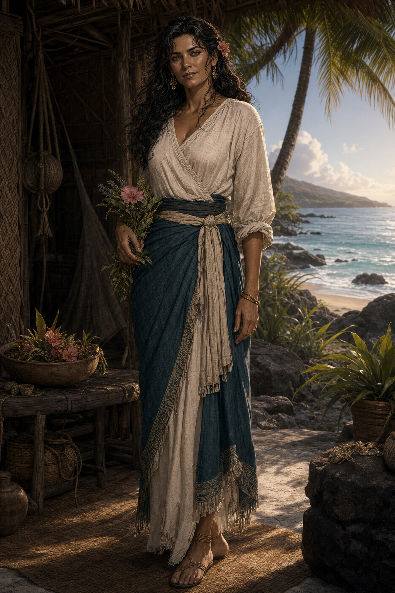

# People and Places

This page collects the setting names that appear in the verified campaign record. Where the source does not supply a biography, appearance, geography, or motive, the wiki leaves it open rather than turning inference into fact.

## People and powers

### Demidius Thorne

Oracle, mythic controller, captain of the Dawnrunner, party face, demigod, and Blessed of Hermes after two completed Hermes trials. He bears the Advanced simple template, and Hermes's followers can sense the god's favor upon him. See the [character overview](demidius-thorne.md).

### Amparo Decoris Ignatius

A level 17 nonbinary undine life oracle, player character, and first mate of the *Matcha Frappuccino*. Amparo is Blessed of Hestia, which means they completed two Hestian trials, bear the Advanced simple template, and are recognizable to Hestia's followers as favored. They were born a one-quarter godling of Hestia's bloodline and became a demigod by eating an Apple of Discord. At Tradegulf, Eris named Amparo her future Champion and confirmed that the battle completed Amparo's first Eris trial toward that separate path.

### Queen Lidda Beaumont of Nysia

Queen of Nysia, Slayer of War, and Minor Goddess of Dueling. She killed Ares at the opening of the Culling and later gave Demidius the Glasses of Beaumont. Her willingness to offer reconciliation before accepting Ares's challenge is one of the few directly recorded clues to her conduct.

### Dame Mathilda

A level-50 paladin of Apollo who refused godhood and possesses the Sword of Helios. Her blood and abilities uniquely tie her to the Sunlit Chain. Maarin proposes installing Mathilda as Declan's successor, with Aelwyn as her second, but Mathilda has not accepted.

### Fel

A lawful-evil primordial blue dragon from the Outer Realms, Fel is Lord of the Underworld and one of the four primary gods of the Lords of Order. Fel is associated with Magic, Death, Knowledge, and Scalykind. Fel's arrival may be the event defining year 0 Post-Arrival, although Cronus's release is the other current candidate.

### Alexander

Alexander is a primordial silver dragon, Lord of the Earth, and one of the four primary gods of the Lords of Order. His half-celestial aasimar mortal avatar retained Alexander's appearance from life and ruled as Emperor of Lodingen for hundreds of years.

### The Council of Seven

The Pirate Kings and Queens who rule the Isles of Berres. At campaign start they were Sea Serpent Declan, Smokey Roberts, Bloody Anne, Bluebeard the Valiant, Rosalind Galeheart, Wavelord Santiago, and Morrigan “the Burner” Crossfire. Declan's death leaves six active members. The Storm King is a separate storm giant rather than a council member.

### Hermes

Demidius's patron deity. Hermes is the source of Demidius's custom obedience and divine-power progression, the Seven-Pipped Gem, and Hermes's Boots of Speed.

### Ares

The God of War killed by Queen Beaumont outside Tradegulf. He refused an opportunity to withdraw and reconcile with the New Gods before attacking.

### Eris and Pat

Eris appeared through the identity or form of Pat at the end of the Battle for Tradegulf. Pat assumed the appearance of a six-foot-tall woman, addressed Amparo as Eris's future champion, and vanished after declaring the battle Amparo's first trial. Whether Pat was a disguise, manifestation, host, or separate person remains unknown.

### Aristea

A level 17 neutral-good elven wizard of Nereus, water-and-cold specialist, merchant-mage, item creator, shapeshifter, Demidius's cohort, and navigator of the Dawnrunner before her death. Pilgrimages and boons from Nereus granted her the Animal Lord of the Tides mantle, sacred narwhal form, and the epithet Silver Tusk of Nereus among some island mystics. Eris killed her with *death knell* during the Battle for Tradegulf, made her appear alive but unconscious, and pulled her soul into Tartarus. The known campaign objective is to release her soul before attempting resurrection.

### Kaelen Thorne

A deceased former party member, elven druid, and student of the elder Ylvara. The child of an elven herbalist and ranger, Kaelen learned the languages of the forest and developed a defining bond with animals after comforting a dying beaver and raising its lone pup. She believed the balance between civilization and nature sometimes had to be enforced. Her relationship to the wider Thorne family and the circumstances of her death remain unrecorded.

### Sly

Declan's second-in-command. Eris killed Sly with *death knell* during the Battle for Tradegulf. The current custody of the Wayfinder associated with Sly's office is unknown.

### Okeanikos

A level 15 male mortal god, sorcerer, Dragon Disciple, child of Echidna, and one of the group's major damage specialists. The party rescued his egg after Maarin received a dark prophecy of his coming birth. Maarin took him as her cohort; he now worships her and regards her as his sister. See his illustrated page in the GitHub wiki.

### Filius and Maarin's first Dark Prophecy

Filius is the stone-covered man shown in Maarin's first vision from the Dark Prophecy Fatal Flaw. The vision showed a cloaked golden-scythe wielder killing him roughly ten years into a possible future, followed by Gaia's awakening, a primordial war, collapse of the Material Plane, and a cosmic reset. It led the party to Filius, who is presently alive and serving aboard the *Matcha Frappuccino*. The warned catastrophe has not occurred.

### Perlot

A person addressed by Queen Beaumont during her duel with Ares. Beaumont called the red-tasseled longsword “our blade” while speaking to Perlot. The current record supplies no further verified identity or relationship.

### Demidius's deceased brother

The former owner of the inherited demiplane. Bix may be his reincarnation, although the possibility remains unconfirmed and unknown to Demidius. His name, history, and the circumstances of inheritance are not yet recorded in the canonical Markdown.

### Bix

A chaotic-good male grippli godling of Hermes, Dawnrunner officer, newlywed to another crew member, and Demidius's longest-serving follower. Bix has one red eye and one blue eye. He may be the reincarnation of Demidius's deceased brother, but Demidius does not know about this uncertain possibility. See the illustrated page in the GitHub wiki.

### Vornix Drazgul

A male kobold petty officer hired by Demidius for the Dawnrunner. Vornix calls Demidius the “great, scaleless, pink lizard.” He proposes a partnership with the Maker's Knot to seize goods from corrupt enterprises, sell them at reduced prices, direct all proceeds to charity and displaced workers, and support honest replacement businesses. He insists that the Dawnrunner be funded separately through ordinary adventures. This remains a proposal rather than an accepted or active policy.

### Qarvel Drah'kar

A male sea elf and newer Dawnrunner petty officer hired by Demidius. Qarvel proposes hunting large sea game for trade and hunting pirates, with recovered pirate goods benefiting struggling communities after a 10% acquisition fee for the ship. This remains a proposal rather than an accepted or active policy.

### Zephyra Coralshade

A female sea elf and newer Dawnrunner petty officer hired by Demidius. Zephyra proposes a safe luxury passenger service using paired fares: every passenger paying 500 gp subsidizes one free passenger in need. This remains a proposal rather than an accepted or active policy.

### Aelwyn

A platinum-skinned female paladin, officer aboard Maarin's *Matcha Frappuccino*, child of Smokey Roberts, paternal half-sister of Demidius, and well-known folk hero in the Sunlit Chain. Aelwyn attacked the slaving operation on Ironclaw Isle, where captives were being worked to death in a platinum mine. She killed the Iron Tyrant's heir and daughter. The daughter was a quarter-godling of Alexander and the heir of one of his demigods, leading Alexander to curse Aelwyn. The Sunken Enclave has placed a bounty on Aelwyn and the rest of the party; Aelwyn knows why she is wanted but not why the others are targets.

### Philomela Thorne

Demidius's radiant and enigmatic mother is a musetouched aasimar, an islander, and a demigod of Aphrodite. Exceptionally beautiful but simply dressed, she fled Lodingen with Demidius to escape the Hellknight Order of the Godclaw, found refuge on Motu Leilani, and revealed his descent from Aphrodite. She later provided what she knew of his scattered siblings when Fetu’mana's vision sent him away. Her class, level, specific divine abilities, and present location remain unrecorded.

### Fetu’mana

Lorekeeper of the Tagata Fetu, whose name means Star Spirit. Many expected Demidius to inherit Fetu’mana's oracle mantle, but the lorekeeper instead received a vision directing him to seek his siblings.

### Siopi and Paradox

Siopi was Demidius's nonbinary, femininely presenting half-sibling, and Paradox was his half-brother. Both were children of Smokey Roberts, former party members, and adventuring companions. Both are now deceased, although the causes and circumstances of their deaths remain unrecorded. Siopi helped Nyssa decipher the map in *The Mother's Lament*. Paradox had one red eye and one blue eye with matching red-and-blue hair, seven reported wives, six reported biological children, and two adopted children presented as his nephews.

## Organizations and vessels

### The Dawnrunner

Demidius's galleon, mobile headquarters, command platform, and the center of an expanding organization of officers, crew, marines, cohorts, and followers. The repository treats the Dawnrunner as both a vehicle and an institution. Its workbook records named specialists in navigation, healing, logistics, artillery, engineering, security, music, food, and counter-piracy. Its supplied visual references establish coordinated black, silver, and crimson uniforms, a winged fleur-de-lis with roses and thorns, naval armor variants, and a Royal Marine tradition. See the [Dawnrunner vessel and crew record](dawnrunner.md).

### The Matcha Frappuccino

A galleon and the Dawnrunner's sister ship. Maarin serves as captain and Amparo Decoris Ignatius as first mate. Maarin is a muscular mistsoul undine with blue skin, aqua mistlike hair, pink eyes, plant-covered medium armor, and a perpetual gathering of plants, animals, and vermin. Amparo is a nonbinary undine life oracle with vitiligo and purple eyes. Other named officers are Okeanikos, Alley, Tulip, Valax, Aelwyn, Razin, and Filius. Alley is a female goblin rogue, worshiper of Hermes, and Maarin's spymaster; she recently married Tulip. Tulip is a male gnome unicorn-bloodline sorcerer, exceptional cook, healer, and head chef, as well as a demigod of Aphrodite and Demidius's half-brother. Filius is a very ancient male Oread, mortal god of the World Tree, and Mystic Theurge who currently serves as a healer after spending millennia petrified. Its supplied stat block records AC 44, 1,250 hull points, saves 22, hardness 10, 160 crew, 30 captain/officer positions, and a substantial siege battery.

Aelwyn is a confirmed member of Maarin's crew. Her campaign against the Ironclaw Isle slavers has made her a regional folk hero, but also brought a Sunken Enclave bounty and a curse from Alexander upon her.

### Nyssa

Nyssa was formerly Demidius's cohort. Demidius pursued her romantically, but she rejected his advances during a crew celebration; they were never a couple. Nyssa possesses an unidentified artifact glove associated with Zeus and used it to control Tulip, leaving him deathly afraid of enchanters, including Demidius.

Nyssa helped Siopi decipher the map in *The Mother's Lament*. The map identified three pieces of the Scepter of Keto and placed its connector or mount under the guardianship of the immortal Gorgon sisters in a temple on Sarpedon. Sarpedon sank during the Sundering of Lodingen about 160 years ago, and a coral reef south-southwest of Dreadtide may cover its ruins.

Nyssa later disappeared with two crew members and stole *The Mother's Lament* after the party encountered a strange glowing city off Ironclaw Isle. At the same time, a pursuing smoke cloud engulfed the ship in falling ash and blocked celestial navigation. Whether Nyssa caused, arranged, or merely exploited the ashfall remains unknown, as do her current status, motive, allies, class, ancestry, and the artifact glove's exact properties.

### The New Gods

A divine grouping or order mentioned in Queen Beaumont's final offer to Ares. The current record confirms the name and the possibility of reconciliation with them, but does not yet define membership, doctrine, or hierarchy.

## Places and planes

### Tradegulf

A city in Old Nysia where two immediately connected conflicts occurred. During the Battle for Tradegulf, Maarin killed Declan while Eris killed Sly and Aristea with *death knell* and pulled Aristea's soul into Tartarus. The battle's 55 deaths triggered the Culling early; immediately afterward, Queen Beaumont killed Ares outside the port at the Culling's opening. The historical map places Tradegulf east of Greyridge, north of Weirworth Falls, and west of the Acis River corridor toward Glistria.

### Nysia

A rising semi-constitutional monarchy ruled by Queen Lidda Beaumont from Arverdon Palace. The palace is her confirmed seat of rule, but has not yet been confirmed as Nysia's formal capital. The Old Nysia map also records Tradegulf, Glistria, Greyridge, Griton, Weirworth, Basilia, Greenport, Kettleton, Hapborough, Certair, Fetil, and Heabury. Current borders and settlement status remain unrecorded.

### Arverdon Palace

Queen Lidda Beaumont's seat of rule in Nysia. The Old Nysia map depicts it as a major fortified palace southwest of Glistria. Its court, defenses, household, government offices, and status as or distinction from the formal capital remain unrecorded.

### Glistria

A large fortified coastal city in Old Nysia, east of Tradegulf along the Acis River corridor and beside Alpamyo Mountain. Its detailed map depicts a central Keep, ten named districts or quarters, markets, guild facilities, shrines, gates, parks, workshops, and ruins. Pete, the Dawnrunner's gnome artificer, owns a shop there with portals to both the Dawnrunner and Matcha Frappuccino. Its current government, population, allegiance, and relationship to Arverdon Palace remain unrecorded. See [Glistria](glistria.md).

### Fizz

Fizz is a gnome, a distinct person, and an avatar of Hermes. He has an orange goatee and is in a relationship with Pete, the Dawnrunner's gnome artificer and mystery-box merchant. His other appearance details, pronouns, powers, divine duties, and degree of independence from Hermes remain unrecorded.

### Misthold

The supplied name for a cloud-covered archipelago or region and for a prominent fortified settlement shown on its map. Other mapped sites include the Diamond Palace, Mistguard, Pythopolis, Song Village, Duskmarsh Haven, Snowfort, Juniper Light, the Heavengazer, Plague Lake, and Arcanerift Cove. Its position within Zatera, government, and present alliances remain unrecorded. See [Misthold](misthold.md).

### Zatera

The world of the campaign, mapped in 150 P.A. Major named lands include Lodingen, Drozag, Yusia, Teecen, Yalta, Polemosland, Hoterra, Prathia, Nysia, Trazac, Salleria, Fritia, and the Isles of Berres. See the [Campaign Setting](campaign-setting.md).

### Motu Leilani and the Tagata Fetu

Motu Leilani, the Heavenly Island, is a secluded island deep in the Isles of Berres where Philomela raised Demidius after their escape from Lodingen. Its people, the Tagata Fetu or People of the Stars, taught Demidius spirit and tribal magic through juju chants and dances.

### Sounon

The island in the Sunlit Chain where the campaign began. It will become the shared home of Demidius's and Maarin's crews. Its local map identifies the Temple of Springs, Hidden Cove, Village Ruins, and an offshore shipwreck.

### The Sunlit Chain

Sea Serpent Declan's former Berresian island domain. It includes Sounon, Caldoran, Ironclaw Isle, Volcara Isle, Rylkora, and many smaller islands and settlements. Declan's death left the Chain without a lord, and the heroes hold his Wayfinder.

### Shipbreaker Sea

Poseidon's cursed waters around the Isles of Berres. Ordinary compasses fail and nightly clouds conceal the stars and moon. Fourteen Wayfinders function within the curse.

### Stormspire

The Storm King's floating city in the Sunlit Chain. During a mission there, the crews distracted its ruler while Odysseus stole the final component required to complete the Scepter of Keto. Odysseus then sabotaged the city's flight to crash it into the settlement below; Maarin used her weather power to stop the fall and save the people beneath it.

### The Storm King

A powerful storm giant and ruler of Stormspire. The Storm King is not one of the Council of Seven, but is a major regional power and an enemy of Nysia and the New Gods.

### Odysseus

A level-30 rogue of an unspecified specialization and a tactical genius recovered by the party after being missing for twenty years. He thinks in terms of the greater good and is willing to sacrifice people without their consent. His deliberate sabotage of Stormspire was intended to remove an enemy of Nysia and the New Gods, but would have destroyed the settlement below if Maarin had not intervened.

### Scepter of Keto

An artifact capable of bypassing Poseidon's navigation spell over the Isles of Berres. Odysseus stole its final required component at Stormspire. Its current assembly, bearer, activation method, and limitations remain unrecorded.

### The Mother's Lament

A famous book banned across the world and an important campaign artifact. It recounts the suffering of Keto, Echidna, Gaia, and their children under the gods, especially the sea gods. The Olympian Council banned it after the Titans fell because it threatened worship of Hades, Zeus, and Poseidon while encouraging reverence for the three Mothers of Monsters. Its custody, surviving copies, magical properties, authorship, and current enforcement remain unknown.

### Tartarus

The plane or divine prison holding Aristea's soul. It is the destination of the campaign's active recovery problem. Reaching Tartarus does not by itself solve the imprisonment.

### The Labyrinth

A place over which the Key of Daedalus has special authority. Within it, the key's wielder may open any door and declare that door to be the exit.

### The inherited demiplane

A private sanctuary formerly owned by Demidius's brother. It has adjustable time, a locked stone-circle gate, a Dionysian nexus, and a powerful sleep blessing with a permanent loyalty cost. See the [Campaign Guide](campaign-guide.md#the-inherited-demiplane).

## Gaps worth recording in play

- Demidius's and the principal cast's physical descriptions.
- The Dawnrunner's appearance, flag, deck plan, and exact Sounon anchorage.
- Perlot's identity and relationship to Beaumont or her sword.
- The membership and aims of the New Gods.
- The current borders, capital, and settlement status of Nysia compared with the historical map.
- The deceased brother's name and the history of the demiplane.
- The exact nature of Aristea's prison in Tartarus.
- Whether the Post-Arrival calendar begins with Fel's arrival or Cronus's release.
- The custody of the Wayfinder associated with Sly, Declan's deceased second-in-command.
