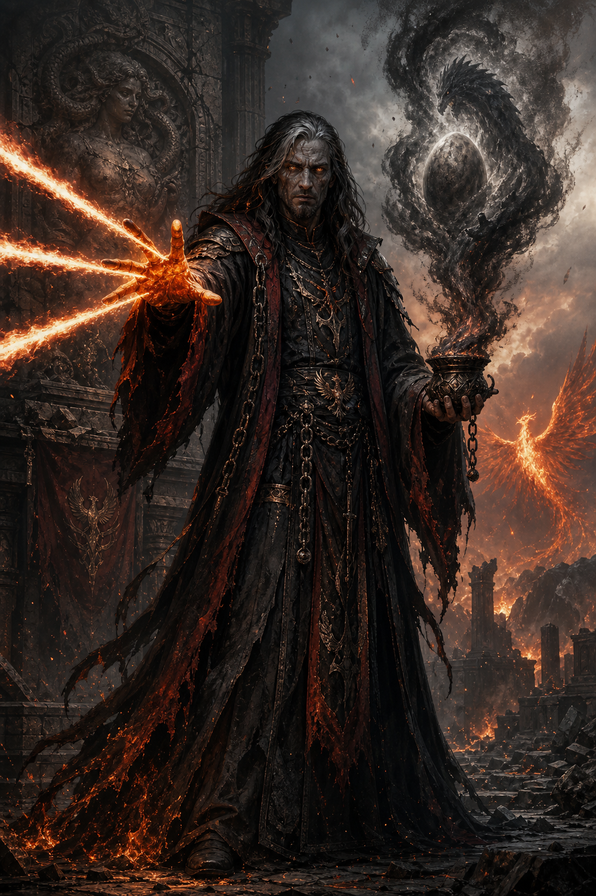

# The Ash Prophet

The **Ash Prophet** is a former citizen of Lodingen and a fire-focused wizard
shaped by that empire's tradition of **Ena**, whom he knew as **Echidna, the
Ravager and Mother of Monsters**. His faith collapsed when Sea Serpent Declan
slew that Ena at her hidden temple at Lavawyn Point thirty-eight years ago. It
returned in a new and more dangerous form when he began receiving visions of
the birth of her child: a promised successor he calls **the Destroyer**.

| Field | Recorded information |
|---|---|
| Origin | Lodingen |
| Class | Wizard |
| Former faith | Lodingen Ena/Echidna, the Ravager |
| Death of his goddess | Slain by Sea Serpent Declan at Lavawyn Point 38 years ago |
| Favored magic | Fire spells, especially *scorching ray* |
| Present belief | The Destroyer will be born and replace the dead Ena |
| Current status | Alive unless later campaign events establish otherwise |

## Ena the Ravager

In the Ash Prophet's Lodingen theology, Ena was **chaotic evil** and held the
domains of **Freedom, Destruction, Fire, and Chaos**. She was the Ravager: a
divine destroyer who would burn the corrupted world away so that an unspoiled
world could be reborn from its ashes like a phoenix.

This is not the same profile as the post-schism minor goddess Ena recorded
elsewhere in the campaign, who is chaotic good and associated with Healing,
Phoenix, Industry, Home, Cooperation, and Liberation. Whether the two Enas are
different divine beings, successive forms, competing traditions, or something
more complicated has not been established.

## Loss, visions, and the Destroyer

Sea Serpent Declan slew the Lodingen Ena at her hidden temple at Lavawyn Point
thirty-eight years ago. The event confirmed the temple's existence to the
wider world, and volcanic activity at Lavawyn Point increased significantly
after her death. The Ash Prophet lost his faith until visions showed him a
child of Ena/Echidna being born. He
believes this child will be called **the Destroyer**, replace the dead goddess,
and complete the Ravager's work.

The visions are confirmed experiences, but their meaning is not confirmed
campaign fact. Pilgrim testimony says Echidna was visibly weak before
Declan's assault, repeatedly exposed herself while defending the temple,
sealed the sanctuary in her final moments, and then lost her heart to Declan
after he killed her. Declan's motive, the cause of Echidna's weakness, what
became of the heart, whether anyone attempted to restore her, the Destroyer's
existence, and the source of the visions remain unknown.

Echidna historically gives birth to either one child or three at a time.
Maarin's vision suggests that the Lavawyn event was meant to be a tri-birth.
Her death may have delayed and weakened the children, and two eggs may have
died prematurely. Okeanikos is the only confirmed survivor, but the other two
eggs remain unresolved. The Ash Prophet may therefore have interpreted one
surviving member of an intended triad as a singular Destroyer.

## Fire wizard

The Ash Prophet favors fire magic, especially *scorching ray*, in conscious
imitation of his former goddess. His exact level, spellbook, school
specialization, mythic abilities, and current allies remain unrecorded.
