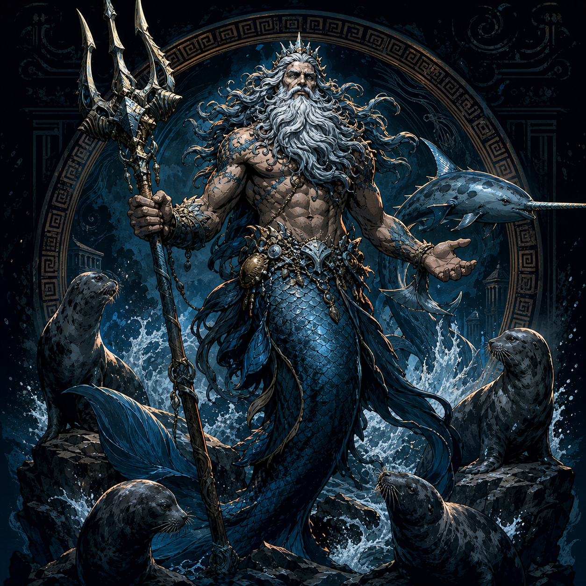

# Nereus

Nereus is the **Old Man of the Sea**, a primordial god of **Sea, Knowledge,
and Prophecy**. His alignment and present faction remain unrecorded.

Campaign legends call Nereus the most accurate prophet in the cosmos. They
say that he only gives a prophecy to someone who captures him. Once caught,
he answers exactly one question before escaping and disappearing again. No
completed attempt to capture him has yet been recorded.

Rumors also claim that the temple associated with Nereus served as a testing
ground for divine champions and that even Nereus was tested there. One strong
inquiry identified him as the original dedicatee. Another tradition says the
sanctuary began as Echidna's temple in Lodingen before demigods rededicated it
to the Olympians. Whether Nereus belongs to that later phase or to a competing
history remains unresolved.

## The temple at Lavawyn Point

The hidden temple where the party recovered Okeanikos's egg stands at
**Lavawyn Point on Volcaris**. The island was historically considered
uninhabitable because fumaroles—volcanic gas vents—cover the area. Reliable
geographical detail beyond that requires a successful Knowledge (geography)
inquiry. Rumors nevertheless describe occasional pilgrims visiting the island
to pray at the hidden temple of Echidna.

The Sundering of Ena's Revenge reportedly stranded the sanctuary in the Isles
of Berres. Echidna later reclaimed it after the Dogs of War raised Polemosland
and occupied the original Isle of Monsters. Pilgrims treated it as Echidna's
temple for roughly a century and believed she sometimes appeared there.

Thirty-eight years ago, Sea Serpent Declan attacked the sanctuary. Pilgrims
reported that Echidna was already weak and repeatedly endangered herself to
keep his crew outside. She sealed the temple before Declan killed her and cut
out her heart. The pilgrims could not reenter and believed divine patronage was
required to pass the seal. Volcanic activity increased significantly after her
death.

The gate itself bears the inscription, **“No name binds the unborn. Only
those who know what must not be chained may enter.”** A series of stone
guardians shaped like lamias stand before it. Rumor holds that approaching the
sealed gate causes one guardian to animate and ask, **“For what purpose do you
approach the mother's lair?”** No reliable account records the answer it
expects or what follows an unacceptable response.

The sanctuary was reportedly dedicated to Nereus before it became a temple of
Echidna. An exceptional assisted inquiry with a result of 56 recovered two
shield traditions:

- Nereus blessed Calico Bill and granted him **Seabreaker**, a shield said to
  let its bearer strike with the full might of the sea. It was not recovered
  after Bill fell to Sea Serpent Declan, and many believe it returned to the
  Lavawyn Point temple.
- **Rhos Aias**, the Shield of Ajax the Great, was broken into eight pieces
  that became part of Echidna's lost hoard and were entrusted to her and her
  children. A purported shard later sold at the Grand Artifact Auction.

The two shields are separate traditions unless later campaign information
establishes a relationship between them.

Echidna's established birth pattern provides additional context for the egg
recovered here. She historically gives birth to either one child or three at
a time, and Maarin's vision suggests that the Lavawyn event was intended as a
tri-birth. Echidna's death likely delayed and weakened the birth. Two eggs may
have died prematurely, but this remains unresolved; Okeanikos is the only
known survivor.

Aristea is a devotee of Nereus. Through pilgrimages and accumulated divine
boons, she received the Animal Lord of the Tides mantle and sacred narwhal
form. After Okeanikos hatched at Lavawyn Point, Maarin apologized for the
explosion of Nereus's temple and invited the unaffiliated primordial to
consider joining the New Gods. His answer remains unrecorded.
