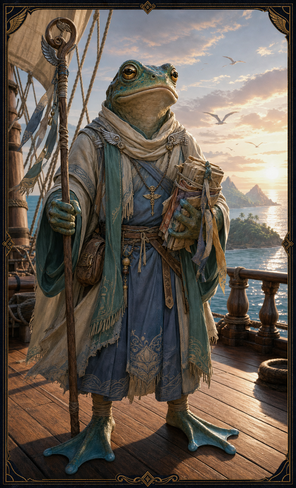

# Ulaa

Ulaa is a grippli cleric of Hermes and the spiritual leader of the grippli
freed on Sounon. His current whereabouts are unknown.

After the grippli were freed, Ulaa decided the party should not be involved in
their relocation because of the powers and dangers surrounding it. He and most
of the grippli purchased passage to another village or island. Pete, a male
gnome, remained aboard, as did six grippli who continue to be counted among
Demidius's followers.

The party last saw Ulaa when he left them on an island that was destroyed soon
afterward. The record does not establish whether he remained there or
survived.

Before departing, Ulaa thanked the party and gave them the [Ember
Blade](../artifacts/ember-blade.md), a green-obsidian sword he had stolen years
earlier at Hermes's direction.

Status: Canon supplied by the user on 2026-07-28. Ulaa's destination, survival,
and present location remain unknown.
