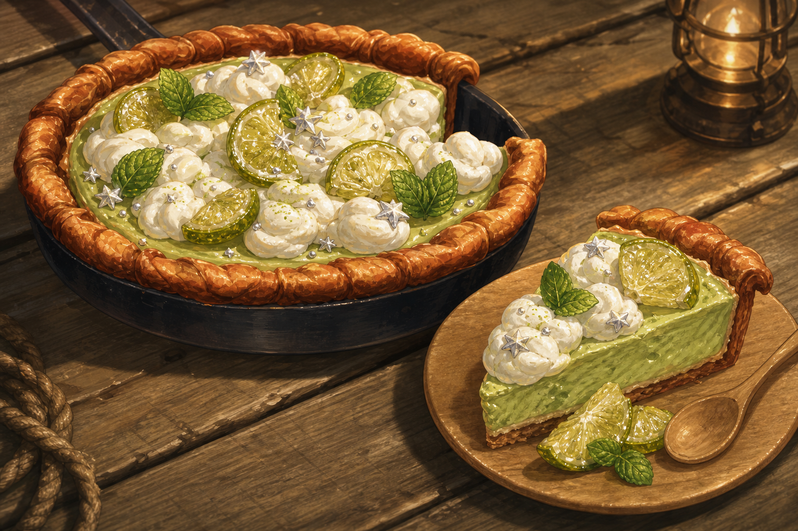
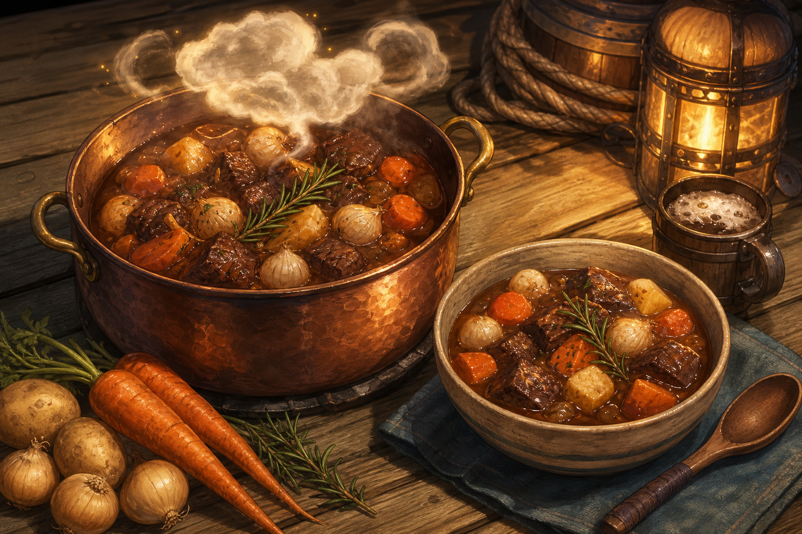
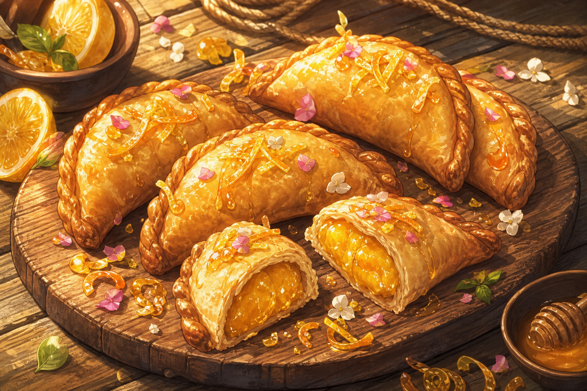
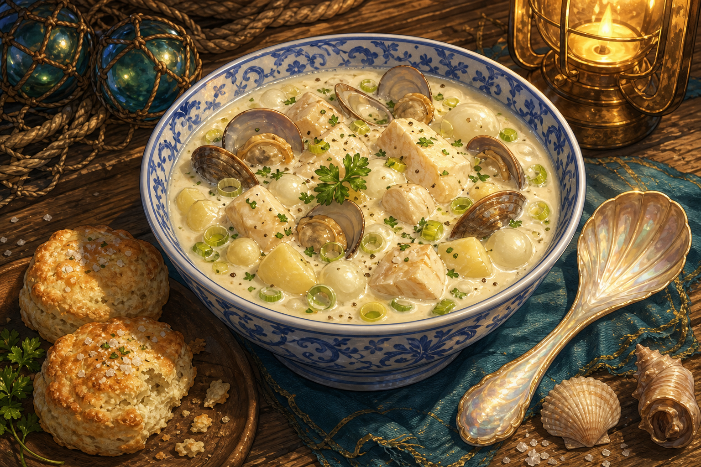
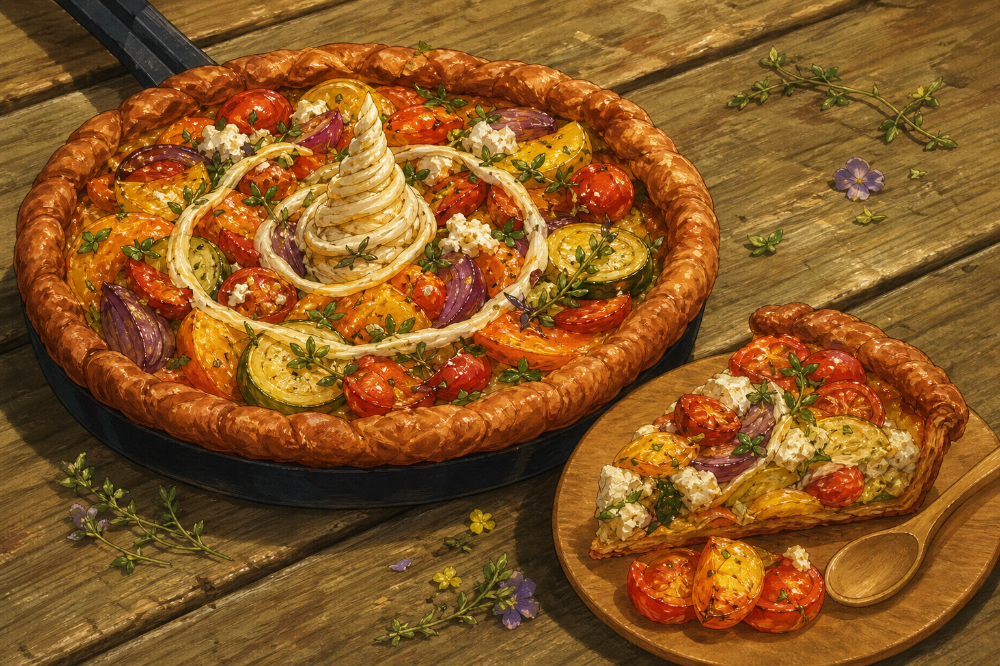
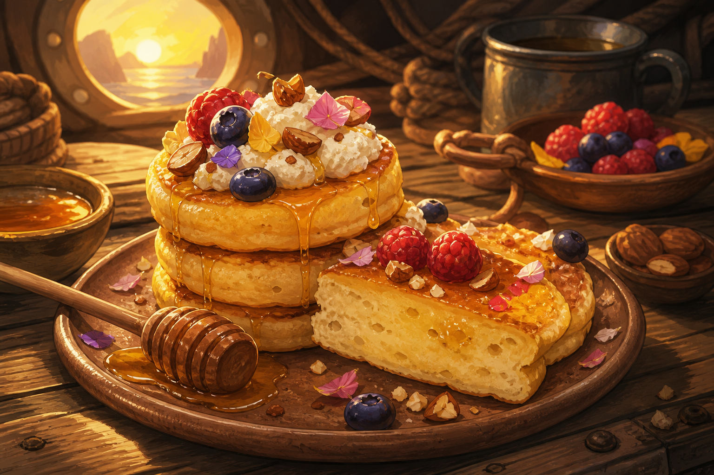
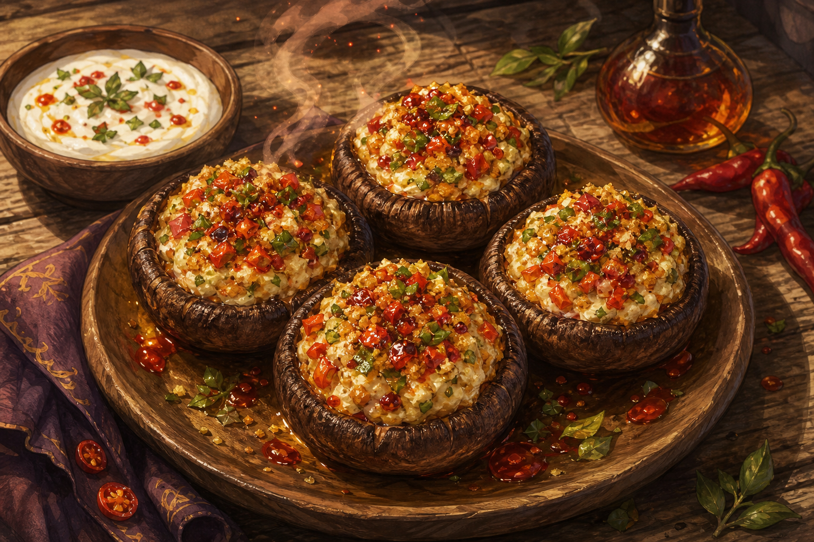
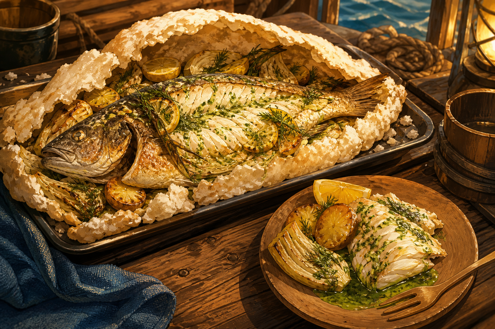
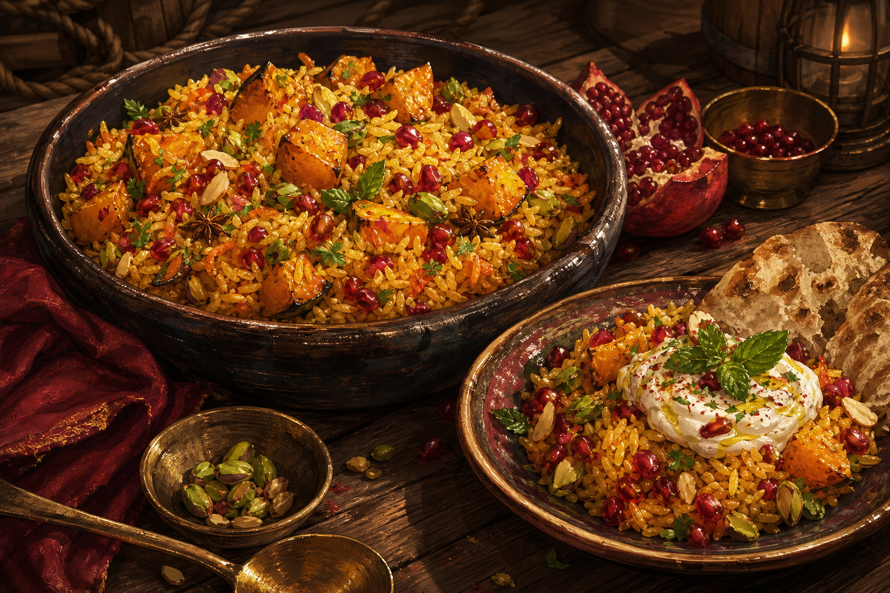
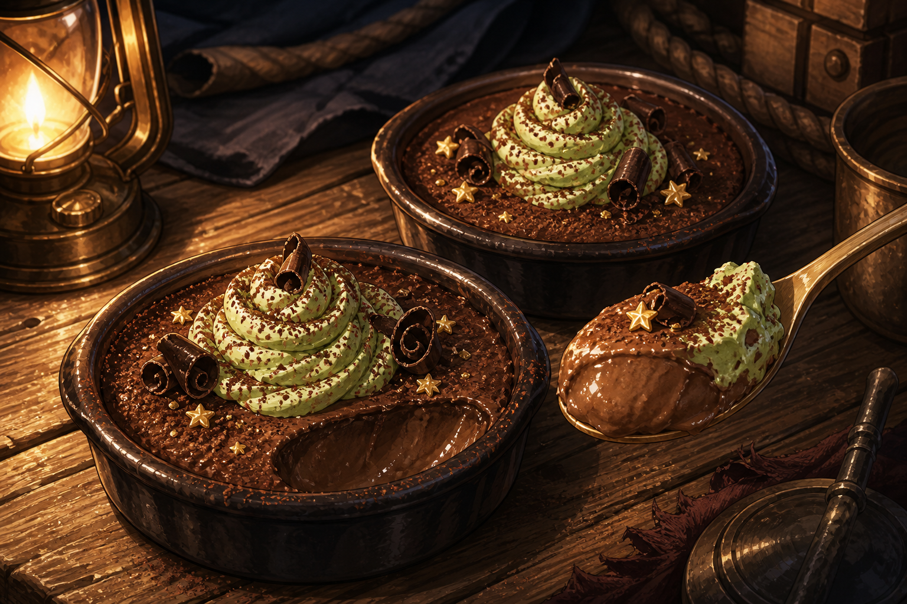

# Tulip's Top 10 Recipes

Tulip, head chef and healer of the *Matcha Frappuccino*, keeps food practical
enough for a working galley and joyful enough to make a hard voyage feel like
home. The fully illustrated, usable recipes are preserved on the campaign
wiki's **Tulip's Top 10 Recipes** page.

## The collection

1. **Matcha Mooncloud Tart** — matcha custard, whipped cream, candied lime,
   and mint.  
   
2. **Stormspire Thunderpot Stew** — browned beef or mutton, dark ale, roots,
   herbs, and a restrained spark of chile.  
   
3. **Sunlit Citrus Hand Pies** — lemon-orange curd in crisp pastry with a
   light honey glaze.  
   
4. **Nereid's Pearl Chowder** — fish, shellfish, pearl onions, potatoes,
   leeks, cream, herbs, and lemon.  
   
5. **Unicorn Garden Galette** — goat cheese, honey, thyme, and a spiral of
   garden vegetables.  
   
6. **Dawn-at-Sea Honeycakes** — small ricotta griddle cakes with honey,
   berries, and toasted nuts.  
   
7. **Dragonpepper Stuffed Mushrooms** — cheese, roasted peppers, chile oil,
   and cooling lime yogurt.  
   
8. **Shipbreaker Salt-Crusted Fish** — whole fish baked in a protective salt
   shell with lemon, fennel, and parsley.  
   
9. **Persephone's Pomegranate Pilaf** — saffron rice, squash, pomegranate,
   pistachio, herbs, and lemon.  
   
10. **Mocha Nightwatch Custards** — dark chocolate and coffee custard topped
    with matcha-dusted cream.  
    

These are culinary recipes, not new mechanical consumables. No game bonuses
are assigned to them unless the GM later establishes such effects.

