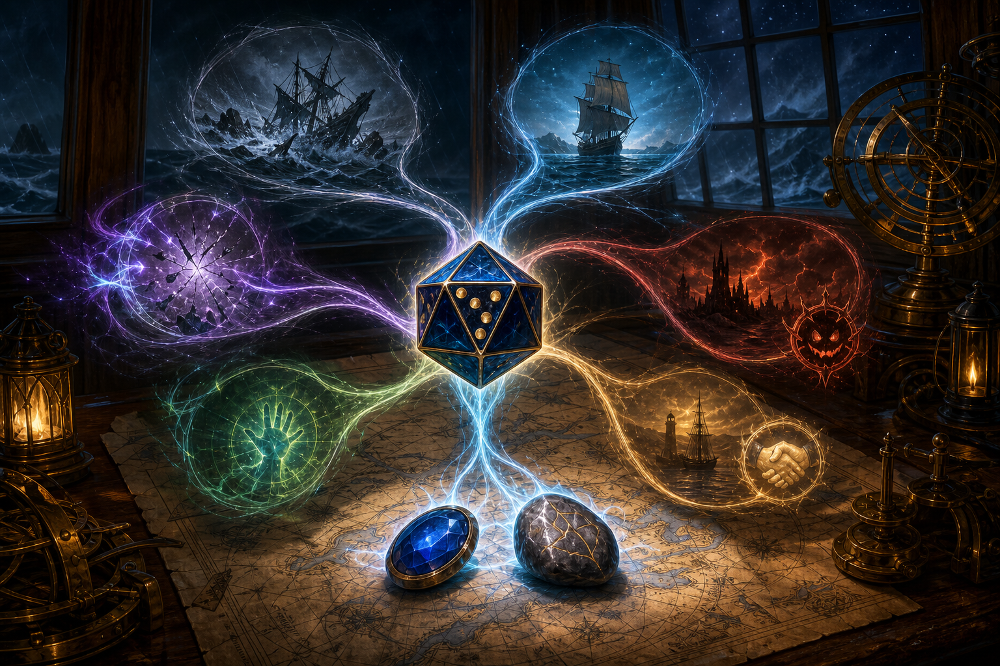

# Probability Engine

The Probability Engine replaces the former Luck Engine. It includes luck bonuses, post-roll intervention, rerolls, bonus conversion, resource timing, and any effect that changes the probability of a pivotal outcome.

## Core sequence

1. Observe the natural roll when the ability permits it.
2. Estimate whether the result is likely to fail.
3. Spend the smallest resource that changes the outcome.
4. Preserve immediate actions when an enemy counterspell or emergency defense is more important.

## Seven-Pipped Gem

Seven-Pipped Gem is a **divine ability**, not an artifact. At 17 HD it grants +8 luck to any d20 roll, increased to +10 by Fortune's Child and Fate's Favored. Gambling and Sleight of Hand use full HD, producing +19. It is declared before the GM announces success or failure and uses an immediate action.

See [Seven-Pipped Gem](../systems/divine_abilities/SEVEN_PIPPED_GEM.md) and CR-05.

## Permanent infrastructure

- Luckstone: +1 becomes +3 under CR-01 and CR-02.
- Eyebrow Piercing of Confidence: +4 luck to mental ability scores becomes +6.
- Invoke Deity (Luck): maintained through Ring of Continuation; exact bonuses must be recorded from the campaign's spell version.
- Four-leaf clover: its +2 luck bonus should become +4 under CR-01 and CR-02, but it replaces rather than stacks with the luckstone's +3. Its free-action activation preserves Demidius's immediate action.

The Ring of Continuation text ends its maintained personal spell when the wearer casts another personal spell, except while the older spell's natural duration would still remain. Audit the campaign version and duration of Invoke Deity before treating the all-day routine as safe. See [Ring of Continuation Audit](../codex/recommendations/ring_of_continuation_audit.md).

## Make Your Own Luck

Converted competence, insight, or morale bonuses become luck bonuses and receive +1 from Fortune's Child and +1 from Fate's Favored under CR-04. Ordinary non-stacking rules among luck bonuses still apply.

## Immediate-action conflict

Seven-Pipped Gem competes with immediate-action counterspells and other reactive defenses. The correct choice depends on whether the roll being modified is more decisive than the enemy action likely to occur before Demidius's next turn.

*Borrow fortune* offers an immediate-action reroll before the result is known, but forces two rounds of rolling twice and keeping the worse result. Reserve it for an outcome whose immediate failure would be worse than that severe follow-on penalty.

## Calculated luck

*Calculated luck* can produce a +2 luck bonus on caster-level checks for 1 round per level. CR-01 and CR-02 should increase that qualifying bonus to +4. The desired result appears at least once on 3d8 about 33% of the time, and the spell also assigns an energy vulnerability.

Use it before a planned sequence of several caster-level checks. Seven-Pipped Gem remains the stronger answer for one decisive roll because it is larger, used after seeing the die, and does not depend on a random setup result. Ordinary non-stacking rules still apply to overlapping luck bonuses.

**Source:** *Pathfinder Campaign Setting: Occult Mysteries* (PZO9269), PDF pp. 52-53 / printed pp. 50-51.

## Spend priority

1. Fatal Flaw save with severe consequences.
2. Mythic greater dispel or counterspell check that determines the encounter.
3. Save against domination, imprisonment, or other loss of agency.
4. Caster-level check required for planar or divine access.
5. Initiative or concentration only when the result changes the entire turn structure.
